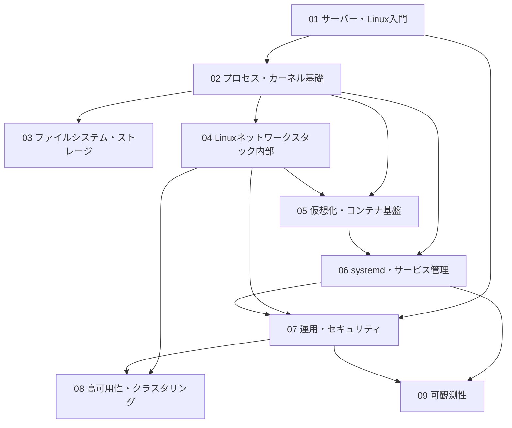

# 教科書全体のロードマップ・前提知識マップ

## 概要

この章では、本書全体の構成(10の分野)と、各分野がどの知識の上に積み上がるかを
示します。前提知識は「Linuxの基本コマンド(`ls` / `cd` / `cp` / `mv` / `rm` / `git` など)を
一通り打てること」だけです。ここを読めば、自分が今どこにいて、次に何を学ぶのかが
見通せるようになります。

## 本書の目的と到達点

本書は、「基本的なコマンドは打てるが、サーバーやOSがなぜそう動くのかは知らない」
段階の読者が、**サーバーの基礎・運用・応用レベルの知識を体系的に身につける**ための
教科書です。

多くの入門書は「このコマンドを打てばこうなる」という操作手順を教えますが、本書の
主目的は**仕組みの理解**です。たとえば「`kill` コマンドでプロセスを止められる」と
覚えるのではなく、「シグナルという仕組みがカーネル内でどう配送され、プロセスが
それをどう受け取るのか」まで理解することを目指します。操作手順は検索すればすぐ
見つかりますが、仕組みの理解は障害対応・設計判断・新技術の習得すべての土台になり、
陳腐化しにくいからです。

各分野の説明は前提知識ゼロで読める平易な導入から始まり、最深部ではLinuxカーネルの
公式ドキュメントやPOSIX仕様(IEEE Std 1003.1)といった一次情報源に基づく
技術書レベルの内容まで踏み込みます。ただし深掘り部分は「発展」として分離してあり、
飛ばしても本筋は追えるように構成しています。

## 前提バージョン

本書は以下を基準に記述します。版によって挙動が異なる仕組みは、本文中で必ず
バージョンを添えて説明します。

- **カーネル**: Linux 7.x 系(基準版: **Linux 7.0**)〔要検証: 執筆時点の
  最新安定版に応じて基準版を更新する可能性があります〕
- **ディストリビューション**: 実行例は **Ubuntu Server 26.04 LTS** を基準と
  します。ディストリビューションが同梱するカーネルは基準カーネルと版が異なる
  場合があるため、版差が挙動に影響する箇所では章の「概要」に前提を明記します
- **代表的な版差の例**: プロセススケジューラは、Linux 6.6 で長年使われてきた
  CFS(Completely Fair Scheduler)が EEVDF に置き換わりました。本書はデフォルトの
  公平分配スケジューラを EEVDF として説明し、CFS は「6.6以前のCFS」のように
  版を添えて歴史的経緯・対比の文脈で扱います

## 全体の地図 — 10の分野

本書は次の10分野(ディレクトリ)で構成されます。番号順に読むことを基本としますが、
各分野は独立して読めるようにも書かれています。

| # | 分野 | 一言でいうと |
|---|---|---|
| 00 | 全体ロードマップ | 本章。地図と前提知識マップ |
| 01 | サーバー・Linux入門 | サーバー/OS/カーネルとは何か。シェル、ファイル階層、パッケージ管理という「土台の語彙」 |
| 02 | プロセス・カーネル基礎 | プログラムはどう動くのか。プロセス、システムコール、仮想メモリ、スケジューラ |
| 03 | ファイルシステム・ストレージ | データはどう保存されるのか。VFS、ジャーナリング、LVM/RAID |
| 04 | Linuxネットワークスタック内部 | パケットはカーネル内をどう流れるのか(`network-guide` との橋渡し分野) |
| 05 | 仮想化・コンテナ基盤 | 1台の物理マシンを複数の実行環境に分ける仕組み。cgroups/namespaces、KVM、コンテナランタイム |
| 06 | systemd・サービス管理 | サーバー上のサービスは誰がどう起動・管理しているのか |
| 07 | 運用・セキュリティ | ここまでの仕組みを実際のサーバー運用にどう使うか。認証、SSH、更新管理、堅牢化 |
| 08 | 高可用性・クラスタリング | サーバーが1台壊れてもサービスを止めない仕組み |
| 09 | 可観測性 | 動いているシステムの内部状態をどう観測するか。ログ、メトリクス、トレース |

## 前提知識マップ — どの分野がどの分野に依存するか

各分野は、それより前の分野で導入した語彙・概念の上に積み上がります。
矢印は「AがBの前提になる(A → B)」ことを表します。

読み方のポイント:

- **01(入門)がすべての土台**です。「カーネル」「プロセス」「ファイルシステム」と
  いった言葉をここで初めて定義するので、必ず最初に読んでください
- **02(プロセス・カーネル基礎)は本書の背骨**です。03〜06の内部原理の分野は
  すべて「プロセスとは何か」「システムコールとは何か」を前提にします
- **05(仮想化・コンテナ)は02と04の合流点**です。コンテナは「プロセスの隔離
  (02の知識)」と「ネットワークの隔離(04の知識)」を組み合わせた技術だからです
- **07(運用・セキュリティ)から先は応用編**です。それまでに学んだ仕組みを
  「実際にサーバーを運用する」文脈で使います

## 各分野の到達目標

### 01 サーバー・Linux入門(4章)

サーバーとは何か、OSとカーネルは何が違うのか、という全体像から始めます。
シェルがコマンドを実行する仕組み、ファイル階層標準(FHS)とパーミッション、
パッケージ管理とシステム起動の概観までを扱い、**以降のすべての分野で使う
基礎語彙**をそろえます。読み終えると、「Linuxマシンの中で何が動いているのか」の
見取り図が頭に入ります。

### 02 プロセス・カーネル基礎(5章)

「プログラムを実行する」とはカーネルにとって何をすることなのかを解きほぐします。
プロセスとスレッド、`fork()`/`exec()`、システムコールとコンテキストスイッチ、
仮想メモリとページテーブル、EEVDFスケジューラ、シグナルとプロセス間通信(IPC)。
読み終えると、`ps` や `top` の出力が「カーネル内部のデータ構造の投影」として
読めるようになります。

### 03 ファイルシステム・ストレージ(5章)

`cat` でファイルを読むとき、カーネル内部で何が起きているのかを追います。
VFS(仮想ファイルシステム)という抽象化層、ext4/XFSのジャーナリング、
inodeとブロック管理、LVM/RAIDによる論理ボリューム、NFS/iSCSIによる
ネットワークストレージ。読み終えると、「ディスクが遅い」「ファイルが消えた」と
いった問題を仕組みのレベルで考えられるようになります。

### 04 Linuxネットワークスタック内部(4章)

アプリケーションが `socket()` を呼んでからパケットがNICを出ていくまで、
カーネル内の経路を追います。ソケットAPI、netfilter/nftablesのフック機構、
ネットワークネームスペース、tc/qdiscによるパケットスケジューリング。
この分野は姉妹書 `network-guide`(ネットワーク技術教科書)との橋渡しであり、
プロトコルそのものの詳細は `network-guide` 側を参照します。

### 05 仮想化・コンテナ基盤(3章)

「コンテナは軽量な仮想マシン」という俗説を卒業し、cgroupsとnamespacesという
カーネル機能の組み合わせとしてコンテナを理解します。あわせてKVM/QEMUによる
ハードウェア仮想化との原理的な違いを学びます。読み終えると、DockerやKubernetesの
下で何が動いているのかを説明できるようになります。

### 06 systemd・サービス管理(3章)

サーバーの電源を入れてからサービスが立ち上がるまでを管理する systemd を扱います。
歴史的な init からの変遷、Unitの依存関係解決、cgroupとの連携、journaldによる
ログ収集。読み終えると、「サービスが起動しない」ときにUnitの依存グラフから
原因を追えるようになります。

### 07 運用・セキュリティ(4章)

ここからは応用編です。ユーザー/グループ/sudo/PAMによる認証の運用、SSHと
リモートアクセス、パッケージ更新とバックアップの設計、ファイアウォールと
基本的な堅牢化。02〜06で学んだ仕組みが「守るべきもの・守るための道具」として
再登場します。

### 08 高可用性・クラスタリング(3章)

サーバーは必ず壊れる、という前提でサービスを止めない設計を学びます。
クラスタリングの基本概念とsplit-brain問題、Pacemaker/Corosyncによる合意形成、
ロードバランシングとレプリケーション。

### 09 可観測性(3章)

動いているシステムの内部状態を外から推測できるようにする技術です。
syslogとログ設計、メトリクス/ログ/トレースの三本柱、そしてPrometheusの
pull型設計思想。「なぜpull型なのか」という設計判断の理由まで掘り下げます。

## 学習パスの目安

- **通読パス(推奨)**: 01 → 02 → … → 09 の順。難易度が連続するように
  配置してあるため、迷ったらこの順で読んでください
- **運用急ぎパス**: 01 → 02 → 06 → 07。実務でサーバーを触る必要が先に来た場合。
  ただし03〜05を飛ばした分、07の一部の「なぜ」は後から埋める必要があります
- **コンテナ目的パス**: 01 → 02 → 04 → 05。コンテナ技術の内部を理解したい場合

## `network-guide` との関係

本書はネットワーク技術教科書 `network-guide` と対をなす独立した教科書です。
役割分担は次の通りです。

- **`network-guide`**: プロトコル(TCP/IP、BGP、VXLAN/EVPNなど)と
  ネットワーク機器・設計が主
- **本書**: Linuxというホストの内部(カーネル、プロセス、ストレージ、
  サービス管理)が主
- **分野04(Linuxネットワークスタック内部)が両者の橋渡し**: パケットが
  「ネットワークから来てホストの中をどう通るか」を本書が、「ホストを出た後
  どう運ばれるか」を `network-guide` が扱います。相互参照は該当章に明記します

## まとめ

- 本書は10分野構成で、01(入門)→ 02(カーネル基礎)を土台に難易度を
  段階的に上げる
- 主目的は操作手順の暗記ではなく**仕組みの理解**。一次情報源(カーネル
  ドキュメント・POSIX仕様)に基づいて「なぜそう動くのか」を説明する
- 基準はLinux 7.x系(基準版7.0)・Ubuntu Server 26.04 LTS。版差のある挙動には
  必ず版を添える
- 迷ったら番号順に通読する。深掘り(発展)は飛ばしても本筋が追える
