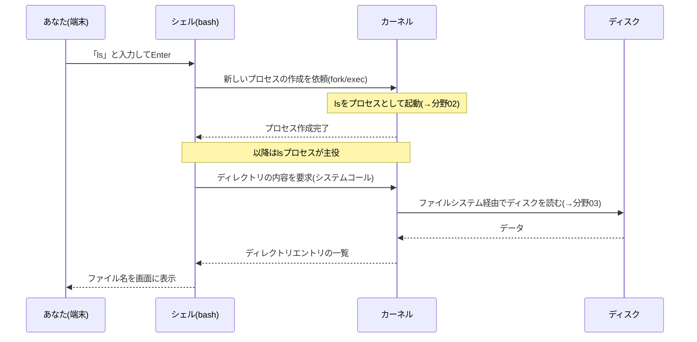

# サーバー/OS/カーネルとは何か — 全体像

## 概要

この章では、「サーバーとは何か」「OSとカーネルはどう違うのか」「Linuxマシンの中では
何が動いているのか」という、本書全体の土台になる見取り図を作ります。前提知識は
基本的なコマンド(`ls` / `cd` など)が打てることだけです。以降のすべての章は、
この章で導入する語彙(カーネル、システムコール、ユーザー空間など)の上に積み上がります。

## 導入 — そもそもサーバーとは何か

### 「サーバー」はハードウェアの名前ではなく「役割」の名前

Webサイトを見るとき、あなたの手元のブラウザは、どこか別のコンピュータに
「このページをください」と依頼し、そのコンピュータが応答を返しています。
このように**他のコンピュータ(やプログラム)からの依頼を受けて、何らかの
サービスを提供する側**をサーバー(server = 給仕する者)と呼び、依頼する側を
クライアント(client = 客)と呼びます。

重要なのは、サーバーとは特定の機械の種類ではなく**役割**だということです。
データセンターに並ぶラック型の専用機もサーバーですし、手元のノートPCで
Webサーバープログラムを起動すれば、その瞬間からノートPCもサーバーです。
ただし実務では、24時間365日動き続けることを求められるため、壊れにくい部品や
冗長化された電源を備えた「サーバー用途向けのハードウェア」が使われることが
多い、という関係です。

### なぜサーバーの学習 = Linuxの学習なのか

世界のサーバーの大半はLinuxで動いています。Webサーバー、クラウド基盤
(AWS/GCP/Azureの内部)、スマートフォン(AndroidはLinuxカーネルを使用)、
スーパーコンピュータのほぼ全数がLinuxです。理由は後の章で仕組みとともに
見えてきますが、大づかみには「ソースコードが公開されていて誰でも検証・改変
できる」「サーバー用途に必要な機能(多数の処理の同時実行、リモート管理、
自動化)が成熟している」ことが挙げられます。本書がLinuxを対象にするのは
このためです。

### デスクトップとの一番の違い: 画面がないのが普通

初学者が最初に戸惑うのは、サーバーには通常**グラフィカルな画面(GUI)がない**
ことです。サーバーは人間が座って操作する機械ではなく、ネットワーク越しに
依頼を処理し続ける機械なので、画面描画は資源の無駄になります。管理者は
ネットワーク越しに文字だけの操作環境(シェル。この章の後半と次章で説明します)へ
接続して操作します。あなたがすでに使える `ls` や `cd` は、まさにこの
「文字だけの操作環境」の道具です。

## 理論 — OSとカーネルの役割分担

### OSは「資源の管理人」であり「抽象化の提供者」

コンピュータの実体は、CPU・メモリ・ディスク・ネットワークカード(NIC)という
ハードウェアの集まりです。もしOSがなければ、プログラムを書く人は「このディスクの
何番目の区画に磁気的にデータを書く」といったハードウェアの生の操作を全部自分で
書かなければならず、しかも複数のプログラムを同時に動かせば互いのメモリを壊し合います。

OS(オペレーティングシステム)の役割は、この問題を2つの機能で解決することです。

1. **資源管理(resource management)**: CPU時間・メモリ・ディスク・ネットワークを
   複数のプログラムに公平かつ安全に配分する。プログラムAのメモリをプログラムBが
   勝手に読めないよう隔離するのもこの仕事です
2. **抽象化(abstraction)**: ハードウェアの生の姿を隠し、扱いやすい概念に
   置き換えて見せる。「ディスクの磁気区画」ではなく「ファイル」、「CPUの実行時間の
   切れ端」ではなく「プロセス」、「NICの電気信号」ではなく「ソケット」として
   見せてくれるので、プログラムは簡潔に書けます

本書全体は、この「OSが提供する抽象化(プロセス、ファイル、ソケット…)が、
実際にはどんな仕組みで実現されているのか」を一枚ずつめくっていく本だと
言えます。

### カーネルとユーザーランド — 「OS」という言葉の2つの意味

日常語の「OS」は曖昧で、文脈により2つの意味で使われます。

- **狭義のOS = カーネル(kernel)**: 資源管理と抽象化を実際に行っている
  中核プログラム。Linuxという名前は、厳密にはこのカーネルの名前です
  (Linus Torvalds氏が開発を始めたことに由来)
- **広義のOS = カーネル + ユーザーランド(userland)**: カーネルの上で動く
  周辺プログラム群(シェル、`ls` などのコマンド、各種ライブラリ、サービス管理の
  仕組み)まで含めた全体

UbuntuやDebian、RHELといった**ディストリビューション(distribution)**は、
Linuxカーネルに、選定したユーザーランドのプログラム群と管理ツールを組み合わせて
「すぐ使えるOS一式」として配布(distribute)しているものです。だから
「Ubuntuのバージョン」と「Linuxカーネルのバージョン」は別物です(実行例で
確認します)。

### カーネル空間とユーザー空間 — 権限の壁

カーネルとそれ以外のプログラムの区別は、単なる分類ではなく、**CPUのハードウェア
機能によって強制される権限の壁**です。

CPUには特権レベル(x86-64では ring 0〜3 などと呼ばれる動作モード)があり、

- **カーネル空間(kernel space)**: カーネルは最高特権(カーネルモード)で動き、
  すべてのメモリとハードウェアに触れる
- **ユーザー空間(user space)**: 通常のプログラムは非特権(ユーザーモード)で
  動き、自分に割り当てられたメモリにしか触れない。ハードウェアの直接操作も
  禁止される

ユーザー空間のプログラムがファイルを読むなどハードウェアが絡む操作をしたい
ときは、**システムコール(system call)**という正規の窓口を通じてカーネルに
依頼します。「プログラムがファイルを読む」の実体は「プログラムがカーネルに
`read` というシステムコールで依頼し、カーネルが代わりにディスクを操作して
結果を渡す」です。この境界の詳細(CPUのモード切り替えの仕組み)は
`02_process_kernel/02_syscall_context_switch.md` で扱います。

なぜこんな面倒な壁があるのでしょうか。答えは**保護**です。どんなプログラムにも
バグや悪意がありえます。壁がなければ、1つのプログラムの暴走がマシン全体を
道連れにします。壁があれば、暴走したプログラムをカーネルが強制終了させて
マシン全体は生き残れます。POSIX(IEEE Std 1003.1)が規定しているのも、まさに
このシステムコールを中心とした「ユーザー空間から見たOSの窓口」のインタフェース
仕様です。

### カーネルの主な責務 — 本書の分野構成との対応

Linuxカーネルが担う仕事は、大きく次のサブシステムに分かれます。これは
そのまま本書の分野02〜05の構成に対応しています。

| カーネルのサブシステム | 仕事 | 本書の分野 |
|---|---|---|
| プロセス管理・スケジューラ | プログラムの実行単位を作り、CPU時間を配分する | 02 |
| メモリ管理 | 各プロセスに隔離されたメモリ空間を見せる | 02 |
| ファイルシステム(VFS) | ディスク上のデータを「ファイル」として見せる | 03 |
| ネットワークスタック | NICの通信を「ソケット」として見せる | 04 |
| デバイスドライバ | 多種多様なハードウェアの差異を吸収する | (各分野内で随時) |
| 隔離機構(cgroups/namespaces) | 資源配分と名前空間をグループ単位で仕切る | 05 |

## 内部動作の詳細 — Linuxマシンの中の全体像

### 層構造の見取り図

ここまでの登場人物を1枚に描くと次のようになります。この図は本書全体で
繰り返し立ち返る基本の見取り図です。

```
 ユーザー空間
 ┌─────────────────────────────────────────────┐
 │  アプリケーション/コマンド (ls, curl, ...)      │
 │  デーモン (sshd, nginx, ...)                  │
 │  シェル (bash)                                │
 ├─────────────────────────────────────────────┤
 │  標準Cライブラリ (glibc など)                  │
 └───────────────┬─────────────────────────────┘
                 │ システムコール (read, write, fork, ...)
 ════════════════╪═══════════════ ← CPUの特権レベルの壁
 カーネル空間     ▼
 ┌─────────────────────────────────────────────┐
 │  Linuxカーネル                                │
 │  ┌──────────┐ ┌──────────┐ ┌─────────────┐  │
 │  │プロセス管理│ │メモリ管理 │ │ファイルシステム│  │
 │  │スケジューラ│ │          │ │(VFS)        │  │
 │  └──────────┘ └──────────┘ └─────────────┘  │
 │  ┌──────────────────┐ ┌──────────────────┐  │
 │  │ネットワークスタック │ │デバイスドライバ     │  │
 │  └──────────────────┘ └──────────────────┘  │
 └───────────────┬─────────────────────────────┘
                 │ 割り込み・レジスタ操作
 ────────────────┼─────────────────────────────
 ハードウェア      ▼
 ┌─────────────────────────────────────────────┐
 │  CPU    メモリ    ディスク    NIC             │
 └─────────────────────────────────────────────┘
```

図中の新しい登場人物を2つ説明します。

- **シェル(shell)**: 人間が打ったコマンド文字列を解釈して、プログラムの
  起動をカーネルに依頼する対話用プログラム。カーネル(核)を包む「殻」という
  命名です。詳細は次章で扱います
- **デーモン(daemon)**: 人間と対話せず、背後で動き続けて依頼を待つプログラム。
  SSH接続を受け付ける `sshd`、Webの依頼を受ける `nginx` などがこれです。
  サーバーの本業は実質的にデーモンたちが担っています

また、アプリケーションは通常システムコールを直接発行せず、**標準Cライブラリ
(glibcなど)**が提供する関数(`printf` など)を呼び、その内部で必要な
システムコールが発行されます。この分業もPOSIXの設計に沿ったものです。

### 縦の一往復 — `ls` と打った瞬間に起きること(予告編)

この見取り図が「動く」様子を、`ls` を例に上から下まで一往復してみます。
各段階の詳細はそれぞれ後の章で扱うので、ここでは流れだけつかめば十分です。



1. シェルが入力文字列「ls」を解釈し、`/usr/bin/ls` というプログラムファイルを
   見つける(→次章)
2. シェルはカーネルに「新しいプロセスを作って `ls` を実行してほしい」と
   システムコールで依頼する(→分野02)
3. `ls` プロセスは「このディレクトリの中身を教えてほしい」とシステムコールで
   依頼し、カーネルはファイルシステムを通じてディスクからデータを読む(→分野03)
4. 結果の文字列が端末に書き出される。あなたがSSH越しに操作していれば、この
   出力はネットワークスタックを通ってあなたの手元に届く(→分野04)

たった`ls`一発でも、ユーザー空間とカーネル空間の壁を何十回も往復しています。
本書の分野02〜05は、この一往復の各区間をそれぞれ拡大して見ていく構成です。

### カーネル自身も「プログラム」である

カーネルは魔法の存在ではなく、ディスク上に置かれた1つのプログラムファイルです。
Ubuntuでは `/boot/vmlinuz-<バージョン>` がそれで、電源投入後にブートローダが
これをメモリに読み込んで実行を始めます(起動の流れは
`01_intro/04_package_and_system_layout.md` と分野06で扱います)。

起動後のカーネルは、自分から何かをし続けるというより、**出来事(イベント)に
反応して動く**存在です。反応のきっかけは主に2つあります。

- **システムコール**: ユーザー空間からの依頼
- **割り込み(interrupt)**: ハードウェアからの通知(「ディスクの読み出しが
  終わった」「NICにパケットが届いた」「タイマーが刻んだ」など)

「カーネルは依頼(システムコール)と通知(割り込み)に反応して資源を差配する
番人である」——この一文が本書の背骨です。以降の章は、この番人の仕事ぶりを
分野ごとに精査していきます。

## 実行例 — 見取り図を自分のマシンで確認する

以下はUbuntu Server 26.04 LTS を前提とした確認例です(他のディストリビューション
でもほぼ同様に動きます)。理論で述べた「カーネルとディストリビューションは別物」
「デーモンが動いている」を実際に見てみます。

カーネルのバージョンと、ディストリビューションのバージョンが別物であること:

```console
$ uname -r
7.0.0-19-generic          ← Linuxカーネルのバージョン

$ cat /etc/os-release | head -2
PRETTY_NAME="Ubuntu 26.04 LTS"   ← ディストリビューションのバージョン
NAME="Ubuntu"
```

カーネルの実体がただのファイルであること:

```console
$ ls -lh /boot/vmlinuz-$(uname -r)
-rw------- 1 root root 15M ... /boot/vmlinuz-7.0.0-19-generic
```

いま動いているプログラムの一覧(プロセス。詳細は分野02):

```console
$ ps aux | head -5
USER   PID %CPU %MEM    VSZ   RSS TTY  STAT START TIME COMMAND
root     1  0.0  0.3  22500 13000 ?    Ss   10:00 0:02 /sbin/init
root     2  0.0  0.0      0     0 ?    S    10:00 0:00 [kthreadd]
root     3  0.0  0.0      0     0 ?    I<   10:00 0:00 [rcu_gp]
...
```

`[kthreadd]` のように角括弧で表示されるものは、カーネルが自分の仕事のために
動かしているカーネルスレッドです(分野02で説明)。また `sshd` や `cron` の
ような行が見つかれば、それが導入で述べたデーモンです。

## トラブルシューティング — この段階でつまずきやすい誤解

この章は概念の導入なので、コマンドの失敗よりも「誤解」が詰まりポイントに
なります。よくある3つを挙げます。

- **誤解1: 「OS = デスクトップ画面」**。画面(GUI)はユーザーランドの一部で
  しかなく、サーバーでは通常インストールすらされません。画面がなくてもOSは
  完全に機能します。SSHで文字の操作環境に入れれば、それがサーバーの「顔」です
- **誤解2: 「Ubuntuのアップグレード = カーネルの更新」**。両者は別々に
  バージョンが進みます。`uname -r`(カーネル)と `/etc/os-release`
  (ディストリビューション)を混同すると、不具合調査で参照する情報源を
  間違えます
- **誤解3: 「アプリが落ちた = OSが壊れた」**。ユーザー空間のプログラムの
  異常終了(クラッシュ)は、カーネルの保護機構が正しく働いた結果であり、
  マシン全体は無事です。逆にカーネル自身が続行不能になる事態は
  カーネルパニック(kernel panic)と呼ばれる別格の異常で、マシン全体が
  停止します。この区別は障害対応の第一歩です

## 演習・確認問題

1. 「サーバー」がハードウェアの種類ではなく役割の名前である、とはどういう
   ことか。自分の言葉で説明してください
2. OSの2大機能である「資源管理」と「抽象化」について、それぞれ具体例を
   1つずつ挙げてください
3. ユーザー空間のプログラムは、なぜディスクを直接操作できない設計に
   なっているのでしょうか。「保護」という観点から説明してください
4. `uname -r` と `/etc/os-release` が示すバージョンは、それぞれ何のバージョン
   ですか
5. `cat memo.txt` と打ってから内容が画面に出るまでに、ユーザー空間と
   カーネル空間の間で少なくともどんな依頼(システムコール)が発生するか、
   この章の「縦の一往復」を参考に推測してください

## まとめ

- サーバーとは「依頼を受けてサービスを提供する役割」であり、その大半はLinuxで
  動いている
- OSの本質は資源管理と抽象化。その中核がカーネルで、シェルやコマンド群などの
  ユーザーランドと合わせてディストリビューションとして配布される
- カーネル空間とユーザー空間はCPUの特権レベルで隔てられ、正規の窓口である
  システムコールを通じてのみ依頼できる。この壁がシステム全体を保護している
- カーネルは「依頼(システムコール)と通知(割り込み)に反応して資源を差配する
  番人」。本書はこの番人の仕組みを分野ごとに拡大して見ていく
