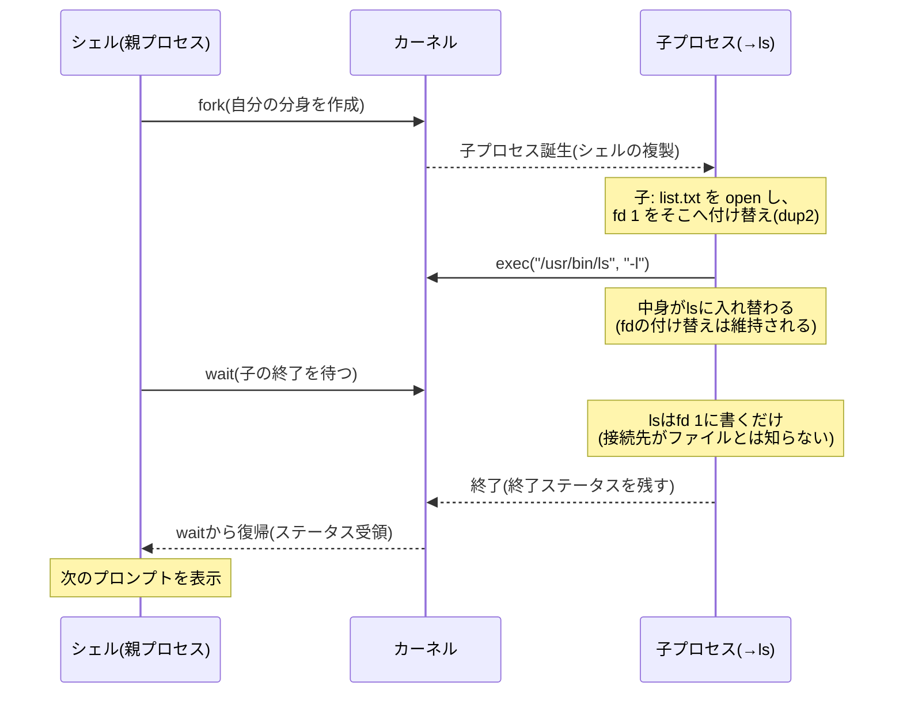

# シェルとコマンドの仕組み — 標準入出力とパイプ

## 概要

この章では、あなたが毎日打っている `ls` や `cat` が「誰に読まれ、どう実行されて
いるのか」を解き明かします。前提知識は前章(`01_server_os_kernel_overview.md`)の
見取り図——カーネル/ユーザー空間の区別と、システムコールという窓口——だけです。
この章を読み終えると、コマンドラインの挙動(`*` の展開、`>` や `|` の動き、
「command not found」の原因)を仕組みから説明できるようになります。

## 導入 — そもそもシェルは何のためにあるか

### カーネルは日本語も英語も解さない

前章で見たとおり、カーネルへの依頼はシステムコールという形式でしか行えません。
システムコールは「`fork` を呼ぶ」「`read` をファイルディスクリプタ3番に対して
呼ぶ」といった、プログラムどうしの取り決めであって、人間が直接打ち込めるもの
ではありません。

そこで、**人間が打った文字列を解釈して、適切なシステムコールの列に翻訳する
通訳プログラム**が必要になります。それがシェル(shell)です。あなたが
`ls -l /home` と打つと、シェルはこの文字列を分解し、「`/usr/bin/ls` という
プログラムを、引数 `-l` と `/home` を渡して、新しいプロセスとして起動して
ほしい」という依頼をカーネルに出します。シェル自身はファイル一覧を作りません。
**シェルの本業は、プログラムを起動する段取りを整えること**です。

### 端末とシェルは別物

もう一つ、混同しやすい登場人物を整理しておきます。

- **端末(ターミナル、terminal)**: 文字の入出力を担う「画面と鍵盤」の側。
  かつては物理的な専用機器(タイプライタ型の端末)でしたが、現在はそれを
  ソフトウェアで再現した**ターミナルエミュレータ**(GNOME Terminal、
  macOSのTerminal.app、Windows Terminalなど)や、SSH接続がその役割を担います
- **シェル(shell)**: 端末から受け取った文字列を解釈する側のプログラム
  (bash、zshなど)

つまり「黒い画面」は端末で、その中で応答しているのがシェルです。SSHでサーバーに
入るとは、「ネットワーク越しに端末を接続し、サーバー側でシェルを起動してもらう」
ことに他なりません(SSHの仕組みは `07_operations_security/02_ssh_remote_access.md`
で扱います)。

シェルにはbash、zsh、dashなど複数の実装がありますが、その基本文法と挙動は
**POSIX(IEEE Std 1003.1)の Shell Command Language** として仕様化されています。
本書の実行例はUbuntu Server 26.04 LTSの既定ログインシェルであるbashを使いますが、
この章で説明する仕組みはPOSIX準拠シェルに共通です。

## 理論 — シェルの一巡り: 読む・解釈する・起動する・待つ

シェルの動作は、突き詰めると次の4段階の無限ループです。

1. **読む(Read)**: プロンプト(`$` など入力待ちの印)を表示し、1行読み取る
2. **解釈する(Parse & Expand)**: 文字列を単語に分割し、変数やワイルドカードを
   展開して、「起動すべきプログラムと引数の列」を確定する
3. **起動する(Execute)**: カーネルに新しいプロセスの作成と、プログラムの
   実行を依頼する
4. **待つ(Wait)**: 起動したプログラムが終わるのを待ち、終わったら1に戻る

この一巡りを頭に置いた上で、各段階を順に見ていきます。

### 解釈(1) — 単語分割と展開: コマンドが起動される「前」にすべてが決まる

シェルは受け取った1行を、まず空白で単語に区切ります。先頭の単語がコマンド名、
残りが引数です。ただしその前に、シェルはいくつかの**展開(expansion)**を
行います。代表的なものは次の2つです。

- **変数展開**: `$HOME` のような表記を、その変数の値(`/home/megane` など)に
  置き換える
- **グロブ(glob)展開**: `*.txt` のようなワイルドカードを、それに一致する
  実在のファイル名の並び(`a.txt b.txt` など)に置き換える。パス名展開とも
  呼ばれます

ここで極めて重要な原則があります。**展開を行うのはシェルであって、起動される
コマンドではない**ということです。`rm *.txt` と打ったとき、`rm` プログラムは
`*.txt` という文字列を一度も見ません。シェルが先に `a.txt b.txt` へ展開し、
`rm` には展開後の引数が渡ります。POSIXのShell Command Languageは、この展開の
種類と適用順序(パラメータ展開→フィールド分割→パス名展開など)を規定して
います。この原則を知らないと、後述のトラブルシューティングで見るような
不可解な挙動に説明がつきません。

### 解釈(2) — コマンドの探し方: PATHとビルトイン

展開が終わると、シェルは先頭の単語(コマンド名)の正体を判定します。
判定は概ね次の順で行われます。

1. **ビルトインコマンド(builtin)か?** — `cd`、`echo`、`export` などは
   シェル自身に組み込まれた機能で、外部のプログラムを起動せずシェルが自分で
   処理します
2. **外部コマンドか?** — それ以外は、**環境変数 `PATH`** に列挙された
   ディレクトリ(`/usr/local/bin:/usr/bin:/bin` のようにコロン区切り)を
   先頭から順に探し、最初に見つかった実行ファイルを起動します

環境変数(environment variable)とは、プロセスに付随して子プロセスへ引き継がれる
「名前=値」の設定情報です(引き継ぎの仕組みは分野02で扱います)。`PATH` はその
一つで、「コマンド名だけ打たれたときにどこを探すか」の探索リストです。
`ls` と打って `/usr/bin/ls` が動くのは、`PATH` に `/usr/bin` が含まれているから、
それだけの理由です。

なぜ `cd` はビルトインでなければならないのでしょうか。これは次節の「起動する」の
仕組みを知ると必然だと分かるので、そこで種明かしします。

### 起動と待機 — fork・exec・wait という3つの依頼

シェルが外部コマンドを起動するとき、カーネルに出す依頼(システムコール)は
決まった3点セットです。

- **fork**: 「自分(シェル)の分身となる新しいプロセスを作ってほしい」。
  複製された子プロセスが誕生します
- **exec**: 子プロセス側で「自分の中身を `/usr/bin/ls` というプログラムに
  入れ替えてほしい」。分身がlsに変身します
- **wait**: 親であるシェル側で「子が終了するまで待たせてほしい」。子の終了を
  見届けてから、次のプロンプトを出します

「なぜ作成と変身が別々の依頼なのか」という設計上の理由と内部動作は分野02
(`02_process_kernel/01_process_thread_basics.md`)の主題なので深入りしませんが、
この章の範囲でも1つ、この分離の恩恵を先取りできます。**リダイレクトの準備は、
forkの後・execの前という「隙間」で行われる**のです(内部動作の詳細で見ます)。

ここで `cd` の種明かしができます。カレントディレクトリ(現在いる場所)は
**プロセスごとに**カーネルが管理する属性です。もし `cd` が外部コマンドだったら、
forkで作られた**子プロセスの**カレントディレクトリが変わるだけで、子が終了すれば
それも消え、親であるシェルは元の場所に居座ったままです。シェル自身の場所を
変えるには、シェル自身が処理する(=ビルトインである)しかありません。

### 標準入出力 — すべてのコマンドが持つ3本の口

コマンドの多くは「何かを読み、何かを書き出す」プログラムです。POSIXは、
プロセスが起動された時点で次の3つの入出力経路が開かれていることを規定しています。

| 名前 | 番号 | 既定の接続先 | 用途 |
|---|---|---|---|
| 標準入力(stdin) | 0 | 端末(キーボード) | データの入り口 |
| 標準出力(stdout) | 1 | 端末(画面) | 正常な結果の出口 |
| 標準エラー出力(stderr) | 2 | 端末(画面) | エラー・診断の出口 |

番号の正体は**ファイルディスクリプタ(file descriptor、fd)**です。ファイル
ディスクリプタとは、プロセスが開いている入出力経路(ファイル、端末、後述の
パイプなど)をカーネルが番号札で管理したもので、プロセスは「3番に書いて」の
ように番号で読み書きを依頼します。0・1・2はその予約席です。

出口が2本(stdout/stderr)ある理由は、**結果とエラーを別の宛先に振り分けられる
ようにするため**です。結果だけをファイルに保存し、エラーは画面で見る——という
使い分けは、出口が1本では実現できません。

### リダイレクトとパイプ — 口の付け替え

3本の口は、既定では端末につながっていますが、シェルはこれを付け替えられます。

- **リダイレクト(redirect)**: `ls > list.txt` は、lsの標準出力(1番)の
  接続先を端末からファイル `list.txt` に付け替えます。`< file` は標準入力を、
  `2> file` は標準エラー出力を付け替えます
- **パイプ(pipe)**: `ls | wc -l` は、lsの標準出力を、wcの標準入力に直結します。
  中継ぎとなるのは、カーネルが用意するメモリ上のバッファです

この設計の思想は「各コマンドは自分の口が**どこにつながっているかを知らなくても
よい**」という点にあります。lsは相手が端末でもファイルでもパイプでも、ただ
1番に書くだけです。だからこそ、小さなコマンドを自由に組み合わせて大きな仕事を
組み立てられます。これはUNIXの設計哲学(1つのことをうまくやる小さな道具を、
パイプでつなぐ)の技術的な土台です。

## 内部動作の詳細

### シェルの一巡りを図で追う

外部コマンド `ls -l > list.txt` を実行したときの全体像です。



注目すべきは、リダイレクトの処理が行われるタイミングです。forkの直後、
execの直前——つまり**子プロセスがまだシェル(の分身)であるうちに**、子が
自分自身のfd 1をファイルへ付け替えます。その後にexecでlsに変身すると、
開いているファイルディスクリプタは**execをまたいで引き継がれる**ため、
lsは生まれつき「1番=list.txt」という状態で動き始めます。lsのコード側に
リダイレクト対応が一切不要なのはこのためです。fork/execが分離しているから
こそ、この隙間に親へ影響を与えない準備作業を差し込めるわけです。

なお、`> list.txt` という文字列はこの時点までにシェルが取り除いており、
lsに渡る引数は `-l` だけです。展開と同じく、**リダイレクト記号を解釈するのは
シェルであってコマンドではありません**。

### ファイルディスクリプタテーブル — 番号札の実体

カーネルはプロセスごとに、開いている入出力経路の対応表(ファイルディスクリプタ
テーブル)を持っています。`ls > list.txt` 実行中のlsプロセスの表は
こうなっています。

```
  lsプロセスのfdテーブル              カーネルが管理する実体
 ┌─────┬──────────────┐
 │ fd 0 │ ──────────────┼──→ 端末(キーボード)
 │ fd 1 │ ──────────────┼──→ ファイル list.txt   ← 付け替え済み
 │ fd 2 │ ──────────────┼──→ 端末(画面)
 └─────┴──────────────┘
```

`2>&1`(標準エラー出力を標準出力と同じ場所へ)という記法は、この表の
「fd 2の矢印を、fd 1の矢印と同じ実体に向ける」操作です。表の操作である
ことが分かると、記述順序の意味も見えてきます。

```console
$ cmd > log.txt 2>&1    # fd1→log.txt にした後、fd2をfd1と同じ実体へ(両方ファイルに入る)
$ cmd 2>&1 > log.txt    # fd2を「この時点のfd1=端末」に向けた後、fd1だけファイルへ
                        # (エラーは画面に出続ける)
```

シェルはリダイレクト指定を左から右へ順に表へ適用するため、この2つは結果が
異なります。丸暗記ではなく「矢印の付け替えの順序」として理解してください。

### パイプ — カーネル内のバッファと2つのプロセス

`ls | wc -l` をシェルが実行するときの手順です。

1. シェルがカーネルにパイプの作成を依頼する(`pipe` システムコール)。
   カーネル内にバッファが確保され、「書き込み口」と「読み出し口」の
   2つのファイルディスクリプタが返る
2. シェルは**2回**forkし、ls用とwc用の子プロセスを作る
3. ls側の子はfd 1(標準出力)をパイプの書き込み口へ、wc側の子はfd 0
   (標準入力)をパイプの読み出し口へ付け替えて、それぞれexecする

```
 lsプロセス                カーネル空間                wcプロセス
 ┌────────┐          ┌────────────────┐          ┌────────┐
 │  fd 1 ──┼──書き込み→│ パイプのバッファ  │→読み出し──┼── fd 0  │
 └────────┘          │ (既定 64 KiB)   │          └────────┘
                      └────────────────┘
```

押さえるべき性質が2つあります。

- **2つのプロセスは同時に走る**: 「lsが全部終わってからwcが始まる」のでは
  ありません。lsが書きながら、wcが並行して読みます
- **バッファが満杯なら書き手は待たされる**: パイプのバッファ容量は有限です
  (`man 7 pipe` によれば、Linuxでは既定64 KiB)。満杯のときlsが書こうとすると、
  カーネルはlsを眠らせ、wcが読んで空きができたら起こします。逆に空のとき
  wcが読もうとすれば、wcが眠ります。この**流量制御をカーネルが自動で行う**ため、
  巨大なデータを流してもメモリがあふれることはありません

つまりパイプとは「カーネルが仲介する、流量制御付きのプロセス間データ通路」です。
これはプロセス間通信(IPC)の一形態であり、その仲間たち(シグナル、共有メモリ等)
は `02_process_kernel/05_signals_ipc.md` で体系的に扱います。

### 終了ステータス — コマンドの「返事」

waitでシェルが受け取るのは「子が終わった」という事実だけではありません。
子プロセスは終了時に**終了ステータス(exit status)**という0〜255の数値を残します。
POSIXの慣例で、**0が成功、0以外が失敗**(値の意味はコマンドごとに定義)です。
シェルは直前のコマンドの終了ステータスを `$?` という特殊変数で参照でき、
`cmd1 && cmd2`(成功したときだけ次を実行)や `cmd1 || cmd2`(失敗したときだけ
次を実行)という制御は、この値の判定に基づいています。後の章で扱うシェル
スクリプトによる自動化や、systemdによるサービスの成否判定(分野06)も、
この終了ステータスの仕組みの上に成り立っています。

## 実行例 — 仕組みを自分のマシンで確認する

前提はUbuntu Server 26.04 LTS(bash)です。

コマンドの正体(ビルトインか外部か)を判定する:

```console
$ type cd
cd is a shell builtin          ← シェル自身が処理する

$ type ls
ls is /usr/bin/ls              ← PATHから見つかった外部プログラム

$ echo $PATH
/usr/local/sbin:/usr/local/bin:/usr/sbin:/usr/bin:/sbin:/bin
```

展開をコマンドが受け取る「前」に観察する(`echo` は受け取った引数をそのまま
表示するだけなので、シェルが何を渡したかが見える):

```console
$ echo *.txt
a.txt b.txt                    ← シェルが展開済みの引数を渡している

$ echo '*.txt'
*.txt                          ← クォートすると展開が抑止され、文字列のまま渡る
```

自分の3本の口(fd 0/1/2)がどこにつながっているかを見る(`/proc` はカーネルが
プロセスの内部情報を見せてくれる特殊なファイル階層。次章と分野02で詳述):

```console
$ ls -l /proc/self/fd/
lrwx------ 1 megane megane 64 ... 0 -> /dev/pts/0    ← 標準入力: 端末
lrwx------ 1 megane megane 64 ... 1 -> /dev/pts/0    ← 標準出力: 端末
lrwx------ 1 megane megane 64 ... 2 -> /dev/pts/0    ← 標準エラー出力: 端末

$ ls -l /proc/self/fd/ > /tmp/fd.txt; cat /tmp/fd.txt
... 0 -> /dev/pts/0
... 1 -> /tmp/fd.txt           ← リダイレクトでfd 1の接続先が変わった
... 2 -> /dev/pts/0
```

パイプの2プロセスが同時に走っていることを示す例(`sleep` を混ぜて観察):

```console
$ ls | wc -l &
$ ps -o pid,stat,cmd | grep -E 'ls|wc'
  1234 S    ls
  1235 S    wc -l              ← 両方が同時にプロセスとして存在する
```

## トラブルシューティング — 仕組みが分かると原因が見える詰まりポイント

- **「command not found」**: シェルがビルトインにもPATH上にも該当を見つけられ
  なかった、という意味です。原因は(1) タイプミス、(2) 未インストール、
  (3) 置き場所がPATHに含まれていない、の3択に絞れます。`echo $PATH` と
  `type <コマンド名>` が一次調査の道具です。カレントディレクトリの実行ファイルを
  `./program` と打つ必要があるのも、`.`(現在地)が既定のPATHに含まれていない
  (セキュリティ上の慣例)からです
- **スクリプトの中で `cd` したのに、実行後も元の場所にいる**: スクリプトは
  子プロセス(別のシェル)で実行されるため、カレントディレクトリの変更は
  子と一緒に消えます。理論で見た「`cd` がビルトインでなければならない理由」と
  同じ原理です。現在のシェル自身に実行させたい場合は `source script.sh`
  (または `. script.sh`)を使います
- **`sudo echo x > /etc/protected.conf` が Permission denied になる**:
  リダイレクトを処理するのはシェルであり、この行では**sudoで権限が上がる前に**、
  一般権限のシェルがファイルを開こうとして失敗しています。sudoが効くのは
  起動されるコマンド(echo)だけで、`>` はその外側です
- **引数が多すぎる/意図しないファイルを巻き込む**: `rm *` などの事故は、
  グロブ展開が「シェルによって・実行前に・実在ファイル名へ」行われることを
  忘れたときに起きます。展開結果を事前に確認したければ、まず `echo *` で
  シェルが何に展開するかを見るのが安全です。逆に `find . -name *.txt` が
  誤動作するのは、find に渡る前にシェルが展開してしまうからで、
  `find . -name '*.txt'` とクォートして「文字列のまま」渡す必要があります

## 演習・確認問題

1. 端末(ターミナル)とシェルの役割の違いを、自分の言葉で説明してください
2. `cd` がビルトインコマンドでなければならない理由を、fork/exec の仕組みから
   説明してください
3. `ls > list.txt` を実行したとき、(a) `>` という記号を解釈するのは誰か、
   (b) fd 1 の付け替えはfork/execのどのタイミングで行われるか、を答えてください
4. `cmd > log.txt 2>&1` と `cmd 2>&1 > log.txt` の結果の違いを、ファイル
   ディスクリプタテーブルの「矢印の付け替え」として説明してください
5. `cat 巨大ファイル | head -1` は、巨大ファイルを最後まで読み終わる前に結果が
   返ることがあります。パイプのどんな性質によるものか説明してください
   (ヒント: 2つのプロセスはいつ動き始めるか)

## まとめ

- シェルは「読む→解釈(展開)→起動(fork/exec)→待つ(wait)」を繰り返す
  通訳プログラムであり、その挙動はPOSIX(IEEE Std 1003.1)のShell Command
  Languageに仕様化されている
- 変数・グロブの展開、PATH探索、リダイレクト記号の解釈はすべて「コマンド起動前に
  シェルが」行う。コマンドは展開後の引数しか見ない
- 全プロセスは標準入力(0)・標準出力(1)・標準エラー出力(2)の3本の口を持ち、
  実体はファイルディスクリプタ。リダイレクトはその接続先の付け替えで、fork後・
  exec前の隙間に行われる
- パイプはカーネル内のバッファを介したプロセス間のデータ通路で、両側のプロセスは
  同時に走り、流量制御はカーネルが行う
- コマンドは終了ステータス(0=成功)を返し、シェルの `&&`/`||` や後の章の
  サービス管理はこの値に基づいて動く
