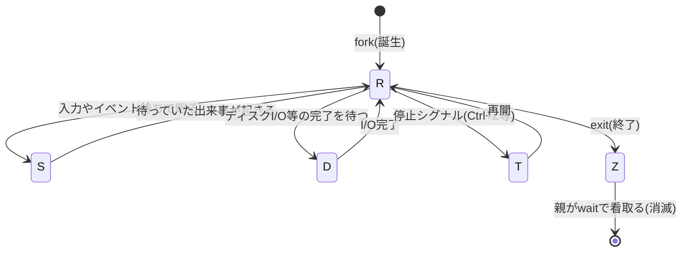

# プロセスとスレッドの基本 — fork・exec と task_struct

## 概要

この章では、これまで「動いているプログラム」と呼んできたものの正体——**プロセス**——を
正式に定義し、カーネルがそれをどう台帳(task_struct)で管理し、fork/exec という
2段階でどう生み出すのかを解き明かします。前提知識は分野01の内容(カーネル/
ユーザー空間の区別、システムコール、ファイルディスクリプタ、シェルの fork/exec/wait
の3点セット)です。基準環境は Linux 7.0 / Ubuntu Server 26.04 LTS です。

## 導入 — そもそもプロセスとは何か

### プログラムとプロセスは別物

`/usr/bin/bash` というファイルは、ディスクに置かれた命令の並び——いわば
**レシピ**です。それ自体は何もしません。一方、あなたがログインしたときに動いている
bash は、レシピをもとに実際に進行中の**調理**です。この「実行中のプログラム」を
**プロセス(process)**と呼びます。

レシピと調理を区別すると、当たり前だが重要な事実が見えてきます。

- **1つのプログラムから、複数のプロセスを同時に作れる**。10人がログインすれば
  bash のプロセスは10個でき、それぞれが別のカレントディレクトリ、別の変数を持つ
- **プロセスにはレシピにない「進行状態」がある**。いまどの命令まで実行したか、
  メモリに何を覚えているか、どのファイルを開いているか——これらは実行のたびに異なる

では、この「進行状態」を誰が覚えているのでしょうか。プログラム自身ではありません。
プログラムはCPUを他のプロセスに明け渡している間(前章までに見たとおり、CPUの数より
プロセスの数のほうがずっと多いので、明け渡しは常に起きています)、自分では何も
できないからです。答えは**カーネル**です。分野01で導入した比喩——「カーネルは依頼
(システムコール)と通知(割り込み)に反応して資源を差配する番人」——を思い出して
ください。番人が資源を配る相手の単位、それがプロセスです。

### プロセスは「隔離された実行環境」でもある

プロセスという単位が必要な理由は、もう1つあります。**互いを壊させないため**です。

サーバーでは sshd、nginx、データベースなど多数のプログラムが同居します。もし
全プログラムが1つのメモリ空間を共有していたら、1つの欠陥(暴走したポインタ)が
無関係なプログラムのデータを破壊し、原因究明は絶望的になります。そこでカーネルは
プロセスごとに**専用のメモリの眺め(アドレス空間)**を与え、他のプロセスの
メモリは見えも触れもしないようにしています(この仕組みの実体である仮想メモリは
`02_process_kernel/03_virtual_memory.md` で扱います)。

つまりプロセスとは、カーネルから見た**資源配分と隔離の基本単位**です。
CPU時間を割り当てる相手も、メモリを配る相手も、「このファイルを開いてよいか」を
UID/GID で検査する相手も、終了ステータスを残して死ぬのも、すべてプロセスです。

## 理論

### プロセス = プログラム + カーネルが管理する資源一式

POSIX(IEEE Std 1003.1)はプロセスを「アドレス空間と、その中で実行される
スレッド群、およびそれらに必要なシステム資源」と定義しています。分野01で
登場した概念を集めると、1つのプロセスに付随する資源の内訳が見えてきます。

| 資源 | 内容 | 初出章 |
|---|---|---|
| アドレス空間 | プログラム本体・データ・スタックが載る専用のメモリの眺め | 本章(詳細は仮想メモリ章) |
| ファイルディスクリプタテーブル | 開いている入出力経路の番号札の表 | `01_intro/02` |
| 身分(credentials) | UID/GID。パーミッション検査に使われる | `01_intro/03` |
| カレントディレクトリ | 相対パスの起点。`cd` がビルトインである理由の張本人 | `01_intro/02` |
| umask | 新規ファイルから削る許可ビット | `01_intro/03` |
| 環境変数 | `PATH` など、子へ引き継がれる名前=値 | `01_intro/02` |
| PID・親子関係 | プロセス番号と、誰が生んだかの系譜 | 本章 |
| 終了ステータス | 死後に親へ残す0〜255の数値 | `01_intro/02` |

**PID(Process ID)**はカーネルがプロセスを識別する番号です。UIDがユーザーの
番号だったのと同じ発想で、カーネルの内部ではプロセスは常にこの番号で扱われます。
起動の最終段階でカーネルが立ち上げる最初のプロセスが PID 1(分野01で見た
systemd)で、以後のプロセスはすべて既存のプロセスの複製として生まれるため、
**全プロセスは PID 1 を祖先とする1本の家系図(プロセスツリー)**をなします。

### PCB — プロセス1つにつき管理台帳1つ

ファイルの章で「ファイル1つにつき inode という管理台帳が1つある」と学びました。
まったく同じ構図がプロセスにもあります。カーネルはプロセス1つにつき1個の
管理台帳を持ち、上の表の資源(への参照)と進行状態をすべてそこに記録します。
OSの教科書ではこれを **PCB(Process Control Block、プロセス制御ブロック)**と
呼び、Linuxカーネルでの実体は **`task_struct`** という構造体です
(カーネルソースの `include/linux/sched.h` で定義されています)。

「プロセスがCPUを明け渡している間、進行状態を誰が覚えているのか」の答えが
これです。カーネルは実行を中断するプロセスのCPUレジスタ等を task_struct(と
それに付随する領域)へ退避し、再開時にそこから復元します(この切り替え——
コンテキストスイッチ——は次章 `02_syscall_context_switch.md` の主題です)。

### プロセスの一生 — 状態遷移

プロセスは誕生から消滅まで、いくつかの状態を行き来します。`ps` の STAT 欄に
表示される主要な状態は次のとおりです(`man 1 ps` の PROCESS STATE CODES)。



- **R(Running / Runnable)**: 実行中、または実行可能でCPUの順番待ち。
  どのRを次に走らせるかを決めるのがスケジューラです(`04_scheduler.md`)
- **S(Interruptible Sleep)**: 出来事を待って眠っている。端末の入力を待つシェル、
  接続を待つデーモンなど、システムのプロセスの大半は普段この状態です
- **D(Uninterruptible Sleep)**: ディスクI/Oなど、中断できない処理の完了待ち。
  後述のトラブルシューティングで重要になります
- **T(Stopped)**: シグナルにより一時停止中(シグナルは `05_signals_ipc.md` で扱います)
- **Z(Zombie)**: 終了済みだが、親がまだ終了ステータスを受け取っていない。
  詳細は内部動作の節で見ます

重要なのは、**眠る・起きるの管理はすべてカーネルの仕事**だという点です。
シェルの章で見た「パイプが満杯なら書き手は眠らされる」は、まさに R→S の遷移
でした。プロセスは「〜が起きるまで眠らせてほしい」とカーネルに依頼して眠り、
番人であるカーネルが割り込み(通知)を受けて起こします。

### fork と exec — なぜ「複製」と「変身」に分かれているのか

新しいプロセスを作るシステムコールについて、POSIX(IEEE Std 1003.1)の設計は
一見遠回りです。「このプログラムを新しいプロセスとして起動せよ」という1発の
依頼は存在せず、必ず2段階を踏みます。

1. **fork** — 呼び出したプロセスの**複製**を作る。複製された子は、親と同じ
   プログラムの同じ場所から実行を続ける(`man 2 fork`)
2. **exec** — 自分自身の中身を、指定したプログラムに**入れ替える**。プロセス
   そのもの(PID、開いているfd等)は同じまま、実行するレシピだけが変わる
   (システムコールの実体は `execve`。`man 2 execve`)

なぜ分かれているのでしょうか。シェルの章で先取りした答えがここで本領を発揮します。
**fork と exec の「隙間」は、子プロセスが自分自身を準備できる時間**だからです。
リダイレクト(fd の付け替え)はその代表例でした。他にも、環境変数の変更、
カレントディレクトリの移動、UID の変更(特権を落として動くデーモン)、後の分野で
扱う名前空間への参加(コンテナ)——「新しいプログラムをどんな環境で動かすか」の
準備がすべて、**通常のシステムコールを隙間で呼ぶだけ**で実現できます。

もし「1発で起動」の設計だったら、この無数の準備オプションをすべてそのシステム
コールの引数として渡せるようにする必要があり、窓口は際限なく複雑化します。
実際、POSIX にも後年 `posix_spawn` という1発型が追加されましたが、その仕様の
大部分は「fork/exec の隙間でできたことを引数でどう指定するか」に費やされて
います。複製と変身の分離は、単純な部品の組み合わせで多様な要求に応える
UNIX の設計哲学の、プロセス版と言えます。

なお、fork の直後にほぼ必ず exec で中身を捨てるのなら「複製を丸ごと作るのは
無駄では?」という疑問が湧きます。そのとおりで、この無駄を消す仕掛けが
コピーオンライト(内部動作の節で扱います)です。

### スレッド — 1つのプロセスの中の複数の実行の流れ

ここまでプロセスを「実行の単位」のように語ってきましたが、正確には実行の流れ
(いまどの命令を実行しているか、の系列)はプロセスから分離できます。これを
**スレッド(thread)**と呼びます。POSIX の定義では、プロセスは「1個以上の
スレッドを収める容れ物」であり、ここまで見てきた「普通のプロセス」は
スレッドを1本だけ持つ特別な場合です。

1つのプロセスに複数のスレッドを走らせると(マルチスレッド)、それらは
**同じアドレス空間・同じfdテーブル・同じ身分を共有**しながら、**実行位置と
スタック(関数呼び出しの作業領域)だけを各自で持ち**ます。POSIX はこの
スレッドのAPIを pthreads(POSIX threads)として規定しています(`man 7 pthreads`)。

| | プロセスを分ける | スレッドを分ける |
|---|---|---|
| メモリ | 別々(隔離) | 共有 |
| fdテーブル | 複製(以後は別) | 共有 |
| データの受け渡し | IPC(パイプ等)が必要 | メモリを直接読み書き |
| 片方の暴走 | 他方は無傷 | プロセスごと巻き添え |
| 典型用途 | 隔離したい仕事 | 密に協調する並行処理 |

要するにスレッドは**隔離を捨てて共有を取る**選択です。データの受け渡しは速く
軽くなりますが、共有メモリを複数の実行の流れが同時に触ることによる競合という、
新しい種類の問題を抱え込みます(排他制御の詳細は本書の範囲を超えるため、
本章では構造の理解にとどめます)。

### Linuxの視点 — すべては「タスク」である

Linuxカーネルの内部では、プロセスとスレッドは別々の仕組みではありません。
カーネルはどちらも **タスク(task)** と呼ぶ同じ単位——つまり task_struct
1個——として扱い、**生成時に「親と何を共有するか」を選べるだけ**です。

この生成を担う Linux 固有のシステムコールが **`clone`** です(`man 2 clone`)。
`clone` は共有する資源をフラグで指定でき、

- **何も共有しない(全部複製)を選べば、それは fork** — 実際、現代の glibc の
  `fork()` は内部で `clone` を呼んでいます
- **アドレス空間・fdテーブル・シグナル処理などを共有すれば、それはスレッド** —
  pthreads ライブラリ(NPTL)は `CLONE_VM | CLONE_FILES | CLONE_THREAD` 等を
  指定した `clone` でスレッドを作ります

「プロセスかスレッドか」の二者択一ではなく「資源ごとに共有/複製を選ぶ」という
一般化された設計になっており、fork とスレッド生成はその両端の特例にすぎません。
中間的な組み合わせを選ぶこともでき、これが分野05で扱うコンテナ(名前空間の
共有/分離)の土台になります。

## 内部動作の詳細

### task_struct の中身

Linux 7.x の `include/linux/sched.h` に定義される task_struct は数百の
メンバを持つ巨大な構造体ですが、本章の範囲で骨格を描くと次のようになります。

```
 task_struct(タスク1つにつき1個)
 ┌──────────────────────────────────────────────┐
 │ pid          : このタスク固有の番号                  │
 │ tgid         : 所属するスレッドグループの番号(後述)  │
 │ __state      : R / S / D / T / Z などの状態          │
 │ real_parent  : 親タスクへの参照(家系図の上方向)      │
 │ children     : 子タスクのリスト(家系図の下方向)      │
 ├─── 以下は「参照」。cloneフラグで共有/複製を選べる ───┤
 │ mm    ───────→ mm_struct   : アドレス空間の台帳      │
 │ files ───────→ files_struct: fdテーブル              │
 │ fs    ───────→ fs_struct   : カレントディレクトリ、umask │
 │ cred  ───────→ cred        : UID/GID(身分)          │
 │ signal, sighand            : シグナル関連(分野02後半) │
 └──────────────────────────────────────────────┘
```

設計上の要点は、**資源の実体が task_struct に直接埋め込まれておらず、独立した
構造体への参照になっている**ことです。fork はこれらの参照先を複製して新しい
task_struct につなぎ、スレッド生成(CLONE_VM 等)は**同じ実体への参照を共有**
します。「プロセスとスレッドは共有の度合いが違うだけ」という理論の節の説明は、
データ構造のこの形にそのまま対応しています。

`ps` や `top` が表示する情報の出どころは、カーネルが `/proc/<PID>/` 以下に
見せてくれる task_struct(と関連構造体)の内容です。`/proc/<PID>/status` が
台帳の要約、`/proc/<PID>/fd/` が fdテーブル、という対応になっています。

### fork の内部動作 — コピーオンライト

`man 2 fork` は、fork が「呼び出し元プロセスの複製を作り、アドレス空間の
コピーを子に与える」と述べたうえで、Linux の実装ではこれを
**コピーオンライト(copy-on-write、CoW)**で行うと明記しています。

素朴に考えると、fork は親のメモリ全部(数GiBかもしれません)を物理的に
コピーする必要があります。しかし理論の節で見たとおり、子はたいてい直後に
exec で中身を捨てます。全コピーはほぼ確実に無駄です。そこでカーネルは:

1. fork 時点では**メモリの実体をコピーしない**。親と子のページテーブル
   (アドレス空間の対応表。詳細は `03_virtual_memory.md`)を同じ物理メモリに
   向け、ただし**両方に「書き込み禁止」の印**を付ける
2. 親か子の**どちらかが書き込もうとした瞬間**、CPUが書き込み禁止違反を検出して
   カーネルに通知(例外)する。カーネルはその**ページ(通常4 KiB)だけ**を
   その場で複製し、書き込んだ側を複製に向け直して、実行を続けさせる

```
 fork直後(コピーゼロ)              親が1ページに書き込んだ後
 親 ──┐                            親 ─────→ [複製ページ]★書けた
      ├─→ [物理メモリ(書込禁止)]
 子 ──┘                            子 ─────→ [元のページ]
```

つまり「コピーしたことにしておいて、実際のコピーは書き込まれたページだけ・
書き込まれた時に行う」遅延戦略です。fork は巨大なプロセスでも一瞬で完了し、
直後に exec するなら実コピーはほぼゼロで済みます。fork/exec 分離という設計を
性能面で成立させているのが CoW だと言えます。

fork で子に複製されるもの・されないものを整理します(`man 2 fork` に基づく)。

- **複製される(以後は別々)**: アドレス空間(CoWで)、fdテーブル、
  カレントディレクトリ、umask、環境変数(アドレス空間の一部として)、
  シグナルの処理設定
- **子で新規/リセット**: PID、親(=fork を呼んだプロセス)、CPU使用時間の
  カウンタ(ゼロから)、保留中のシグナル(引き継がない)

注意すべき点が1つあります。fdテーブルは複製されますが、**番号札の先にある
「開いたファイルの状態」(読み書き位置など)は親子で共有されたまま**です。
シェルのリダイレクトで親子が同じログファイルに書いても出力が重ならないのは
この共有のおかげです(この二層構造の詳細は `03_filesystem_storage/01_vfs_basics.md`
で扱います)。

### exec の内部動作 — 入れ替わるものと生き残るもの

`execve` システムコールは、実行ファイルのパス・引数の列(argv)・環境変数の列
(envp)を受け取り、呼び出したプロセスの中身を入れ替えます(`man 2 execve`)。
カーネルが行うことの骨子は:

1. 実行ファイルの形式を判定する。Linux の実行ファイルの標準形式は
   **ELF(Executable and Linkable Format)**。`#!` で始まるスクリプトなら、
   1行目に書かれたインタプリタ(`/bin/bash` 等)を代わりに実行対象とする
2. **古いアドレス空間を破棄**し、新しいアドレス空間を作って、実行ファイルの
   コードとデータを配置する(このとき動的リンクの実行ファイルなら、分野01で
   概観した動的リンカ ld.so が先に制御を受け取り、共有ライブラリを結合する)
3. 新しいスタックに argv と envp を積み、新プログラムの先頭から実行を開始する

シェルの章の伏線をここで正確に回収できます。exec をまたいで**生き残る**ものと
**リセットされる**ものの区別です(`man 2 execve` の詳細な一覧に基づく抜粋)。

- **生き残る**: PID、親子関係、**fdテーブル**(だからリダイレクトが効く)、
  カレントディレクトリ、umask、UID/GID(setuid ビットの場合を除く——分野01参照)
- **入れ替わる/リセット**: アドレス空間の全内容(コード、データ、スタック)、
  シグナルの独自処理設定(既定に戻る。理由: 処理関数のコードごと消えるため)
- **例外**: fd に **CLOEXEC(close-on-exec)**印を付けておくと、その fd だけ
  exec の瞬間に自動で閉じられる。「子に引き継ぎたくない内部用の fd」を
  デーモンが確実に始末するための仕組みです

環境変数が「子プロセスへ引き継がれる」仕組みの正体もこれで説明できます。
魔法の共有機構があるわけではなく、**fork がアドレス空間ごと環境変数を複製し、
exec では呼び出し側(シェル)が自分の環境変数の列を envp 引数として明示的に
渡している**だけです。シェルの `export` は「envp に載せる変数の目印を付ける」
操作だった、というわけです。

### wait とゾンビ — 死亡通知の受け取りかた

プロセスが終了(`exit`)しても、カーネルはその task_struct をすぐには消せません。
**終了ステータスを親に届けるまで、記録の置き場が必要**だからです。終了済みで
ステータスの回収待ちの状態が **Z(ゾンビ、zombie)**です。`ps` では
`<defunct>` と表示されます。

- ゾンビはもう実行されません。アドレス空間も fd もすべて解放済みで、残っている
  のは task_struct(PID と終了ステータスを含む最小限の記録)だけです
- 親が `wait` 系システムコール(`man 2 wait`)でステータスを回収した瞬間、
  カーネルは task_struct を解放し、プロセスは完全に消滅します
- つまり**少数のゾンビは異常ではなく、プロセスの正常な一生の最終段階**です。
  問題になるのは、親が wait を怠りゾンビが大量に溜まる場合だけです(ゾンビは
  メモリはほぼ食いませんが、PID を占有し続けます)

親が子より先に死んだ場合(**孤児、orphan**)はどうなるでしょうか。終了ステータスの
届け先がいなくなるため、カーネルは孤児を**別のプロセスに養子縁組(reparenting)**
します。伝統的な引き取り先は PID 1 で、PID 1 は wait し続けて孤児たちを看取る
責務を負います(systemd では、自らを引き取り先として登録したサービス管理用の
プロセス——subreaper——が代わりに引き取ることもあります。`man 2 prctl` の
PR_SET_CHILD_SUBREAPER)。「PID 1 は全プロセスの祖先」という家系図が、死後処理
の面でも要になっているわけです。

### スレッドの実装 — PID と TGID

Linux がプロセスとスレッドを同じ「タスク」として扱う設計は、番号の付け方に
表れています。task_struct には2つの番号がありました。

- **pid**: タスク1つごとに固有の番号
- **tgid(Thread Group ID)**: 所属する**スレッドグループ**の番号。グループの
  先頭タスク(最初の1本)の pid と同じ値になる

ユーザーから見た「プロセスID」の正体は **tgid** です。`getpid()` は tgid を
返し、`ps` が既定で表示するのも tgid、シグナルもグループ宛てに届きます。
一方、タスク固有の pid はユーザーには「スレッドID(TID)」として見えます。

```
 「1つのプロセス(PID=1200)に3本のスレッド」の実体:

  task_struct     task_struct     task_struct
  pid  = 1200     pid  = 1201     pid  = 1202
  tgid = 1200     tgid = 1200     tgid = 1200
      │               │               │
      └───────┬───────┴───────────────┘
              ↓ mm・files 等は同じ実体を共有
         [mm_struct] [files_struct] ...
```

`/proc/<PID>/status` の `Pid:`(実際は tgid が表示される)と `Threads:` 行、
および `/proc/<PID>/task/` 以下(グループ内の全タスクが1つずつ現れる)で、
この構造をそのまま観察できます。カーネル内部に「プロセスの構造体」と
「スレッドの構造体」の区別はなく、**同じ tgid を持つタスクの集まりを外から
「プロセス」と呼んでいる**——これが Linux の答えです。

## 実行例 — 台帳と家系図を観察する

前提は Ubuntu Server 26.04 LTS です。

自分のシェルの台帳(task_struct)の要約を見る:

```console
$ cat /proc/$$/status | head -8        # $$ はシェル自身のPID
Name:   bash
State:  S (sleeping)          ← あなたの入力を待って眠っている
Tgid:   1200                  ← ユーザーから見た「プロセスID」
Pid:    1200                  ← タスク固有の番号(単一スレッドなので同じ)
PPid:   1199                  ← 親のPID(sshd等)
...
$ grep Threads /proc/$$/status
Threads: 1                    ← このスレッドグループのタスク数
```

fork/exec/wait の3点セットを、システムコールのレベルで実際に見る
(`strace -f` は子プロセスまで追跡する):

```console
$ strace -f -e trace=clone,execve,wait4 bash -c 'ls' 2>&1 | head -6
execve("/usr/bin/bash", ["bash", "-c", "ls"], ...) = 0
clone(child_stack=NULL, flags=SIGCHLD, ...)  = 4321   ← fork(実体はclone)
[pid  4321] execve("/usr/bin/ls", ["ls"], ...) = 0    ← 子がlsに変身
wait4(-1, [{WIFEXITED(s) && WEXITSTATUS(s) == 0}], ...) = 4321
                                              ↑ 親が終了ステータス0を回収
```

プロセスツリー(家系図)を見る。すべての道が PID 1 に通じることを確認:

```console
$ ps -o pid,ppid,stat,cmd $$
    PID    PPID STAT CMD
   1200    1199 Ss   -bash
$ pstree -p 1 | head -4
systemd(1)─┬─sshd(980)─── sshd(1199)───bash(1200)───pstree(4400)
           ├─cron(801)
           ...
```

ゾンビを意図的に作って観察する(親が wait しない状況を作る):

```console
$ bash -c 'sleep 2 & exec sleep 10' &   # 親はsleep 10に変身しwaitできない
$ sleep 3; ps -o pid,ppid,stat,cmd | grep -E 'sleep|defunct'
   4500    1200 S    sleep 10
   4501    4500 Z    [sleep] <defunct>   ← 終了済み・回収待ちのゾンビ
```

10秒後に親(sleep 10)が終了すると、ゾンビは PID 1 系に引き取られて即座に
看取られ、消滅します。

マルチスレッドのプロセスをタスク単位で見る(`-L` でスレッド表示。TID 列が
タスク固有の pid):

```console
$ ps -Lo pid,tid,stat,cmd -p $(pgrep -f systemd-journald)
    PID     TID STAT CMD
    620     620 Ssl  /usr/lib/systemd/systemd-journald
    620     621 Ssl  /usr/lib/systemd/systemd-journald
                ↑ 同じPID(tgid)の下に複数のTID
```

## トラブルシューティング — 台帳の読み方が分かると原因が見える

- **`ps` に `<defunct>` が居座り続ける**: ゾンビ自体は殺せません
  (もう死んでいるので `kill -9` も無意味です)。原因は**親が wait していない**
  ことなので、見るべきは PPID の指す親プロセスです。親を修正(または再起動)
  すれば解消します。親を終了させれば、孤児化した子は PID 1 が看取ります
- **STAT が `D` のまま固まって kill も効かない**: D(Uninterruptible Sleep)は
  ディスクや NFS などの I/O 完了を待つ状態で、**シグナルでは中断できません**。
  プロセスの問題ではなく、その下のストレージ/ネットワークの問題を疑うのが
  定石です(D 状態の意味は分野03のストレージの文脈で再登場します)
- **子プロセスで変えた環境変数が親に反映されない**: fork はアドレス空間を
  複製する(CoW)ので、子の変更は子の複製ページに書かれるだけです。シェルの章の
  「スクリプト内の cd が消える」と同一の原理で、これは異常ではなく仕様です。
  伝えたい値があれば、終了ステータス・標準出力・ファイルなどで明示的に渡します
- **プロセス数を数えたら想像よりずっと多い/監視ツールと `ps` の数が合わない**:
  スレッドをタスクとして数えているかどうかの差です。`ps` の既定はスレッド
  グループ(tgid)単位、`ps -eL` や `/proc/<PID>/task/` はタスク単位です。
  「プロセス数の上限」に見える設定(`kernel.threads-max` や
  `ulimit -u`)も、実際にはタスク数を数えています
- **fork が `Resource temporarily unavailable`(EAGAIN)で失敗する**: ユーザー
  あたりのタスク数上限(`ulimit -u`)に達した可能性が高いです。wait されない
  ゾンビの蓄積や、終了せずに増え続けるスレッドが原因の典型です。
  `ps -eLf | grep <ユーザー名> | wc -l` で実数を確認します

## 演習・確認問題

1. 「プログラム」と「プロセス」の違いを、`/usr/bin/bash` を例に説明してください
2. fork と exec が別々のシステムコールに分かれていることの利点を、
   シェルのリダイレクトを例に説明してください
3. fork は数GiBのメモリを使う巨大なプロセスでも一瞬で完了します。
   コピーオンライトの仕組みでこれを説明してください。また、fork 直後に
   親がメモリへ大量に書き込むと何が起きますか
4. ゾンビプロセスとは何が「残っている」状態ですか。また、ゾンビを消すために
   本人ではなく親プロセスに働きかけるべき理由を説明してください
5. Linux では `getpid()` が返す「プロセスID」の実体は task_struct のどの
   フィールドですか。「1プロセス3スレッド」がカーネル内部でどう表現されるかを
   pid と tgid を使って説明してください

## まとめ

- プロセスは「実行中のプログラム+カーネルが管理する資源一式」であり、資源配分と
  隔離の基本単位。カーネルはプロセス1つにつき task_struct(PCB)という台帳を持つ
- プロセス生成は fork(複製)と exec(変身)の2段階。その隙間が準備の時間となり、
  リダイレクトも特権降格も通常のシステムコールの組み合わせで実現できる
- fork のアドレス空間複製はコピーオンライトで遅延され、実コピーは「書き込まれた
  ページだけ・書き込まれた時」に行われる
- 終了したプロセスは親が wait でステータスを回収するまでゾンビ(Z)として残り、
  親を失った孤児は PID 1(または subreaper)が引き取って看取る
- Linux 内部にプロセス/スレッドの区別はなく、どちらも「タスク」。clone の
  フラグで資源ごとに共有/複製を選び、同じ tgid のタスク群が外から「プロセス」
  と呼ばれる
