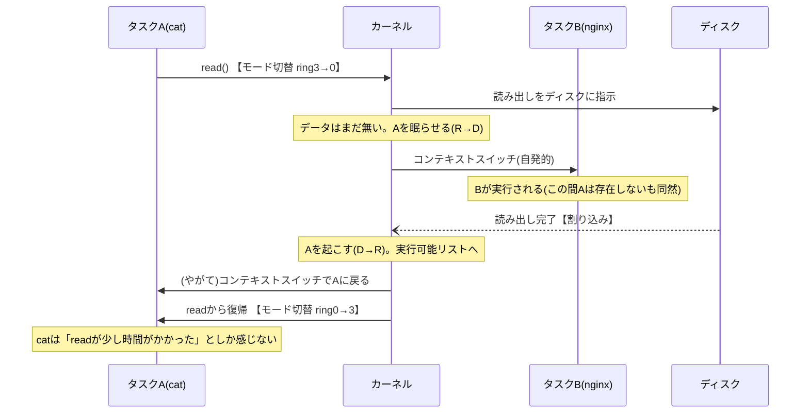

# システムコールとコンテキストスイッチ — 境界の越え方と CPU の主の交代

## 概要

この章では、本書に何度も登場してきた2つの「切り替え」を正面から扱います。
1つはユーザー空間とカーネル空間の行き来(**モード切替**)、もう1つは CPU を使う
タスクの交代(**コンテキストスイッチ**)です。前提知識は分野01の全体像
(カーネル空間/ユーザー空間、システムコール、割り込み)と前章の task_struct です。
基準環境は Linux 7.0 / Ubuntu Server 26.04 LTS です。

## 導入 — 「依頼の窓口」の内側で何が起きているのか

分野01の最初の章から、私たちはシステムコールを「ユーザー空間のプログラムが
カーネルに処理を依頼する正規の窓口」と呼んできました。また前章では、プロセスが
CPU を明け渡すとき「カーネルがレジスタ等を task_struct へ退避し、再開時に復元する」
と述べました。この章は、その2つの「言いっぱなし」を機械のレベルまで下りて
回収する章です。

まず、混同しやすい2つの出来事をはっきり区別することから始めます。

1. **モード切替(mode switch)** — **同じプロセスのまま**、CPU の実行モードが
   ユーザーモードとカーネルモードの間で切り替わること。システムコールを呼ぶたびに
   往復1回のモード切替が起きます。あなたが `cat` でファイルを読むとき、cat という
   プロセスは変わらず、その実行がユーザー空間の cat のコードとカーネル空間の
   read 処理の間を行き来しています
2. **コンテキストスイッチ(context switch)** — CPU を使う**タスク(task_struct)
   そのものが交代**すること。cat が読み込み完了を待って眠り、代わりに nginx が
   走り始めるとき、これが起きています

日常の比喩で言えば、モード切替は「同じ客が窓口カウンターの前に進み出て、
用が済んだら席に戻る」こと、コンテキストスイッチは「席に着く客そのものが
入れ替わる」ことです。両者はよく似た文脈で語られますが、仕組みもコストも
別物です。そして後で見るとおり、**コンテキストスイッチは必ずカーネルの中で
起きる**——つまりタスクの交代は、モード切替(または割り込み)でカーネルに
入った後でしか起こらない——という関係で2つはつながっています。

もう1つ、この章で答えを出したい素朴な疑問があります。システムコールは
C言語のプログラムからは `read(fd, buf, size)` のような**ただの関数呼び出しに
見える**のに、なぜ「境界を越える特別な仕組み」が必要なのでしょうか。
普通の関数呼び出しでカーネルの処理に飛んではいけないのでしょうか。

## 理論

### 特権レベル — なぜ普通の関数呼び出しではだめなのか

答えは CPU のハードウェアにあります。x86-64 の CPU には**特権レベル
(privilege level)**という仕組みが組み込まれており、実行中のコードに
0〜3 の4段階の「身分」を与えます(慣例で **ring 0〜ring 3** と呼びます。
分野01で予告した「ring」の正確な話がこれです)。数字が小さいほど強い権限を
持ち、次のことが CPU によって強制されます。

- **ring 0(カーネルモード)**: すべての命令を実行でき、すべてのメモリに
  アクセスできる。ハードウェアの制御レジスタ、割り込みの設定、ページテーブルの
  切り替え(後述)など、資源管理に必要な操作はここでしか行えない
- **ring 3(ユーザーモード)**: 上記の特権命令を実行しようとすると CPU が
  例外を発生させて拒否する。また、カーネルのメモリ領域はアクセス禁止の印が
  付いており、読むことすらできない

Linux はこのうち **ring 0 と ring 3 の2つだけ**を使います(ring 1・2 は
歴史的な設計の名残で、主要な OS はどれも使っていません)。「カーネル空間/
ユーザー空間」という分野01の区別は、ソフトウェアの取り決めではなく、
**CPU の特権レベルという物理的な仕組みで強制された区別**だったわけです。

これで冒頭の疑問に答えられます。普通の関数呼び出し(call 命令)は「飛び先の
アドレスを呼ぶ側が自由に指定する」仕組みです。もしユーザーモードのままカーネルの
コードに飛べたら、悪意あるプログラムはカーネル関数の**途中**(検査をすっ飛ばした
場所)に飛び込めてしまいます。かといって飛んだ瞬間に ring 0 になれるなら、
特権レベルの意味がありません。そこで CPU は、**ring 3 から ring 0 に入る方法を
「カーネルが事前に登録した入口から入る」場合だけに限定**しています。

### カーネルへの3つの入口

ring 3 から ring 0 へ入る正規の門は、大きく3種類あります。どれも共通して
「**飛び先はカーネルが起動時に CPU へ登録済みで、ユーザー側は選べない**」
という性質を持ちます。

| 入口 | きっかけ | 例 |
|---|---|---|
| **システムコール** | プログラムが自発的に依頼(`syscall` 命令) | read、fork、execve |
| **割り込み(interrupt)** | ハードウェアからの通知(実行中のコードとは無関係に届く) | ディスクI/O完了、パケット到着、タイマー |
| **例外(exception)** | 実行中の命令が起こした異常・特殊事態 | ゼロ除算、不正なメモリアクセス、CoWの書き込み禁止違反 |

3つ目の「例外」は前章ですでに登場しています。fork 後のコピーオンライトで
「書き込み禁止のページに書こうとした瞬間、CPU がカーネルに通知する」——あれが
例外によるカーネル入りです。割り込みが「外から届く通知」であるのに対し、
例外は「いま実行した命令自身が引き金」という違いがあります。

カーネルは、この3つの門のどれかから入ってきたときにだけ動きます。分野01の
背骨の一文「カーネルは依頼(システムコール)と通知(割り込み)に反応して資源を
差配する番人」は、ハードウェアのレベルではこの登録済みの門の仕組みで
実現されているのです。

### システムコールの呼び出し規約 — POSIX が決めること、ABI が決めること

ここで役割分担を整理しておきます。POSIX(IEEE Std 1003.1)が規定しているのは
「`read()` という**C関数**が、どんな引数を取り、どう振る舞うか」という
**インタフェース**です。一方「その依頼を CPU のどの命令で、引数をどのレジスタに
載せてカーネルに渡すか」という**呼び出しの機構**は POSIX の範囲外で、
アーキテクチャごとの **ABI(Application Binary Interface、バイナリレベルの
取り決め)**が定めます。`man 2 syscall` にアーキテクチャ別の規約一覧があり、
x86-64 の Linux では次のようになっています。

- **システムコール番号**を rax レジスタに入れる(read は 0、write は 1、
  execve は 59……という対応表がカーネルに組み込まれている。一覧は
  `man 2 syscalls`)
- **引数**は rdi、rsi、rdx、r10、r8、r9 の順に最大6個までレジスタで渡す
- **`syscall` 命令**を実行する(ここで ring 0 への移行が起きる)
- **戻り値**は rax で返る

普段私たちが書く `read(fd, buf, size)` は、実はカーネルを直接呼んでいません。
**libc(glibc)のラッパー関数**を呼んでおり、ラッパーが上記の規約どおりに
レジスタを整えて `syscall` 命令を実行しています。つまり、

```
 あなたのプログラム ──関数呼び出し──→ glibcのread() ──syscall命令──→ カーネル
                    (ただのcall。境界なし)              (ここが境界)
```

「システムコールは関数呼び出しに見える」のは、libc が機械レベルの規約を
包んで関数の顔をさせているからです。

### errno — 失敗の伝え方の二層構造

この二層構造は、エラーの伝え方にも表れています。カーネルは失敗を
「**負のエラー番号**」で返します(例: 存在しないファイルの open は -2 =
-ENOENT)。libc のラッパーはこれを検査し、負なら**エラー番号を大域変数
`errno` に格納して、関数の戻り値としては -1 を返す**という POSIX 流の作法に
翻訳します(`man 3 errno`)。`ls` が表示する `No such file or directory` の
文字列は、errno の値 2(ENOENT)を人間語に直したものです。後の実行例で、
strace がこの生のやり取りをどう見せるかを確認します。

### vDSO — 境界を越えない抜け道

モード切替には後述のとおり実費がかかります。そこで Linux は、頻繁に呼ばれるのに
特権が要らない一部のシステムコール——現在時刻の取得(clock_gettime 等)が
代表——について、**カーネルが用意したコードとデータをユーザー空間のアドレス空間に
貼り付けておき、境界を越えずに関数呼び出しだけで済ませる**仕組みを持っています。
これを **vDSO(virtual Dynamic Shared Object)**と呼びます(`man 7 vdso`)。
時刻はカーネルが vDSO 内のデータ領域を更新し続けており、プログラムは
それを読むだけで済みます。すべてのプログラムに自動で結合されるため、
`ldd` の出力に現れる `linux-vdso.so.1` として観察できます(実行例参照)。
「原則はモード切替、例外的な高頻度・読み取り専用の依頼は貼り紙で済ます」
という最適化として覚えてください。

### コンテキストスイッチはいつ起きるか

もう1つの主役、タスクの交代に話を移します。コンテキストスイッチが起きる
きっかけは、大きく2つに分けられます。この区別は `/proc` で実際に数えられて
おり(実行例参照)、トラブルシューティングでも効く分類です。

1. **自発的(voluntary)** — タスクが**待ちに入って CPU を手放す**場合。
   read したがデータがまだ来ていない、パイプが満杯で書けない、など。前章の
   状態遷移で言えば R→S(または R→D)への遷移とセットで起きます。
   「〜まで眠らせてほしい」という依頼ですから、システムコールの処理中、
   つまりカーネル内で起きます
2. **非自発的(involuntary)** — タスクは走り続けたいのに**カーネルが取り上げる**
   場合。**プリエンプション(preemption、横取り)**と呼びます。根拠は公平性です。
   もし CPU の明け渡しがタスクの自発性任せだったら、無限ループするプログラムが
   1個あるだけでマシン全体が固まります(実際、この方式——協調的マルチタスク——を
   採った古い OS はそうなりました)

では、走り続けているタスクから CPU を取り上げる機会を、カーネルはどうやって
得るのでしょうか。答えは3つの門の2番目、**タイマー割り込み**です。カーネルは
起動時にタイマーを設定し、一定間隔(構成 CONFIG_HZ によるが、サーバー向けの
既定では秒250回程度。基準環境の値は実行例で確認)で割り込みを受け取ります。
割り込みが入れば CPU は強制的にカーネルに制御を移すので、カーネルはそこで
「いまのタスクは走りすぎていないか」を検査し、必要なら **TIF_NEED_RESCHED**
という「再スケジュール要求」の旗をそのタスクに立てます。旗が立っていると、
割り込み処理やシステムコールからユーザー空間へ**戻る間際**にスケジューラが
呼ばれ、次に走るべきタスクが選ばれて交代が起きます(どのタスクを選ぶかの
アルゴリズム——EEVDF——は `04_scheduler.md` の主題です。本章は「交代そのもの」
だけを扱います)。

まとめると、**コンテキストスイッチは常にカーネル内で起きます**。自発的な場合は
システムコールの中で、非自発的な場合は割り込みで入ったカーネルからの出口で。
ユーザー空間のコードが走っている最中に、いきなり別タスクに切り替わることは
ありません——切り替わったように見えるときは、必ずその裏に割り込みによる
カーネル入りが挟まっています。

### 全体像 — ブロッキング read の一部始終

ここまでの部品(モード切替、割り込み、自発的スイッチ)を1本につなぐと、
「cat がファイルを読む」の裏側はこうなります。



cat のプログラムから見れば read という関数が1回呼ばれて返ってきただけですが、
その裏で境界越えが2回、タスク交代が2回以上、割り込みが1回起きています。
「システムコールは遅いことがある」の正体は、たいていこの**眠っていた時間**です。

## 内部動作の詳細

### syscall 命令の道中 — entry_SYSCALL_64

x86-64 で `syscall` 命令が実行された瞬間から、カーネルの処理が始まるまでを
追います(カーネルソース `arch/x86/entry/entry_64.S`、および
カーネルドキュメント Documentation/arch/x86/entry_64.rst に基づく)。

1. **CPU がハードウェアとして行うこと**: 特権レベルを ring 0 に上げ、
   実行位置(rip)を **MSR(Model Specific Register)という特殊レジスタに
   カーネルが起動時に登録しておいた入口アドレス**(エントリコード
   `entry_SYSCALL_64`)へ差し替える。戻り先のアドレスとフラグは rcx と r11 に
   退避される(引数レジスタの4番目が rdx の次に r10 へ飛ぶ変則は、この rcx が
   CPU に横取りされるため)
2. **エントリコードが行うこと**: まず**スタックをそのタスクのカーネルスタックに
   切り替える**。次に、ユーザー空間の全レジスタをカーネルスタック上の
   `pt_regs` という構造体の形に退避する
3. **振り分け(dispatch)**: rax のシステムコール番号を上限と照合し、
   カーネル内の**システムコールテーブル(sys_call_table)**——番号から処理関数への
   対応表——を引いて、該当する関数(read なら VFS の読み出し処理)を呼ぶ
4. **復帰**: 処理関数の戻り値を pt_regs の rax の位置に書き込み、退避した
   レジスタを復元して `sysret` 命令で ring 3 に戻る。その直前に、シグナルの
   配達や TIF_NEED_RESCHED の検査といった「出口の仕事」が挟まる(前節で見た
   「出口でスケジューラが呼ばれる」のはここ)

手順2の**カーネルスタック**は重要な登場人物なので補足します。タスクは
ユーザー空間のスタックとは**別に、カーネル専用のスタック(x86-64 で 16 KiB)を
1本ずつ**持っています。カーネルがユーザーのスタックを使わないのは、ユーザーが
自分のスタックポインタを偽の値(例えばカーネルのデータ領域を指す値)にして
syscall を呼べば、カーネル自身の手でカーネルメモリを破壊させられるからです。
**境界を越えたら、足場も信用できるものに履き替える**——これが原則です。

なお、歴史的には x86 のシステムコール呼び出しは `int 0x80` というソフトウェア
割り込み命令で行われていました(32ビット時代の方式)。`syscall` 命令は
この用途専用に追加された高速版で、x86-64 の Linux では syscall が標準です。

### コンテキストスイッチの実体 — context_switch()

タスクの交代処理の本体は、カーネルソース `kernel/sched/core.c` の
`context_switch()` 関数です。その仕事は本質的に2つの切り替えです。

```
 context_switch(A → B)
 ├─ (1) switch_mm  : アドレス空間の切り替え
 │        CR3レジスタ(ページテーブルの根の物理アドレス)を
 │        Aのmm_structのものから、Bのmm_structのものへ書き換える
 │        ※ ring 0 でしか実行できない特権操作
 └─ (2) switch_to  : 実行状態の切り替え
          Aのcallee-saved(呼び出され側保存)レジスタと
          スタックポインタを task_struct 内の thread 領域へ退避
          → スタックポインタを B のカーネルスタックのものに差し替え
          → Bのthread領域からレジスタを復元
          この瞬間から「実行中のタスク」はBになる
```

**(1) アドレス空間の切り替え**は、前章の「プロセスごとに専用のメモリの眺め」を
物理的に実現している操作です。CPU は CR3 レジスタが指すページテーブル
(住所変換の対応表。詳細は次章 `03_virtual_memory.md`)を通してすべてのメモリ
アクセスを解決するため、CR3 を差し替えた瞬間に「見える世界」が丸ごと入れ替わり
ます。ここには重要なコストが付随します。CPU は住所変換の結果を **TLB** という
キャッシュに溜めており、世界が入れ替わると原則としてこれが無効になるのです
(TLB と、フラッシュを緩和する PCID の仕組みは次章で扱います)。

(1)には前章の設計が効いてくる例外があります。**同じプロセスのスレッドどうしの
交代では、mm(アドレス空間)が同一なので CR3 の切り替えが丸ごと省略**されます。
また、カーネルスレッド(カーネル内部の仕事専用のタスク。mm を持たない)への
交代でも、直前のタスクのアドレス空間を「借りたまま」にして切り替えを省きます。
スレッドが「軽い」と言われる理由の1つは、この交代コストの差にあります。

**(2) 実行状態の切り替え**が、前章からの宿題「進行状態の退避と復元」の正体
です(実装は `arch/x86/entry/entry_64.S` の `__switch_to_asm` と
`arch/x86/kernel/process_64.c` の `__switch_to`)。退避先は task_struct の中の
`thread`(struct thread_struct)というアーキテクチャ依存の領域です。
興味深いのは、**全レジスタを保存するわけではない**ことです。コンテキスト
スイッチは常にカーネル内の関数呼び出しとして起きるため、C言語の呼び出し規約で
「呼び出し側が保存する」と決まっているレジスタはすでにスタックに退避済みで、
明示的に保存するのは callee-saved レジスタとスタックポインタ等だけで済みます。
ユーザー空間のレジスタ一式はどこにあるかというと——syscall や割り込みで
カーネルに入った時点で、そのタスクの**カーネルスタックの pt_regs に退避済み**
です。つまり:

```
 タスクAのカーネルスタック          タスクBのカーネルスタック
 ┌────────────────┐          ┌────────────────┐
 │ pt_regs(Aのユーザー │          │ pt_regs(Bのユーザー │
 │ 空間のレジスタ一式)  │          │ 空間のレジスタ一式)  │
 │ ...カーネル内の     │          │ ...カーネル内の     │
 │    関数呼び出しの跡  │          │    関数呼び出しの跡  │
 │ →切り替え時のrspの位置│ ←────┐  │ →切り替え時のrspの位置│
 └────────────────┘      │  └────────────────┘
   task_struct A の thread に退避─┘   ↑ Bのthreadから復元
        「スタックポインタを差し替える」ことがタスク交代の核心
```

タスクの実行状態とは畢竟「スタック(の中身)とレジスタ」であり、スタック
ポインタを別のタスクのカーネルスタックへ差し替えることこそがタスク交代の核心
——これが Linux の実装が示す答えです。B はかつて自分が switch_to で眠りに
ついた場所から目を覚まし、自分のカーネルスタックを巻き戻しながら復帰して、
最終的に自分の pt_regs を復元してユーザー空間へ帰っていきます。

### 切り替えのコスト — 直接費と間接費

2つの切り替えのコストを整理します。厳密な数値はハードウェアと構成に強く
依存するため、ここでは桁の感覚と構造だけを述べます。

- **モード切替(syscall 往復)の直接費**: レジスタの退避・復元と特権レベルの
  移行で、現代の CPU で概ね**数十〜数百ナノ秒**の桁。ただし後述の KPTI が
  有効だと数倍に膨らむ
- **コンテキストスイッチの直接費**: switch_mm + switch_to +スケジューラの
  選択処理で、概ね**マイクロ秒**の桁。モード切替より1〜2桁重い
- **間接費(しばしば直接費より高くつく)**: 交代後のタスクにとって、CPU の
  キャッシュと TLB は前のタスクの内容で汚れた状態です。自分のデータを
  再びキャッシュに乗せ直すまで、しばらくメモリアクセスが軒並み遅くなります。
  コンテキストスイッチが頻発するワークロードで性能が「数字上の切り替え時間」
  以上に落ちるのは、主にこの間接費のためです

**発展: KPTI** — 2018年に公表された CPU の脆弱性 Meltdown(投機実行を悪用して
ユーザーモードからカーネルメモリを読み出せてしまう)への対策として、Linux 4.15
以降には KPTI(Kernel Page-Table Isolation)が入っています。従来はモード切替を
軽くするため「ユーザー空間のページテーブルにもカーネル領域を(アクセス禁止印
付きで)載せたまま」にしていたのを、KPTI はページテーブル自体をユーザー用/
カーネル用に分離し、**モード切替のたびに CR3 を切り替える**方式に変えました。
つまり脆弱性対策として、モード切替にコンテキストスイッチの費目の一部(CR3
切り替え)が持ち込まれた形です。影響を受けない新しい CPU では自動で無効化
されます(有効/無効は `/sys/devices/system/cpu/vulnerabilities/meltdown` で
確認できます)。安全と速度の交換が現在進行形で行われている例として
覚えておく価値があります。

## 実行例 — 境界越えと交代を観察する

前提は Ubuntu Server 26.04 LTS です。

システムコールを生の姿で見る。strace はプロセスが発行したシステムコールを
すべて表示するツールです(境界は必ずここを通るので、プログラムとカーネルの
やり取りは strace で漏れなく観察できます):

```console
$ strace -e trace=openat,read,write cat /etc/hostname
openat(AT_FDCWD, "/etc/hostname", O_RDONLY) = 3   ← 戻り値はfd番号
read(3, "server1\n", 131072)            = 8       ← 8バイト読めた
write(1, "server1\n", 8)                = 8       ← fd 1(標準出力)へ
...
```

エラーの二層構造(カーネルは負の番号、libc が errno に翻訳)を見る:

```console
$ strace -e trace=openat cat /no/such/file
openat(AT_FDCWD, "/no/such/file", O_RDONLY) = -1 ENOENT (No such file or directory)
cat: /no/such/file: No such file or directory   ← catがerrnoを人間語で報告
```

どのシステムコールを何回呼んだかの集計(`-c`)。「コマンド1つの裏で境界を
何百回越えているか」の感覚をつかむのに最適です:

```console
$ strace -c ls > /dev/null
% time     seconds  usecs/call     calls    errors syscall
------ ----------- ----------- --------- --------- ----------------
 21.09    0.000133          14         9           mmap
 12.36    0.000078          11         7           openat
  ...
------ ----------- ----------- --------- --------- ----------------
100.00    0.000631                    98        11 total    ← lsだけで約100回
```

vDSO が結合されていることを確認する(実体のファイルが存在しない共有
ライブラリとして現れる):

```console
$ ldd /bin/ls | head -2
        linux-vdso.so.1 (0x00007fff30bd1000)   ← カーネルが貼り付けたvDSO
        libselinux.so.1 => /lib/x86_64-linux-gnu/libselinux.so.1 (...)
```

自分のシェルのコンテキストスイッチ回数を、自発的/非自発的に分けて見る
(台帳 task_struct の会計情報の一部):

```console
$ grep ctxt /proc/$$/status
voluntary_ctxt_switches:        152    ← 入力待ちで眠った回数が主
nonvoluntary_ctxt_switches:     9      ← 横取りされた回数
```

対話シェルは「人間の入力を待って眠る」のが仕事なので、自発的が圧倒的に
多くなります。逆に計算し続けるプログラムは非自発的が積み上がります。

システム全体の毎秒のコンテキストスイッチ(cs 列)と割り込み(in 列)を見る:

```console
$ vmstat 1 3
procs -----------memory---------- ---swap-- -----io---- -system-- -------cpu-------
 r  b   swpd   free   buff  cache   si   so    bi    bo   in   cs us sy id wa st
 1  0      0 3012345  81234 923456    0    0     1     3  120  310  1  0 99  0  0
 0  0      0 3012345  81234 923456    0    0     0     0   95  270  0  0 100 0  0
                                                        ↑割込/秒 ↑交代/秒
```

タイマー割り込みの実在を確認する(LOC = ローカルAPICタイマー。CPU ごとの
累積回数が並ぶ):

```console
$ grep -E 'LOC|CPU' /proc/interrupts
            CPU0       CPU1
 LOC:    2412345    2298765   Local timer interrupts   ← プリエンプションの心臓
```

## トラブルシューティング — 2つの切り替えを疑う手順

- **プログラムが遅いが、CPU 使用率は低い**: 本章の sequenceDiagram の
  「眠っていた時間」が長いパターンが典型です。`strace -T`(各システムコールの
  所要時間を表示)や `strace -c` で、どの依頼で時間が溶けているかを特定します。
  read や poll で長く待っているなら、遅いのはそのプロセスではなく待たれている
  相手(ディスク、ネットワーク、他プロセス)です
- **`top` で %sy(システム時間)が高い**: CPU 時間の会計は「ユーザーモードで
  使った時間(us)」と「カーネルモードで使った時間(sy)」に分かれています。
  sy が高い=境界の内側で忙しいということなので、システムコールの発行回数が
  過剰(小さすぎるバッファでの read/write の乱発が典型)か、カーネル側の処理
  (ネットワーク、ファイルシステム)が重いかを疑い、`strace -c` や後の分野で
  扱う perf で切り分けます
- **vmstat の cs が異常に高い**: コンテキストスイッチの直接費・間接費が
  積み上がっている状態です。`pidstat -w 1` でどのプロセスが交代を起こして
  いるかを特定します。cswch/s(自発的)が高いならロックや短い I/O の待ち合わせが
  頻発する設計、nvcswch/s(非自発的)が高いなら CPU の奪い合い(コア数に対して
  実行可能タスクが多すぎる)が典型です
- **strace を付けると劇的に遅くなる**: 仕様です。strace は ptrace という
  デバッグ用の仕組みで**システムコールのたびに対象を停止させて**観察するため、
  境界越えのコストを大幅に増幅します。観察対象の性能を測りたいときは strace
  ではなく、摂動の小さい仕組み(perf 等)を使います。「観察行為が観察対象を
  変える」ことをツール選びの前提に置いてください
- **本番サーバーでシステムコールがベンチマークより遅い**: KPTI などの脆弱性
  対策(ミティゲーション)の有無が環境間で違う可能性があります。
  `/sys/devices/system/cpu/vulnerabilities/` 以下で各対策の状態を比較して
  ください。対策の無効化は安全性との交換なので、性能差の原因特定と、
  それを外す判断は分けて考えるべきです

## 演習・確認問題

1. モード切替とコンテキストスイッチの違いを説明してください。また
   「read() を1回呼んだら、モード切替は何回起きるか。コンテキストスイッチは
   必ず起きるか」に答えてください
2. ユーザーモードのプログラムが普通の call 命令でカーネルの処理に飛べない
   理由と、syscall 命令なら安全に飛べる理由を、「飛び先を誰が決めるか」の
   観点から説明してください
3. プリエンプション(非自発的なタスク交代)は、タイマー割り込みなしには
   実現できません。その理由を「カーネルはいつ動けるか」の観点から説明して
   ください
4. 同じプロセス内のスレッドどうしのコンテキストスイッチが、別プロセスへの
   スイッチより軽いのはなぜですか。switch_mm と switch_to のどちらが
   省略できるかに触れて説明してください
5. `grep ctxt /proc/<PID>/status` で、あるプロセスの nonvoluntary_ctxt_switches
   だけが急増しているとします。何が起きていると考えられ、次に何を確認すべき
   ですか

## まとめ

- ユーザー空間/カーネル空間の区別は CPU の特権レベル(ring 3 / ring 0)で
  物理的に強制されており、境界を越える門はシステムコール・割り込み・例外の
  3つ。いずれも飛び先はカーネルが事前登録済みで、ユーザー側は選べない
- システムコールの実体は「番号と引数をレジスタに載せて syscall 命令を実行」。
  POSIX は C 関数のインタフェースを、ABI が機械レベルの規約を定め、libc の
  ラッパーが両者を橋渡しする(エラーは負の番号→errno に翻訳される)
- モード切替は同一タスク内の往復、コンテキストスイッチはタスクの交代。交代は
  常にカーネル内で起き、自発的(待ちで眠る)と非自発的(タイマー割り込みを
  契機とするプリエンプション)に分かれる
- 交代の実体は context_switch() = switch_mm(CR3 差し替え。スレッド間では
  省略)+ switch_to(レジスタとカーネルスタックの差し替え)。ユーザー空間の
  実行状態はカーネルスタック上の pt_regs に退避されている
- コストは直接費(退避・復元)より、キャッシュ・TLB の汚染という間接費が
  効きやすい。観察には strace(境界)、vmstat・pidstat(交代)、
  /proc/<PID>/status(タスク別の内訳)を使う
