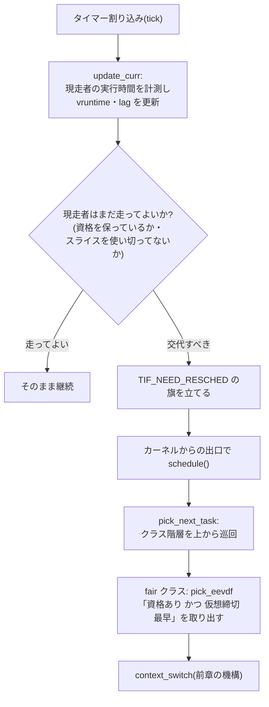

# スケジューラ — 「次に誰を走らせるか」という方針

## 概要

この章では、走行可能なタスクの中から次に CPU を使う者を選ぶ仕組み——
スケジューラ——を扱います。Linux 6.6 以降の標準である **EEVDF** を中心に、
先代 **CFS** からなぜ置き換わったのかという変遷も追います。前提知識は前3章
(task_struct と状態遷移、タイマー割り込みとプリエンプション、
コンテキストスイッチ)です。基準環境は Linux 7.0 / Ubuntu Server 26.04 LTS です。

## 導入 — 交代の作法は学んだ、残る問いは「誰と交代するか」

前章で、タスクの交代(コンテキストスイッチ)が**どうやって**行われるかを
見ました。switch_mm で世界を差し替え、switch_to で足場とレジスタを差し替える
——あれは交代の**機構(mechanism)**です。しかし前章では、交代相手を選ぶ
場面を「スケジューラが次のタスクを選ぶ」の一言で素通りしていました。
**誰と**交代するかという**方針(policy)**が、この章の主題です。

機構と方針を分けて作るのはカーネル設計の常套手段です。交代の作法(機構)は
1種類で固定し、人選のアルゴリズム(方針)だけを差し替えられるようにして
おけば、方針の改良——まさに CFS から EEVDF への交代——が機構に手を
触れずに済みます。

さて、なぜ人選が問題になるのか。CPU のコアは数個〜数十個しかないのに、
サーバーでは数百のタスクが動いています。大半は眠っています(S 状態。
デーモンは依頼待ち、シェルは入力待ち)が、走行可能(R 状態)のタスクが
コア数を超えることは日常的に起きます。そこで「待っている走行可能タスクの
列から、次の1人をどう選ぶか」を決めなければなりません。素朴な案から
考えてみます。

1. **早い者勝ち(来た順に、終わるまで走らせる)** — 無限ループするプログラム
   が1つ紛れ込んだ瞬間、マシン全体が固まります。前章で見たとおり、強制的な
   取り上げ(プリエンプション)は必須です
2. **固定の持ち時間で輪番(ラウンドロビン)** — 独占は防げます。しかし全員
   一律なので「このタスクを他より優先したい」が表現できません。さらに深刻な
   のは性格の違う仕事の混在です。**対話型**のタスク(シェルやエディタ。
   ほとんど眠っていて、キー入力の瞬間だけ**すぐ**走りたい)は、**バッチ型**の
   タスク(動画のエンコードなど。常に走り続けたい)の列の後ろに並ばされ、
   最悪「(タスク数−1)×持ち時間」だけ反応が遅れます
3. **優先度順** — 対話型に高い優先度を付ければ2は解決しそうですが、高優先度
   が走り続ける限り低優先度には永遠に順番が来ません(**飢餓**)。「優先しつつ、
   誰も飢えさせない」を優先度の大小関係だけで作るのは存外に難しいのです

現代の Linux の答えは**重み付きの公平分配**です。各タスクは重みを持ち、
CPU 時間は長い目で見れば重みに比例して配られる——これを土台の原理として
保証した上で、「配る**順番**」の工夫で応答性を作ります。この「順番の工夫」の
原理こそが、CFS から EEVDF への交代で変わった部分です。

## 理論

本節の内容は、主に `man 7 sched`(Linux のスケジューリング API の総覧)、
カーネルドキュメントの **Documentation/scheduler/sched-design-CFS.rst** と
**Documentation/scheduler/sched-eevdf.rst**、および EEVDF の原典である
Ion Stoica / Hussein Abdel-Wahab の1995年の論文
(*Earliest Eligible Virtual Deadline First: A Flexible and Accurate
Mechanism for Proportional Share Resource Allocation*)に基づきます。

### スケジューリングクラス — 人選は階層の上から

まず全体の構造から。Linux のスケジューラは単一のアルゴリズムではなく、
**スケジューリングクラス(scheduling class)**の階層です。

```
 優先 ┌────────────┬───────────────────────────┐
  高  │ stop       │ カーネル内部専用(CPU停止処理等)        │
  ↑  │ deadline   │ SCHED_DEADLINE(締切を申告する型。発展)  │
  │  │ realtime   │ SCHED_FIFO / SCHED_RR(POSIXリアルタイム)│
  │  │ fair       │ SCHED_OTHER / SCHED_BATCH / SCHED_IDLE  │
  ↓  │            │ ← 通常のタスクは全部ここ。本章の主役     │
  低  │ idle       │ 走るものが皆無のときのアイドルタスク     │
      └────────────┴───────────────────────────┘
```

規則は単純で、**上位クラスに走行可能なタスクが1つでもいる限り、下位クラスに
順番は回ってきません**。ユーザーから見えるのはクラスそのものではなく
**ポリシー(policy)**で、POSIX(IEEE Std 1003.1、リアルタイム拡張)が
SCHED_FIFO / SCHED_RR / SCHED_OTHER の3つを規定し、Linux が SCHED_BATCH /
SCHED_IDLE / SCHED_DEADLINE を追加しています(`man 7 sched`)。

realtime クラス(SCHED_FIFO / SCHED_RR)は「静的優先度 1〜99 の高い者から。
FIFO は自発的に手放すまで走り続け、RR は同一優先度内でのみ輪番」という
導入の素朴案そのものの世界です。導入で見たとおりこの方式は飢餓と隣り合わせ
で、リアルタイムタスクが暴走すると fair クラス(つまり通常のプロセス全部と
管理者のシェル)が一切走れなくなります。カーネルはこの事故に備え、既定で
リアルタイムクラスの消費を 95% までに制限しています
(`/proc/sys/kernel/sched_rt_runtime_us`。残り 5% が生命線になります)。

通常のプロセスはすべて fair クラス(ポリシー名 SCHED_OTHER。カーネル内部の
呼び名は SCHED_NORMAL)に属します。以降はこの fair クラスの中の人選——
CFS と EEVDF の領分——に絞ります。

### 理想のモデル — 重みに比例した「流体」の分配

fair クラスの重みを決めるユーザー向けのつまみが **nice 値**です(-20〜+19、
既定 0。「他人に **nice**(親切)なほど値が大きい」、つまり大きいほど譲る側)。
カーネルは nice 値を重み(weight)に変換します(`kernel/sched/core.c` の
変換表)。抜粋すると:

| nice | weight |
|---:|---:|
| -20 | 88761 |
| -10 | 9548 |
| 0 | **1024**(基準) |
| 10 | 110 |
| 19 | 15 |

1段の差が約 1.25 倍になるよう設計されており、nice 5 段の差なら
1.25^5 ≒ 3 倍の重みの差になります。

目指す分配の理想像はこうです——**走行可能なタスクが N 個あるなら、N 個が
重みの比率で「同時に少しずつ」進む**。CPU が液体のように分割できるなら、
重み 2:1 の2タスクは常時 66%:33% の速度で同時に進みます(流体モデル)。
現実の CPU コアは一度に1つのタスクしか走らせられないので、これは実現
できません。そこで問いはこうなります:**細切れの交代の並べ方を工夫して、
この理想にどれだけ忠実に近づけるか**。CFS も EEVDF も、この同じ問いへの
answer が違うだけです。

なお「重み比で帯域を分ける」という問題設定は、ネットワークのパケット
スケジューリング(公平キューイング)と同族で、EEVDF の原論文自体が資源共有
一般の理論として書かれています。パケット側の系譜は分野04
(`04_linux_network_stack/04_qdisc_traffic_control.md`)で再会します。

### CFS(Linux 2.6.23〜6.5)— 仮想ランタイムという発明

歴史を一段だけ遡ります。2.6 前期のスケジューラ(いわゆる O(1) スケジューラ)
は優先度別の待ち行列と経験則の塊で、対話型の判定ロジックが複雑化して
限界を迎えていました。2007年の Linux 2.6.23 で導入された
**CFS(Completely Fair Scheduler)**は、これを1つの美しい会計で置き換えました。

- 各タスクに**仮想ランタイム(vruntime)**というメーターを持たせる。走った
  実時間をそのまま足すのではなく、**重みで換算して**足す:
  進み = 実行時間 × (1024 / weight)
- 重いタスクほどメーターの進みが遅い。つまり「同じメーター値」に達するまでに
  重いタスクはより多くの実時間を受け取れる
- 選択規則はただ1つ——**常に vruntime が最小のタスク(いちばんサービスを
  受けていない者)を走らせる**

全員の vruntime を揃えるように走らせ続ければ、受け取った実時間は自動的に
重みに比例します。流体モデルの近似が、たった1つの単調な会計値の最小値選択に
落ちるわけです。実装は vruntime をキーにした赤黒木で、最左端(最小)を
取り出します。

CFS は公平の分配量については原理的でした。しかし**「いつ走れるか」を表現する
語彙を持っていません**でした。vruntime は「どれだけ受け取ったか」という
**量**の会計であり、「このタスクは量は要らないが、必要になった瞬間には
すぐ走りたい」という**応答性(レイテンシ)の要求**を書き込む場所がないのです。
実際の CFS は、この穴を最小走行粒度(min_granularity)や目覚め時の横取り
判定のしきい値(wakeup_granularity)といった**全体一律のヒューリスティクス
のつまみ**で埋めており、つまみ同士は互いに干渉し、負荷の性格が変わると
再調整が必要でした。タスクごとにレイテンシ要求を指定したいという要望
(latency-nice と呼ばれた一連の議論)に原理的な置き場がなかったことが、
次の世代への直接の動機になります。

### EEVDF(Linux 6.6〜)— 会計に「締切」の軸を加える

2023年の Linux 6.6 で、fair クラスの人選アルゴリズムは **EEVDF
(Earliest Eligible Virtual Deadline First)**に置き換わりました。基になった
のは前掲の1995年の論文——カーネルの中では珍しく、実装より理論が28年先行
していた例です。EEVDF は CFS の vruntime の会計をそのまま土台にし、部品を
2つ追加します。

1. **lag(貸し借りの残高)** — 「理想の流体モデルなら今までに受け取れたはず
   の量」から「実際に受け取った量」を引いた差。正なら**もらい足りない
   (貸しがある)**、負なら**もらいすぎ(借りがある)**
2. **資格(eligibility)** — **lag ≥ 0 のタスクだけが選択の候補になれる**。
   もらいすぎた者は、理想の進みが自分に追いつくまで候補から外される。
   長期の公平(受け取る総量が重みに比例すること)は、この規則だけで守られる
3. **仮想締切(virtual deadline)** — 各タスクは自分の**スライス(slice)**
   (1回に走りたい長さ。既定値あり)を持ち、資格を得た時点の仮想時刻に
   スライスを重み換算した長さを足した時刻を「締切」とする。
   **スライスが短いタスクほど締切が早い**

選択規則は「**資格のある者の中で、仮想締切が最も早い者**」。これが名前
(Earliest **Eligible** Virtual **Deadline** First)そのものです。

この設計の要点は、**量と順番の分離**です。

- **総量**は lag と資格が守る——スライスを短く申告しても、もらえる総量は
  1ミリも増えません(走るほど lag が減り、資格を失って待たされるからです)
- **順番**はスライスが決める——短いスライス=「**早く・細かく**」
  (すぐ選ばれるが1回は短い)、長いスライス=「**遅く・まとまって**」
  (順番は後だが選ばれたら続けて走れる)

CFS が全体一律のつまみで作っていた応答性が、EEVDF では**タスクごとの
性質として、公平の原理を崩さずに**表現できます。たとえば対話型タスクの
反応の良さは、EEVDF ではこう説明できます——ほとんど眠っていて走った量が
少ないから lag は正(常に資格あり)、目覚めればすぐ締切が来る位置に並ぶ
(すぐ選ばれる)。CFS 時代に経験則で作り込んでいた性質が、定義から自然に
従うのです。

## 内部動作の詳細

### ランキュー — CPU ごとの待合室

人選の舞台は**ランキュー(run queue)**です。カーネルは CPU(論理コア)
1つにつき1本のランキュー(`struct rq`、`kernel/sched/sched.h`)を持ち、
その中にクラスごとのサブキュー(fair 用の cfs_rq、realtime 用の rt_rq など)
を束ねています。

ここで `01_process_thread_basics.md` の状態遷移図の宿題を回収します。
**R(TASK_RUNNING)状態の実体は「いずれかのランキューに載っている(または
現に走っている)こと」**です。タスクが待ちに入る(S / D 状態)とはキューから
外れる(dequeue)こと、目覚めるとはキューに戻る(enqueue)ことです。
つまりスケジューラが人選のたびに眺めるのは全タスクではなく、自分の CPU の
ランキュー上の R 状態タスクだけです。

fair クラスのサブキュー(cfs_rq)の中身は赤黒木です。CFS 時代は vruntime 順
に並べて最左端を取るだけでしたが、EEVDF では**仮想締切の順**に並べ、各節に
部分木の資格判定に使う情報を添えて(augmented rbtree)、「資格があり、かつ
締切最早」の1個を O(log n) で取り出せるようにしています
(`kernel/sched/fair.c` の pick_eevdf)。

### tick から pick まで — 前章の伏線の回収

前章で「タイマー割り込みがプリエンプションの契機になる」ところまで見ました。
スケジューラ側から全体をつなぐと、こうなります。



もう1本の契機が**目覚め(wakeup)**です。ディスク I/O の完了割り込みや
パイプへの書き込みが、眠っていたタスクを起こす(enqueue する)とき:

- 眠る前の lag は保存されており、目覚めたタスクは**眠って得も損もしない**
  位置(貸し借りを引き継いだ位置)に置かれます。「長く眠ったタスクの
  メーターが周回遅れになり、目覚めた途端に CPU を独占する」といった会計の
  歪みはこの補正で防がれます
- 目覚めたタスクの仮想締切が現走者より早ければ、その場で
  TIF_NEED_RESCHED を立てます(**wakeup preemption**)。「キーを押した瞬間に
  シェルが反応する」「パケットが着いた瞬間にデーモンが動く」の裏側は、
  割り込み → 目覚め → 締切比較 → 横取り、という一本道です

どちらの経路でも、旗が立ってから実際の交代までの流れ(カーネルからの
出口で旗を検査して schedule() へ)は前章で見たとおりです。**機構は1種類、
方針がその上に載っている**という冒頭の構図を確認してください。

### スライスと tick の粒度

スライスの既定値は `/sys/kernel/debug/sched/base_slice_ns` で確認でき、
0.75 ms 程度です(要検証: 基準版 Linux 7.0 での既定値)。一方、前章の宿題
だった **CONFIG_HZ**(tick の頻度。サーバー向け既定はおおむね 250 Hz = 4 ms
間隔)は「走りすぎの検査が起きる間隔」を決めます。検査の間隔(4 ms)が
スライス(0.75 ms)より粗いことに気づいたでしょうか——tick だけに頼ると
締切超過の発覚が tick 粒度でしか起きないため、より細かい交代が必要な場面
ではカーネルが高精度タイマーを併用します(HRTICK。本書では深追いしません)。

tick についてもう1つ、アイドル時の挙動だけ触れておきます。眠っている CPU を
毎秒 250 回起こして「誰か走る者はいるか」と確認させるのは電力の無駄なので、
Linux は走る者のいない CPU の tick を止めます(**NO_HZ_IDLE**、
Documentation/timers/no_hz.rst)。「tick は常に鳴っている」は厳密には
「仕事のある CPU では鳴っている」です。

### SMP — ランキューが複数あるということ

ランキューを CPU ごとに分けたのは、全 CPU で1本の列を取り合うとその列の
ロックが奪い合いになるからです(コア数十個が人選のたびに同じ木を触る事態を
想像してください)。しかし分けた代償として、**キュー間の偏り**が生まれます。
CPU 0 の列に5人、CPU 1 の列が空、という状態を放置すれば公平もスループット
もありません。

これを均すのが**ロードバランシング(load balancing)**で、暇な CPU が
混んでいる CPU からタスクを引き取ります(migration)。ただし「即座に完全に
均す」が正解ではありません。前章・前々章で見たとおり、走っていたタスクは
その CPU のキャッシュと TLB に足跡を残しており(**cache hot**)、別の CPU に
移した瞬間にそれを失って、しばらくミスの嵐から再出発になるからです。
そこでカーネルは CPU のハードウェア上の遠近を**スケジューリングドメイン**の
階層(同一コアの SMT 兄弟 → 同一キャッシュ(LLC)を共有するコア群 →
同一 NUMA ノード → マシン全体)として持ち、**近いほど頻繁に・気軽に、
遠いほど慎重に**均すよう、階層ごとに頻度としきい値を変えています。

タスクを特定 CPU に固定する仕組み(CPU アフィニティ。`sched_setaffinity` /
`taskset`)はこのバランシングへの明示的な介入です。また「タスク単位ではなく
サービス単位・コンテナ単位で CPU を配分したい」という要求はグループ
スケジューリング(cgroup)の領分で、分野05
(`05_virtualization_containers/01_cgroups_namespaces.md`)で扱います。

### 発展: 締切をユーザーが握る2つの口

- **SCHED_DEADLINE** — fair クラスの締切は相対的な順番付けの道具ですが、
  deadline クラスでは「周期 P ごとに R 時間の実行を、締切 D までに」を
  タスクが**申告**し、カーネルは受け入れ検査(admission control。全員の
  申告の合計が CPU 容量を超えるなら新規を断る)の上で**保証**します
  (Documentation/scheduler/sched-deadline.rst)。産業制御や音声処理など
  「遅れが誤りになる」領域向けの、公平とは別原理の世界です
- **スライスの申告** — EEVDF の完成に伴い、通常タスクも `sched_setattr`
  (`man 2 sched_setattr`)の sched_runtime フィールド経由で自分のスライスを
  申告できるようになりました(Linux 6.12 以降。要検証: 基準版での指定可能
  範囲)。CFS 時代に宙に浮いていた latency-nice の要求が、EEVDF では
  「スライス=締切の早さ」という原理内の置き場を得た、という決着です

## 実行例 — 方針を観察する

前提は Ubuntu Server 26.04 LTS です。

ポリシーの一覧と優先度範囲を見る:

```console
$ chrt -m
SCHED_OTHER min/max priority    : 0/0      ← fair(通常。優先度は使わずniceで)
SCHED_FIFO min/max priority     : 1/99     ← realtime
SCHED_RR min/max priority       : 1/99     ← realtime
SCHED_BATCH min/max priority    : 0/0      ← fair(対話性不要と申告)
SCHED_IDLE min/max priority     : 0/0      ← fair(暇な時だけでよいと申告)
SCHED_DEADLINE min/max priority : 0/0
```

各プロセスのクラスと nice 値を見る(CLS 列: TS = SCHED_OTHER、FF = FIFO 等):

```console
$ ps -eo pid,cls,ni,pri,stat,comm | head -6
    PID CLS  NI PRI STAT COMMAND
      1  TS   0  19 Ss   systemd
      2  TS   0  19 S    kthreadd
     15  FF   - 139 S    migration/0   ← ロードバランシングの実働部隊はrealtime
    812  TS   0  19 Ss   sshd
   1207  TS   5  14 SN   backup.sh     ← nice 5(STATのNは「niceされている」印)
```

重み比の分配を実験する。1つの CPU に閉じ込めた2つの無限ループを
nice 差 5(重み比 1024:335 ≒ 3:1)で競わせる:

```console
$ taskset -c 0 nice -n 0 yes > /dev/null &
$ taskset -c 0 nice -n 5 yes > /dev/null &
$ sleep 10; ps -o pid,ni,%cpu,comm -C yes
    PID  NI %CPU COMMAND
   5001   0 74.8 yes    ← ほぼ 3:1。重みの比が
   5002   5 25.1 yes       そのまま実時間の比になる
$ kill %1 %2
```

タスクごとの会計簿(vruntime、締切、交代の内訳)を覗く:

```console
$ grep -E 'vruntime|deadline|slice|nr_switches|nr_voluntary|nr_involuntary|policy' /proc/self/sched
se.vruntime        :        214360.491227   ← 重み換算済みの会計メーター
se.deadline        :        214363.491227   ← 仮想締切
se.slice           :             0.750000   ← スライス(既定 0.75ms)
nr_switches        :                  152
nr_voluntary_switches   :             148   ← 自発的(待ちで眠った)交代
nr_involuntary_switches :               4   ← 非自発的(横取りされた)交代
policy             :                    0   ← 0 = SCHED_OTHER
```

対話的なシェルは自発的交代が圧倒的多数(ほとんどの交代が「入力待ちで
眠った」)であることが読み取れます。CPU バウンドのタスクではこの比率が
逆転します。

ロードアベレージ(走行可能+割り込み不能待ちのタスク数の移動平均)を
コア数と見比べる:

```console
$ cat /proc/loadavg
0.52 0.58 0.59 2/384 5321
  ↑1分  ↑5分  ↑15分 ↑走行可能/全タスク数
$ nproc
8      ← 8コアに対して0.5なら「待ち行列はほぼ空」
```

システム全体の交代の頻度(前章の cs 列の再訪):

```console
$ vmstat 1 3
procs -----------memory---------- ---swap-- -----io---- -system-- -------cpu-------
 r  b   swpd   free   buff  cache   si   so    bi    bo   in   cs us sy id wa st
 1  0      0 348120  81234 1452344   0    0     1     3  120  310  1  0 99  0  0
 ↑r列: ランキュー上で待つタスク数            ↑cs: 交代/秒
```

## トラブルシューティング — 「CPU が足りない」の切り分け

- **ロードアベレージが高い=CPU 不足、とは限らない**: Linux のロード
  アベレージは走行可能(R)だけでなく**割り込み不能な待ち(D 状態)も
  数えます**(`man 5 proc`)。ディスクや NFS が詰まって D 状態が積み上がると、
  CPU がほぼ遊んでいてもロードは跳ね上がります。まず `vmstat` で r 列
  (純粋な CPU 待ち)と b 列・wa 列(I/O 待ち)を見て、どちらの渋滞かを
  切り分けます。また絶対値ではなく**コア数との比**で読みます(ロード 8 は
  2コアなら過負荷、32コアなら閑散です)
- **nice を下げた(または上げた)のに何も変わらない**: 重みは**同じ CPU を
  取り合う競合相手がいるときだけ**意味を持ちます。CPU に空きがあれば
  nice 19 でも全速で走りますし、遅さの原因が I/O 待ちなら CPU の配分を
  いくら変えても効きません。「何を待って遅いのか」(r 列か b 列か)の確認が
  先です
- **リアルタイムタスクが暴走して操作すら重い**: SCHED_FIFO のタスクが
  無限ループすると、fair クラス(シェルも sshd も)には既定で 5% しか
  順番が回りません。かろうじて操作できるのはその 5% のおかげです。
  `ps -eo pid,cls,comm | grep -E 'FF|RR'` で心当たりを探し、`chrt` で
  ポリシーを確認・変更します
- **スループットが出ない・cs が異常に多い**: `vmstat` の cs 列が恒常的に
  数十万/秒なら、交代の直接費・間接費(前章)が本業を食っています。
  タスク数が過剰(コア数の何十倍ものワーカーを起こしている等)が典型で、
  対処はアプリケーション側の並列度の見直しです
- **仮想マシンで「CPU を使い切っていないのに遅い」**: vmstat の **st 列
  (steal)**は「ゲストが走りたかったのに、ハイパーバイザが物理 CPU を
  くれなかった時間」です。ここが非ゼロで恒常的なら、原因はゲスト内の
  スケジューラではなくホスト側の CPU の取り合いです(分野05で再訪します)
- なお「CPU の奪い合いがどれほど起きているか」をタスクの待ち時間側から
  直接測る仕組み(PSI: `/proc/pressure/cpu`)もあります。メトリクスとして
  の活用は分野09で扱います

## 演習・確認問題

1. 「機構と方針の分離」を、前章の context_switch と本章の pick_next_task
   (pick_eevdf)の役割分担で説明してください。この分離は CFS → EEVDF の
   置き換えでどう役に立ったでしょうか
2. vruntime が「実行時間 × (1024/weight)」で進むことが、なぜ重み比の
   CPU 分配になるのかを説明してください。nice 0 と nice 5 の CPU バウンドな
   2タスクが1コアを取り合うと、実時間はおよそ何対何に分かれますか
3. CFS の「vruntime 最小を選ぶ」に対し、EEVDF は lag による資格と仮想締切の
   2部品を足しました。それぞれが何を守り・何を表現するのかを説明して
   ください。スライスを短く申告したタスクは、受け取る CPU 時間の総量が
   増えますか
4. ほとんど眠っていて時々だけ走る対話型タスクが、EEVDF で「目覚めた直後に
   選ばれやすい」理由を、lag と仮想締切の言葉で説明してください
5. 4コアのサーバーでロードアベレージが 8.0、しかし CPU 使用率は 25% でした。
   何が起きていると考えられますか。次に見るべき観測値を2つ挙げてください

## まとめ

- スケジューラは交代の「方針」であり、交代の「機構」(コンテキストスイッチ)
  とは分離されている。人選はスケジューリングクラスの階層(stop > deadline >
  realtime > fair > idle)の上から行われ、通常のタスクはすべて fair クラス
- fair クラスの原理は重み付き公平分配。nice 値が重み(1段 ≒ 1.25倍)を決め、
  受け取る CPU 時間の総量は長期的に重みに比例する
- CFS(2.6.23〜6.5)は重み換算の会計 vruntime の最小値選択で公平を実現した
  が、応答性を表現する原理を持たずヒューリスティクスに頼った。EEVDF
  (6.6〜)は lag による資格(総量=公平を守る)と、スライス由来の仮想締切
  (順番=応答性を表す)を加え、「資格のある者の中で締切最早」を選ぶ
- 人選の舞台は CPU ごとのランキュー(R 状態=キューに載っていること)。
  tick と目覚めが検査の契機で、交代は TIF_NEED_RESCHED → schedule() の道筋。
  CPU 間の偏りはキャッシュの足跡(cache hot)を勘案しつつロードバランシング
  で均される
- 観察は ps の CLS/NI/STAT、/proc/PID/sched(vruntime・締切・交代の内訳)、
  /proc/loadavg(D 状態も混ざる点に注意)、vmstat の r/b/cs/st で行う
