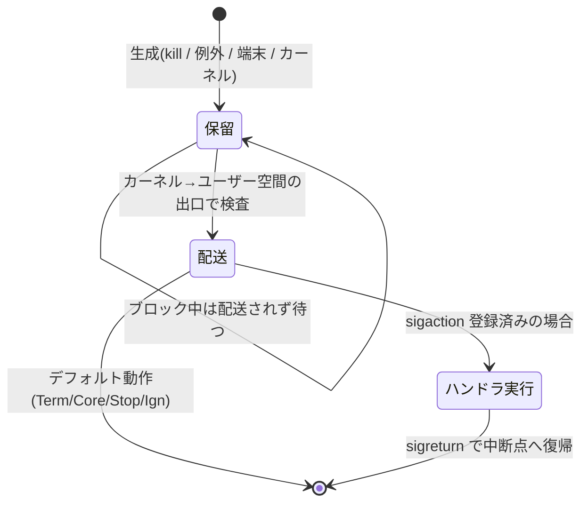

# シグナルとIPC — 隔離されたプロセスをつなぐ連絡手段

## 概要

この章では、プロセスに「出来事」を非同期に知らせる**シグナル**の仕組みと、
プロセスどうしが「データ」をやり取りする **IPC(プロセス間通信)** の全体像を
扱います。分野02(プロセス・カーネル基礎)の最終章で、前提知識はこの分野の
前4章すべてです。基準環境は Linux 7.0 / Ubuntu Server 26.04 LTS です。

## 導入 — 隔離した以上、連絡手段が要る

この分野で見てきたことを一言でまとめると、**カーネルはプロセスを徹底的に
隔離する**、です。アドレス空間は仮想メモリで分離され(他人のメモリは見えも
触れもできない)、CPU 時間はスケジューラが差配し、資源一式は task_struct
ごとに管理される——プロセスは互いに干渉できない「個室」に入っています。

しかし、隔離だけでは仕事になりません。シェルは子プロセスの終了を知る必要が
あり(`ls` が終わったからプロンプトを出す)、パイプラインでは `ls` の出力が
`grep` に流れ込む必要があります。個室どうしをつなぐ連絡手段が要るのです。
そして隔離を実現しているのがカーネルである以上、**連絡もすべてカーネル
経由**になります。プロセスが別のプロセスと直接やり取りする手段は原理的に
存在せず、どの連絡手段も正体はシステムコールです。

連絡には、性質の違う2種類があります。

1. **「起きたこと」を知らせたい** — 子が終了した、Ctrl-C が押された、
   不正なメモリアクセスをした。内容はほぼ「何が起きたか」の種別だけで、
   量はないが**相手が何をしていようと割り込んで**伝えたい。これが
   **シグナル(signal)** の領分です
2. **「データ」を渡したい** — コマンドの出力、リクエストとレスポンス、
   計算結果の共有。量があり、受け手が**都合のよいときに読める**形で
   渡したい。これが狭義の **IPC(Inter-Process Communication)** の領分です

シグナルには、実はすでに何度も出会っています。`02_syscall_context_switch.md`
で「ハードウェアからカーネルへの通知」が割り込みでした。シグナルはその
プロセス版——**カーネルからプロセスへの通知**です。第1章の背骨の一文
「カーネルは依頼(システムコール)と通知(割り込み)に反応して資源を差配する
番人」になぞらえるなら、シグナルは番人が個室の住人に向けて鳴らすベルに
あたります。SIGSEGV(`03_virtual_memory.md`)、SIGCHLD と wait
(`01_process_thread_basics.md`)、Ctrl-C で死ぬ `sleep`——ばらばらに
登場したこれらを、この章で1つの仕組みとして束ねます。

## 理論

本節の内容は、主に POSIX(IEEE Std 1003.1)の Signal Concepts、
`man 7 signal`(Linux のシグナル機構の総覧)、`man 2 sigaction`、および
IPC 各手段の総覧である `man 7 pipe` / `man 7 shm_overview` /
`man 7 mq_overview` / `man 7 sem_overview` / `man 7 unix` に基づきます。

### シグナルの本質 — 番号1つだけの非同期通知

シグナルの中身は、突き詰めれば**番号1つ**です(SIGINT = 2、SIGKILL = 9、
SIGSEGV = 11、…)。メッセージ本文はありません。「どのベルが鳴ったか」だけが
伝わる、最小限の通知です。この割り切りが、シグナルの用途(出来事の種別を
知らせる)と限界(データは運べない)の両方を決めています。

発生源は大きく4つあります。

| 発生源 | 例 | 既出の章 |
|---|---|---|
| ハードウェア例外の翻訳 | 不正メモリアクセス → SIGSEGV、ゼロ除算 → SIGFPE | ページフォールトの帰結(`03_virtual_memory.md`) |
| 端末 | Ctrl-C → SIGINT、Ctrl-Z → SIGTSTP、切断 → SIGHUP | — |
| 他のプロセスからの明示的な送信 | `kill` コマンド / `kill(2)` システムコール | — |
| カーネル内の出来事 | 子の終了 → SIGCHLD、読み手のいないパイプへの書き込み → SIGPIPE | ゾンビと wait(`01_process_thread_basics.md`) |

どの発生源でも、シグナルを実際に相手へ届けるのはカーネルです。`kill(2)` は
「カーネルに配達を依頼する」システムコールにすぎず、送信者が相手のメモリに
触れるわけではありません(隔離は破られていません)。また誰にでも送れる
わけではなく、**同じ UID のプロセスか、root(正確には CAP_KILL を持つ者)
だけ**が送れます(`man 2 kill`)。身分証(cred)による検査がここでも
働いています。

### 受け取ったらどうするか — 処分(disposition)

シグナルごとに、受信側プロセスは「受け取ったときの扱い」——POSIX の用語で
**処分(disposition)**——を1つ持ちます。選択肢は3つです。

1. **デフォルト動作** — 何も設定しなければこれ。シグナルごとに定義されて
   おり、種類は5つ: **Term**(終了)、**Core**(コアダンプを残して終了。
   SIGSEGV 等)、**Ign**(無視。SIGCHLD 等)、**Stop**(一時停止。
   `ps` の STAT で T——`01_process_thread_basics.md` の状態遷移図の T は
   これです)、**Cont**(停止からの再開)
2. **無視(SIG_IGN)** — 届いても捨てる
3. **ハンドラ(handler)** — 自作の関数を登録しておき、届いたらそれを
   実行させる(`man 2 sigaction`)。「Ctrl-C されたら一時ファイルを消してから
   終了する」のような後始末はこれで作ります

ただし例外が2つだけあります。**SIGKILL(9)と SIGSTOP(19)は、捕捉も
無視もブロックもできません**(POSIX)。処分を変えられるということは
「終了通知をプログラム自身が拒否できる」ということであり、それを全シグナルに
許すと、管理者がプロセスを確実に止める手段がなくなります。SIGKILL と
SIGSTOP は、この最終手段として意図的に留保されているのです。`kill -9` が
「最後の手段」なのは強力だからではなく、**相手に後始末の機会を与えない**
からです(まず SIGTERM で「終了してほしい」と伝え、応じない場合に 9、が
行儀です)。

fork と exec をまたいだ処分の運命は、`01_process_thread_basics.md` の
「exec で生き残るもの」の表に1行追加する形で整理できます——**fork では
処分がそのまま複製**され、**exec ではハンドラはデフォルトに戻ります**
(登録された関数はアドレス空間ごと消えるので、戻すしかありません)。
ただし「無視」は関数を指さないので exec 後も生き残ります(POSIX)。
`nohup` コマンドが SIGHUP を無視に設定してからコマンドを exec するのは、
この「無視は exec を生き残る」性質の応用です。

### 非同期であることの代償

シグナルの最大の特徴は**非同期**であること——受信側が何をしている最中でも
届く——です。ハンドラは、プログラムの実行のどの2命令の間にでも割り込んで
実行されえます。これは割り込みがカーネルにもたらす事情と同じ問題を、
ユーザープログラムに持ち込みます。

たとえば `malloc` の内部でヒープの管理構造を書き換えている最中に
シグナルが届き、ハンドラの中でまた `malloc` を呼んだら——管理構造は
書き換え途中の不整合な状態で再入され、壊れます。このため POSIX は
「ハンドラの中から安全に呼べる関数」を**非同期シグナル安全
(async-signal-safe)**な関数として明示的に列挙しており
(`man 7 signal-safety`)、`printf` も `malloc` もその表に**ありません**。
実務でのハンドラの定石が「フラグ(`volatile sig_atomic_t`)を立てるだけに
して、本処理はメインループでやる」なのはこのためです。後述の signalfd は、
この不自由さへの現代的な答えです。

### シグナルの一生 — 生成・保留・配送

シグナルは送った瞬間に相手のハンドラが動くわけではありません。POSIX は
一生を3つの段階で定義しています。

- **生成(generation)** — 出来事が起き、カーネルが相手プロセスの
  **保留集合(pending set)**に番号を記録する
- **保留(pending)** — 記録されてから配送されるまでの待ち状態。プロセスは
  シグナルごとに**ブロック(block)**を設定でき(シグナルマスク、
  `man 2 sigprocmask`)、ブロックされている間は配送されずに保留のまま待つ
  (SIGKILL / SIGSTOP はブロックも不可)
- **配送(delivery)** — 処分が実行される(ハンドラが走る、またはデフォルト
  動作が起きる)



ここに、標準シグナルの重要な性質が隠れています。保留集合は**集合(各番号に
つき有無の1ビット)**であって、待ち行列ではありません。つまり**同じ番号の
シグナルが保留中に何度生成されても、1回にまとめられます**(合流)。
SIGCHLD がその典型で、子が3人立て続けに死んでも、届く SIGCHLD は1回かも
しれません。「シグナル1回=出来事1回」と数えるプログラムは必ず壊れます
(トラブルシューティングで再訪します)。

この「数えられない・データを運べない」制約への POSIX の答えが
**リアルタイムシグナル**(SIGRTMIN〜SIGRTMAX。Linux では標準シグナルの
1〜31 番の上、おおむね 34〜64 番)です。こちらは**待ち行列に積まれ**
(同じ番号でも回数分届く)、`sigqueue(3)` で整数1個またはポインタ1個の
小さな付加データを運べ、番号の小さい順に配送されます(`man 7 signal`)。
とはいえ用途は限られており、本書では「標準シグナルの合流という罠を回避
する拡張が存在する」という位置づけの理解で十分です。

### IPC の見取り図 — データの渡し方は4系統

シグナルが「出来事の通知」を受け持つのに対し、データのやり取りには
複数の手段が併存しています。歴史的な経緯(UNIX の系譜と System V の系譜、
そしてそれらを整理した POSIX)で似た道具が重複しているため、まず**形**で
分類するのが見通しのよい整理です。

| 系統 | 手段 | データの形 | 使える相手 |
|---|---|---|---|
| バイトストリーム | パイプ | 区切りのないバイト列(一方向) | 血縁(fork で fd を引き継げる関係)のみ |
| | FIFO(名前付きパイプ) | 同上 | 無血縁でも可(ファイル名で合流) |
| | UNIX ドメインソケット | バイト列または境界つき(双方向) | 無血縁でも可(パス名で合流) |
| メッセージ | System V メッセージキュー / POSIX mq | 境界のあるメッセージ単位 | 無血縁でも可 |
| 共有メモリ | System V shm / POSIX shm_open + mmap | メモリそのもの | 無血縁でも可 |
| 同期(データなし) | セマフォ、futex | 「空き/使用中」の帳尻のみ | 無血縁でも可 |

選択の軸は3つです。

1. **相手との関係** — パイプは fd を fork で引き継ぐ仕組みなので血縁専用。
   無血縁のプロセスどうしは、ファイルシステム上の名前(FIFO、ソケットの
   パス、shm の名前)を待ち合わせ場所にします。「すべてはファイル」の思想
   (`01_intro/03`)が、ここでは**無関係なプロセスの合流地点**として
   働いています
2. **データの形** — バイトストリームは境界を保存しません(3回の write が
   1回の read で読めてしまう)。「1依頼=1メッセージ」の形を保ちたいなら
   メッセージ系か、境界を保つ型のソケットを使います
3. **経由地** — パイプもソケットもメッセージキューも、データは
   ユーザー空間 → カーネル内バッファ → ユーザー空間と**2回コピー**されます。
   共有メモリだけはこのコピーがゼロになる代わり、同時アクセスの交通整理
   (同期)を自前で背負います

この最後の点は、`03_virtual_memory.md` の道具立てでそのまま説明できます。
**共有メモリの正体は「2つのプロセスのページテーブルに、同じ物理ページ
フレームを指す PTE を書き込むこと」**です。翻訳表が同じ実体を指せば、
一方の書き込みは即座に他方から見えます——fork の CoW が「同じフレームを
指させて書き込み禁止にする」だったのに対し、共有メモリは「同じフレームを
指させて書き込みも許す」、それだけの違いです。カーネルは設定(mmap)にだけ
関与し、以後の読み書きには一切介在しません。最速である理由と、同期を
自前で背負う理由(カーネルが間にいないので流量制御も順序付けもない)は
表裏一体です。

なお同期の道具のうち**セマフォ(semaphore)**は「同時に入れる人数を数える
カウンター」で、共有メモリの交通整理の古典的な相棒です(`man 7 sem_overview`)。
スレッド間の mutex の土台である **futex** も含め、同期機構の深掘りは
本書の範囲では行いません(`01_process_thread_basics.md` で述べた方針の
とおりです)が、位置づけだけ「発展」で触れます。

## 内部動作の詳細

### カーネル内のデータ構造 — 台帳のどこに書かれるか

シグナルの実装は task_struct の周辺に集まっています
(`include/linux/sched/signal.h`)。押さえるべきは「何がスレッド固有で、
何がプロセス(スレッドグループ)共有か」です。

```
task_struct(スレッドごと)          signal_struct / sighand_struct(プロセス共有)
┌──────────────────┐          ┌────────────────────────┐
│ blocked: シグナルマスク │          │ shared_pending: プロセス宛の保留集合 │
│ pending: 自分宛の保留集合│─参照→ │ action[]: 処分の表(全スレッド共通)  │
│ TIF_SIGPENDING フラグ  │          │                            │
└──────────────────┘          └────────────────────────┘
```

- **処分の表(どのシグナルにどのハンドラか)はプロセスで1枚**。あるスレッド
  が sigaction で登録すれば全スレッドに効きます
- **マスク(何をブロックするか)はスレッドごと**
- 保留集合は2段構えです。`kill` のような**プロセス宛**のシグナルは共有の
  保留集合に入り、**そのシグナルをブロックしていないスレッドのうち任意の
  1つ**に配送されます(POSIX)。一方、SIGSEGV のように**特定スレッドの
  行為が原因**のシグナルは、原因を作った当のスレッドの保留集合に入ります

マルチスレッドプログラムのシグナル処理が難しいと言われる主因はこの
「プロセス宛はどのスレッドに届くか分からない」性質で、定石は「1本の
スレッド以外は全シグナルをブロックし、専任スレッドで受ける」です。

### 配送のタイミング — 前章の出口検査、2枚目の旗

シグナルは「送られた瞬間」ではなく、**受信側タスクがカーネルから
ユーザー空間へ戻る出口**で配送されます。既視感のある話です——
`02_syscall_context_switch.md` で、プリエンプションは TIF_NEED_RESCHED の
旗を立てておき、カーネルからの出口で検査して実行されるのでした。シグナルも
まったく同じ設計で、生成時に **TIF_SIGPENDING** の旗を立て、出口で検査
します。**カーネルからユーザー空間への出口は、たまった用事(再スケジュール、
シグナル配送)をまとめて片付ける関所**なのです。

では、受信側が眠っていたら(S 状態で read 待ちなど)?  カーネルは
シグナル生成時に相手を起こします。ここで `01_process_thread_basics.md` の
S と D の違いの正体が明かせます——**S(TASK_INTERRUPTIBLE)は「シグナルで
起こしてよい眠り」、D(TASK_UNINTERRUPTIBLE)は「シグナルでは起こさない
眠り」**です。D 状態が kill -9 にすら応じないのは、SIGKILL が無視されて
いるのではなく、**配送の前提である「目覚めてカーネルの出口に向かう」が
起きない**からです(保留にはなっています。目覚めれば直ちに死にます)。
なお「I/O 完了までは中断できないが、死ぬのはよい」という中間の眠り
(TASK_KILLABLE、Linux 2.6.25 以降)もあり、NFS などはこれで「D 状態
なのに kill は効く」を実現しています。

シグナルで起こされた場合、眠りの原因だったシステムコール(read 等)は
完了していません。このときシステムコールは **EINTR**(Interrupted system
call)のエラーで戻ります——`errno` の表(前章)にあった、あの番号です。
「read は失敗しうる。シグナルで中断されただけでも」という事実は、堅牢な
プログラムが EINTR をリトライする理由であり、sigaction の **SA_RESTART**
フラグ(中断されたシステムコールをカーネルが自動で再開する)が存在する
理由です(`man 7 signal` に、再開できるシステムコールとできないものの
一覧があります)。

### ハンドラはどうやって走るのか — カーネルによる「偽装呼び出し」

配送されるシグナルにハンドラが登録されていた場合、カーネルは奇妙な仕事を
します。**ハンドラはユーザー空間の関数**なので、カーネルが直接呼ぶことは
できません(ring 0 から ring 3 の関数を「呼ぶ」機構はありません)。
そこでカーネルは、**ユーザー空間に戻る際のレジスタとスタックを偽装**します。

1. カーネル入り時に退避してあったレジスタ一式(pt_regs——前章参照)と
   シグナルマスクを、**ユーザースタック上**にコピーする(シグナルフレーム)
2. 戻り先アドレス(pt_regs 内の rip)を、本来の中断点から**ハンドラの
   先頭**に書き換える
3. ハンドラから return したときの戻り先として、`rt_sigreturn(2)` システム
   コールを呼ぶだけの小さな踏み台を仕込む
4. 何食わぬ顔でユーザー空間へ戻る——CPU はハンドラの先頭から実行を始める
5. ハンドラが return すると踏み台が rt_sigreturn を呼び、カーネルが
   スタック上のシグナルフレームから元のレジスタ一式を復元して、**中断点の
   続きから**実行が再開される

つまりハンドラの実行とは、「カーネルがユーザースタック上に架空の関数呼び出しを
組み立てて帰る」ことです。プログラム本体から見れば、2命令の間に幻の
呼び出しが挟まったように見えます。ハンドラ実行中のスタックが本体と同じ
1本である点は、スタックあふれ(SIGSEGV)をハンドラで捕まえたい場合の
急所になります——あふれたスタックの上にフレームは積めません。このために
**代替スタック**(`man 2 sigaltstack`)が用意されています。

### パイプの内部 — 64 KiB の貯水槽(第1部の宿題の回収)

IPC 側の代表として、最も身近なパイプの内部を確定させます。
`01_intro/02_shell_and_commands.md` で「カーネル内のバッファを介した
流量制御つきの通路」と述べ、容量を保留にしていました。`man 7 pipe` に
よれば:

- 容量は Linux 2.6.11 以降、**既定 16 ページ = 64 KiB**(x86-64)
- `fcntl(F_SETPIPE_SZ)` で変更でき、非特権プロセスの上限は
  `/proc/sys/fs/pipe-max-size`(既定 1 MiB)
- **PIPE_BUF(Linux では 4096 バイト)以下の write は原子的**——複数の
  書き手が同じパイプに書いても、この大きさまでは互いに混ざらないことを
  POSIX が保証します

流量制御の実体はプロセス状態の言葉で言えます。バッファが満杯のときの
write、空のときの read は、**S 状態で眠る**(そして相手の read / write が
割り込みハンドラよろしくこちらを起こす)——分野02で学んだ道具立てが
そのまま裏側です。

もう1つ、パイプには**終端の通知**が組み込まれています。書き手が全員 fd を
閉じれば読み手の read は 0(EOF)を返します。逆に**読み手が全員いなくなった
パイプへの write は SIGPIPE を生成**し、デフォルト動作は Term です。
`yes | head -n 1` が一瞬で終わるのはこのおかげです——head が1行読んで
終了した瞬間、無限に書き続けるはずだった yes は SIGPIPE で殺されます。
パイプラインの下流が死ねば上流も連鎖的に止まる、という UNIX の作法は、
シグナルとパイプの合作なのです。

### UNIX ドメインソケットと fd の受け渡し

現代の Linux サーバーで無血縁プロセス間の主役は **UNIX ドメインソケット**
です(`man 7 unix`)。API は分野04で学ぶネットワークソケットと同一
(socket / bind / listen / accept)ですが、通信はカーネル内で完結し、
待ち合わせにはファイルシステム上のパス(例: `/run/systemd/private`)を
使います。双方向で、境界を保つ型(SOCK_SEQPACKET / SOCK_DGRAM)も選べ、
相手の身分(UID/GID/PID)をカーネル保証つきで確認でき(SO_PEERCRED)、
そして他の IPC にない特技として **fd そのものを相手に送れます**
(SCM_RIGHTS)。「開いたファイルの通行証」であった fd がプロセス間を
渡り歩けるという事実は、権限分離(特権プロセスが open だけして、開いた
fd を非特権プロセスに手渡す)の基盤で、systemd のソケットアクティベーション
(分野06)や D-Bus もこの土台の上にあります。ソケット自体の内部機構は
`04_linux_network_stack/01_socket_api.md` が主担当なので、ここでは
「IPC の道具箱の万能選手」という位置づけだけ押さえてください。

### System V と POSIX — 2世代の共存

共有メモリ・セマフォ・メッセージキューには、それぞれ System V 版と
POSIX 版の2世代があります(`man 7 sysvipc`、`man 7 shm_overview` ほか)。
System V IPC(shmget / semget / msgget)は 1980 年代からの古参で、
資源を整数のキーで識別し、fd の世界の外に独自の名前空間を持ちます
(観察も専用の `ipcs` コマンド)。POSIX 版(shm_open / sem_open /
mq_open)は「すべてはファイル」に寄せた再設計で、名前は `/dev/shm`
(tmpfs)や `/dev/mqueue` 上のファイルとして見え、fd で扱え、mmap や
select 系と組み合わせられます。新規に書くなら POSIX 版が原則ですが、
運用では System V 時代のソフトウェア(古い RDBMS 等)に今も出会うため、
`ipcs` の存在は知っておく価値があります。

### 発展: fd に化けるシグナル — signalfd と現代のイベントループ

シグナルの非同期性(いつでも割り込む・安全に呼べる関数が限られる)は、
「多数の fd を監視して届いた順に処理する」イベントループ型のサーバーと
相性が悪い仕組みです。Linux の答えは**シグナルを fd に化けさせる**ことでした。

- **signalfd**(`man 2 signalfd`)— 指定したシグナルの到着を「read できる
  fd」に変換する。ハンドラの割り込みは起きず、イベントループが他の fd と
  同列に、都合のよいタイミングで読める
- **eventfd / timerfd** — プロセス内・プロセス間の汎用の通知やタイマーも
  同様に fd 化する仲間
- **pidfd**(`man 2 pidfd_open`、Linux 5.3 以降)— プロセスそのものを fd で
  参照する。従来の kill(2) には「PID が再利用され、死んだはずの別人に
  シグナルを送ってしまう」競合が原理的にありましたが、pidfd は特定の
  プロセス実体に紐づくため、この競合がありません
  (`pidfd_send_signal(2)`)

「すべてはファイル」への合流がここでも進んでいる、という構図です。これらは
分野04(epoll を扱う際)と分野06(systemd はこれらの仕組みの大口利用者
です)で実際に登場します。

## 実行例 — シグナルと IPC を観察する

前提は Ubuntu Server 26.04 LTS です。

シグナルの一覧(番号と名前の対応)を見る:

```console
$ kill -l
 1) SIGHUP   2) SIGINT   3) SIGQUIT  4) SIGILL   5) SIGTRAP
 6) SIGABRT  7) SIGBUS   8) SIGFPE   9) SIGKILL 10) SIGUSR1
11) SIGSEGV 12) SIGUSR2 13) SIGPIPE 14) SIGALRM 15) SIGTERM
...
34) SIGRTMIN ...  64) SIGRTMAX     ← 34以降がリアルタイムシグナル
```

シェルの trap でハンドラを体験する(trap はシェル向けの sigaction):

```console
$ trap 'echo "SIGINT を受け取ったが終了しない"' INT
$ sleep 30
^CSIGINT を受け取ったが終了しない   ← Ctrl-C(SIGINT)の処分が変わっている
$ trap - INT                        ← 処分をデフォルトに戻す
```

プロセスごとのシグナル状態(マスク・保留・処分)は `/proc` で見えます。
64 ビットのビットマスクで、各ビットが1つのシグナル番号に対応します:

```console
$ grep -E '^Sig(Pnd|Blk|Ign|Cgt)' /proc/self/status
SigPnd: 0000000000000000    ← 保留中(pending)の集合
SigBlk: 0000000000010000    ← ブロック中(マスク)の集合
SigIgn: 0000000000384004    ← 無視に設定済みの集合
SigCgt: 000000004b813efb    ← ハンドラ捕捉(caught)済みの集合
```

Stop / Cont のデフォルト動作と T 状態(`01_process_thread_basics.md` の
状態遷移図の実演):

```console
$ sleep 100 &
[1] 4210
$ kill -STOP 4210; ps -o pid,stat,comm -p 4210
    PID STAT COMMAND
   4210 T    sleep        ← Stop の結果が T 状態
$ kill -CONT 4210; ps -o pid,stat,comm -p 4210
    PID STAT COMMAND
   4210 S    sleep        ← Cont で待ち(S)に復帰
```

SIGPIPE によるパイプラインの連鎖停止:

```console
$ yes | head -n 1
y            ← 無限に出力するはずの yes が即座に終わる。
             ← head の終了 → パイプの読み手消滅 → yes に SIGPIPE
```

パイプ容量の上限設定を確認する:

```console
$ cat /proc/sys/fs/pipe-max-size
1048576      ← F_SETPIPE_SZ で広げられる上限(既定 1 MiB)。既定容量は 64 KiB
```

POSIX 共有メモリ(tmpfs 上のファイルとして見える)と System V IPC の観察:

```console
$ ls -l /dev/shm
-rw------- 1 postgres postgres 1048576 Jul 17 09:14 PostgreSQL.2384752194
$ ipcs -m
------ Shared Memory Segments --------
key        shmid  owner     perms  bytes   nattch
0x00000000 32768  postgres  600    56      6       ← System V 世代の共有メモリ
```

UNIX ドメインソケットの待ち合わせ場所を一覧する:

```console
$ ss -xl | head -4
Netid State  Recv-Q Send-Q Local Address:Port
u_str LISTEN 0      4096   /run/systemd/private 18276
u_str LISTEN 0      4096   /run/dbus/system_bus_socket 15142
u_str LISTEN 0      128    /run/user/1000/gnupg/S.gpg-agent 33518
```

## トラブルシューティング — 「kill したのに死なない」の分類学

- **kill -9 してもゾンビが消えない**: ゾンビ(STAT Z)は**すでに死んで
  います**。残っているのは終了ステータスを親に渡すための記録だけで、
  シグナルを配送すべき実行主体がもう存在しません。消す方法は親に wait
  させること(親を修正するか、親を終了させて PID 1 に回収させる)だけです
  (`01_process_thread_basics.md` 参照)
- **kill -9 が効かない(D 状態)**: STAT が D のプロセスは、シグナルでは
  起こせない眠りの中にいます。SIGKILL は保留されており、I/O が完了して
  目覚めた瞬間に死にます。逆に言えば **D のまま長時間動かないのは
  シグナルの問題ではなく、その先の I/O(ディスク、NFS)の問題**です。
  `cat /proc/<PID>/stack`(root 権限)でカーネル内のどこで眠っているかが
  見えます
- **SIGCHLD を数えていて子の回収が漏れる**: 標準シグナルは保留中に合流
  します。子が3人死んでも SIGCHLD は1回かもしれません。SIGCHLD ハンドラ
  では `waitpid(-1, ..., WNOHANG)` を**ループで回収し尽くす**のが定石です
  (`man 2 wait` の注記)。ゾンビが散発的に溜まるデーモンは、ほぼこれです
- **ハンドラの中で printf/malloc していて、まれに固まる・壊れる**: 非同期
  シグナル安全(`man 7 signal-safety`)違反の典型で、再現性が低いのが
  特徴です。ハンドラはフラグを立てるだけにするか、signalfd 方式に
  改めます
- **シグナルで read が失敗する(EINTR)**: 眠っているシステムコールは
  シグナル配送で中断されて EINTR で戻ります。リトライしないプログラムは
  「タイマーやウィンドウリサイズ(SIGWINCH)で散発的に I/O エラー」の
  ような不可解な症状を示します。sigaction の SA_RESTART、またはリトライ
  ループが対処です
- **nohup したのに SSH を切ったら死んだ / していないのに生きている**:
  端末の切断で SIGHUP を受けるかどうかは、セッションとプロセスグループの
  所属で決まります(`man 7 signal`、ジョブ制御)。本書では深追いしませんが、
  「サービスは端末から切り離して起動する」問題の正式な解決は systemd の
  領分です(分野06)
- **`/dev/shm` が肥大してメモリを圧迫する**: POSIX 共有メモリの実体は
  tmpfs、つまり**物理メモリ(+スワップ)**です。プログラムが shm_unlink
  せずに異常終了すると、誰も使っていないセグメントがメモリを掴んだまま
  残ります。`ls /dev/shm` と `ipcs -m`(nattch = 0 のセグメント)が
  点検場所です

## 演習・確認問題

1. シグナルを「割り込みのプロセス版」と呼べる理由を、(a) 通知の方向、
   (b) 非同期性がもたらす制約(割り込みハンドラ/シグナルハンドラで
   やってよいこと)、の2点で説明してください
2. SIGKILL と SIGSTOP だけが捕捉・無視・ブロックのすべてを禁じられている
   のはなぜですか。また `kill -9` を最初の手段にすべきでない理由を、
   「処分」の言葉で説明してください
3. D 状態のプロセスに SIGKILL が(すぐには)効かない理由を、シグナルの
   配送タイミング(カーネルからの出口)と眠りの種類の言葉で説明して
   ください。ゾンビに効かない理由との違いは何ですか
4. パイプと共有メモリを「データのコピー回数」と「カーネルの関与」の観点で
   比較し、共有メモリを使うプログラムだけがセマフォ等の同期を自前で
   必要とする理由を、ページテーブルの言葉で説明してください
5. `yes | head -n 1` の実行が一瞬で終わるまでに起きることを、fd・EOF・
   SIGPIPE・デフォルト動作の語を使って時系列で説明してください

## まとめ

- 隔離されたプロセスをつなぐ手段はすべてカーネル経由。「出来事の通知」が
  シグナル、「データの受け渡し」が IPC の領分
- シグナルは番号1つの非同期通知。処分(デフォルト/無視/ハンドラ)を
  プロセスが選べるが、SIGKILL と SIGSTOP だけは管理の最終手段として不可侵。
  標準シグナルは保留中に合流する(数えられない)
- 配送はカーネル→ユーザー空間の出口で行われる(TIF_SIGPENDING)。
  S は「シグナルで起こせる眠り」、D は「起こせない眠り」であり、これが
  kill の効き方の違いの正体。ハンドラはカーネルがユーザースタック上に
  組み立てる偽装呼び出しで走り、非同期シグナル安全の制約を伴う
- IPC はバイトストリーム(パイプ / FIFO / UNIX ドメインソケット)、
  メッセージ、共有メモリ、同期の4系統。共有メモリは「2つのページテーブルに
  同じ物理フレームを指させる」だけの最速の手段で、代わりに同期を自前で負う
- 観察は kill -l、/proc/PID/status の Sig* 行、ps の STAT(T/Z/D)、
  /dev/shm と ipcs、ss -x で行う
