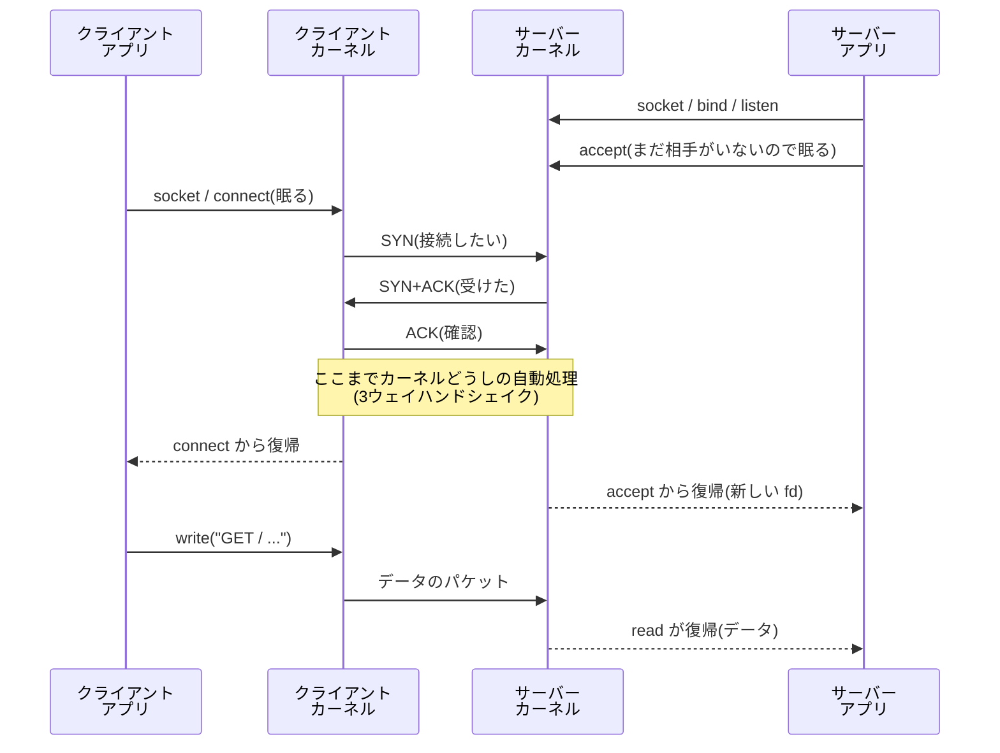

# ソケット API — システムコールからパケットまで

## 概要

分野04(Linux ネットワークスタック内部)の最初の章として、プロセスが
ネットワーク通信に使う唯一の窓口——**ソケット**——を、API の設計から
カーネル内部でパケットになるまで貫いて扱います。前提知識は分野02
(システムコール、待ちと起床、シグナル)と `03_filesystem_storage/01`
(VFS、fd → struct file の三層)です。IP ルーティングや L2/L3 の
プロトコル自体は姉妹書 `network-guide` の領分で、本分野は「Linux
カーネルがそれをどう実装しているか」を受け持ちます。基準環境は
Linux 7.0 / Ubuntu Server 26.04 LTS です。

## 導入 — 「すべてはファイル」をネットワークへ延ばす

分野02の最終章で、こう整理しました。プロセスは互いに隔離されている、
だから**連絡はすべてカーネル経由**である——パイプも、共有メモリも、
UNIX ドメインソケットも。では、相手が**別のマシンの上のプロセス**
だったらどうでしょう。

隔離どころの話ではありません。相手は別のカーネルの管理下にいて、
こちらのカーネルは相手のメモリにもプロセスにも一切手が届きません。
2台の間にあるのはネットワークだけです。つまり通信は必然的に
「**こちらのカーネルと相手のカーネルが、ネットワーク越しにパケットを
やり取りする**」形になります。アプリケーションどうしが直接会話して
いるように見えて、実際に会話しているのは常にカーネルどうしです。

では、アプリケーションにはこの仕組みをどんな顔で見せるべきでしょうか。
Linux(と UNIX 一族)の答えは一貫しています——**ファイルの顔**です。
通信の端点を1つ作ってもらい、それをファイルディスクリプタとして
受け取り、あとは read / write する。`01_intro/03` で導入し
`03_filesystem_storage/01` で機構を見た「すべてはファイル」の思想を、
ネットワークまで延ばすわけです。この端点が**ソケット(socket)**です。

ただし、ファイルとまったく同じにはできません。通信には、ファイルに
なかった事情が4つあります。

1. **相手がいる。** 読み書きの前に「誰と」を決める必要がある(宛先)
2. **合意が要る。** 一方的に書き始めても、相手が受け取る態勢に
   なければ意味がない(接続)
3. **相手のペースがある。** こちらが速く書いても、相手が読むのが
   遅ければどこかで詰まる(流量制御)
4. **失敗が日常である。** 相手が落ちる、経路が切れる、パケットが
   消える——ローカルのファイルでは例外だった事態が、常に起こりうる

ソケット API とは、「read / write というファイルの契約は守ったまま、
この4つの事情を扱う専用の道具(socket、bind、listen、accept、
connect …)を足したもの」です。この章の前半で道具の設計を、後半で
fd の裏側——write したバイト列がパケットになり、届いたパケットが
read で読めるようになるまでのカーネル内の道のり——を見ます。

```
   マシン A                                        マシン B
  ┌───────────────────────┐          ┌───────────────────────┐
  │ アプリ    write(fd,…)  │          │ アプリ    read(fd,…)   │
  ├─────────┬─────────────┤          ├─────────────┬─────────┤
  │         ↓ ユーザー空間 │          │ ユーザー空間 ↑         │
  │ ~~~~~~~~~~~~~~~~~~~~~ │          │ ~~~~~~~~~~~~~~~~~~~~~ │
  │  ソケット(通信の端点)│  カーネル │(通信の端点)ソケット  │
  │         ↓             │  どうしの │             ↑         │
  │  TCP / IP スタック     │  会話     │  TCP / IP スタック     │
  │         ↓             │          │             ↑         │
  │  NIC ドライバ          │          │  NIC ドライバ          │
  └─────────┬─────────────┘          └─────────────┬─────────┘
            └────────→ ネットワーク ────────────────┘
                        (パケット)
```

## 理論

本節の内容は、主に **POSIX(IEEE Std 1003.1)のソケット関連の規定**、
`man 2 socket`、`man 2 listen`、`man 7 socket`、`man 7 tcp`、
`man 7 udp`、`man 7 epoll`、および Linux カーネルドキュメント
(Documentation/networking/)に基づきます。ソケット API の原型は
1983年の 4.2BSD で導入されたもので、以後の UNIX 系 OS がこれを踏襲し、
POSIX が標準化しました。TCP プロトコル自体の仕様は RFC 9293、UDP は
RFC 768 ですが、プロトコルの中身(輻輳制御、再送の詳細など)は
本書では深追いしません。

### ソケットの3つの座標 — どの世界で、どんな形式で話すか

ソケットは `socket(ファミリ, 型, プロトコル)` という3つの引数で
作られます。最初の2つが本質です。

**アドレスファミリ**は「宛先をどの世界の住所で指定するか」です。
`AF_INET`(IPv4)、`AF_INET6`(IPv6)、そして分野02で登場済みの
`AF_UNIX`(同一ホスト内。住所はファイルシステム上のパス名)が
代表です。UNIX ドメインソケットとネットワークソケットの API が
同一なのは、この引数1つの違いにすぎないからです。

**型**は「データをどんな形式でやり取りするか」です。

- **SOCK_STREAM(ストリーム)** — 境界のない**バイト列**を、
  欠けも重複も順序の入れ替わりもなく届ける。AF_INET では TCP
- **SOCK_DGRAM(データグラム)** — **1通ずつ独立した手紙**を送る。
  境界は保存されるが、届く保証も順序の保証もない。AF_INET では UDP

ストリームで注意すべきは、パイプ(`01_intro/02`)で学んだ性質の
再演です——**write の回数という境界は保存されません**。こちらが
100バイトの write を3回しても、相手の read には300バイトが一度に
見えるかもしれないし、150バイトずつ2回かもしれません。TCP が
約束するのは「バイト列として正しい」ことだけです。「1依頼=
1メッセージ」の形が必要なら、アプリケーション側が長さ情報などで
区切りを作ります(データグラムなら形そのものが保存されますが、
今度は到達が保証されません)。

### 住所の申告 — bind とポート番号

ファイルには「パス名」というカーネル管理の名前空間がありましたが、
ネットワークの宛先はマシンの外の世界と共有する名前空間です。宛先は
**IP アドレス**(マシンを指す。`network-guide` の主題)と
**ポート番号**(そのマシンの中の窓口を指す。16ビット、0〜65535)の
組で指定します。1台のマシンで sshd と nginx が同居できるのは、
届いたパケットをポート番号で仕分けているからです。

`bind` は「このソケットはこの住所(アドレス+ポート)で受け付ける」
という**自分の側の**申告です。サーバーが 22 番や 80 番といった
**よく知られたポート**に bind するのは、クライアントが事前に番号を
知っている必要があるからです。1024 未満のポートへの bind は伝統的に
特権(現代の Linux では capability の1つ、CAP_NET_BIND_SERVICE。
分野07)を要求します——「22番を名乗る」ことが一般ユーザーに許されて
いたら、偽の sshd を立てられてしまうためです。一方クライアント側は
番号を名乗る必要がないので bind を省くのが普通で、connect の瞬間に
カーネルが空きポート(エフェメラルポート。既定でおおむね
32768〜60999 の範囲、`/proc/sys/net/ipv4/ip_local_port_range`)を
自動で割り当てます。

### TCP の会話が始まるまで — 5つのシステムコール

サーバーとクライアントの役割は非対称なので、使う道具も非対称です。
サーバーは `socket → bind → listen → accept`、クライアントは
`socket → connect`。



この図で最も大事なことは、**接続を確立する3往復(3ウェイハンド
シェイク)を行うのはカーネルであって、アプリケーションではない**と
いう点です。`listen` は「このソケットを接続受付所にせよ。完成した
接続は待ち行列(**バックログ**)に並べておけ」という宣言で、以後、
SYN への応答も ACK の確認もカーネルが勝手に進めます。`accept` は
**完成品の接続を待ち行列から1つ取り出すだけ**です。accept を
呼んでいない間にも接続は成立し、行列に積まれていきます(この行列の
あふれが実運用の典型的な障害になります——内部動作の節で見ます)。

もう1つの要点は、**listen しているソケットと、会話するソケットは
別物**だということです。accept は呼ばれるたびに**新しい fd** を
返します。listen ソケットは受付窓口として残り続け、会話は接続ごとの
専用ソケットで行われます。では 80 番ポートへの接続が1万本あったら
カーネルはどう区別するのか——接続は
**(自分のIP, 自分のポート, 相手のIP, 相手のポート)の4つ組**で
識別されます。自分側が全部 80 番でも、相手側の組み合わせが違えば
別の接続です。届いたパケットは、この4つ組でソケットを表引きして
配達されます。

なお UDP(データグラム)には接続の概念がないため、この儀式は
まるごと不要です。socket と bind だけで、`sendto`(宛先を毎回指定
して送る)/ `recvfrom`(差出人付きで受け取る)により即座に
やり取りできます。届く保証がない代わりに、始めるのも軽いのです。

### 読み書きと待ち — ブロッキングの正体

接続が確立すれば、あとはファイルの契約どおり read / write です。
その裏では、分野02・03で見た型がそのまま再演されます。

**read** — ソケットの受信キューにデータがあればコピーして返ります。
なければ、プロセスは**そのソケットの待ち行列に登録して S 状態で
眠ります**(`02_process_kernel/01` の「待ちで眠る」)。後述する
受信処理がパケットをキューに積んだとき、カーネルが眠っている
タスクを起こします。read が「ブロックする」の正体は、この
眠りと起床です。

**write** — 書いたバイト列は**送信バッファに積まれた時点で復帰**
します。相手に届いた保証はおろか、まだ1パケットも出ていないかも
しれません(「遅らせると、まとめられて、賢く決められる」——
ライトバックや遅延割り当てと同じ型が、ここにもあります)。TCP は
バッファから「いつ・どれだけ送るか」を、相手の受信能力(受信
ウィンドウ)とネットワークの混み具合(輻輳制御。RFC 9293。本書
では踏み込みません)から自分で決めます。相手が読まずにバッファが
満杯になれば、write は空きができるまで眠ります——パイプの流量
制御(`01_intro/02`)の、ネットワーク版です。

そして「失敗が日常」の顔もここに出ます。相手が接続を閉じた後に
write し続けると、EPIPE エラーと **SIGPIPE** が返ってきます——
`02_process_kernel/05` でパイプについて見た「聞き手のいない発言は
罰する」仕組みは、ソケットにも同じく働きます(サーバープログラムが
SIGPIPE を無視に設定するのが定石なのも同じ理由です)。

### 1プロセスで1万本の接続 — 多重化という第2の様式

ここまでの様式は「fd 1本に対して read で待つ」でした。接続1本なら
これで足ります。しかしサーバーのデーモンは何百・何千の接続を同時に
抱えます。接続ごとにプロセスやスレッドを立てる古典的な様式は、
数千本を超えるとメモリとコンテキストスイッチのコストで苦しくなり
ます(1999年頃「C10K 問題」として定式化された課題です)。

答えの方向は、「**どれかの fd が読み書き可能になるまで待つ**」を
1回の眠りにまとめることです。ノンブロッキングモード(データが
なければ眠らず EAGAIN を返す設定)と組み合わせ、1つのプロセスが
多数の fd を巡回します。この「まとめて待つ」系のシステムコールが
select(POSIX)、poll(POSIX)、そして Linux 固有の **epoll** です。

select / poll は「呼ぶたびに監視したい fd の全リストを渡し、
カーネルが全部を検査する」設計で、接続数 n に対して毎回 O(n) の
仕事が発生します。epoll は**関心の登録と、発生の受け取りを分離**
しました。監視リストはカーネル内に持たせて(epoll_ctl で増減)、
epoll_wait は「実際に何かが起きた fd」だけを受け取ります。1万本を
監視していても、動きのあった10本ぶんの仕事しか発生しません。
現代のサーバーソフトウェア(nginx、systemd 自身も)はこの様式で
動いています。

この様式が快適になるほど、「待つ対象はすべて fd であってほしい」と
いう圧力が生まれます。`02_process_kernel/05` の最後に見た
signalfd / timerfd / eventfd はまさにこのための道具でした——
シグナルもタイマーも、fd の顔にしてしまえば epoll の1つの眠りに
合流できます。「すべてはファイル」は、多重化の時代にいっそう
効いてくる設計だったわけです。

## 内部動作の詳細

### fd の裏の二層 — struct socket と struct sock

`03_filesystem_storage/01` で、fd の裏は「fd テーブル → struct file →
inode」の三層だと学びました。ソケットの場合、struct file の先が
こう置き換わります。

```
  fd テーブル
     └→ struct file(f_op = ソケット用の操作表)
           └→ struct socket   … VFS 側の顔。型・状態・待ち行列
                 └→ struct sock … プロトコル側の実体。
                                   受信キュー / 送信キュー /
                                   バッファ上限 / プロトコル状態
                                   (TCP なら tcp_sock に拡張)
```

**struct socket** は VFS との接点で、read / write システムコールが
ソケット用の操作表を経由して送受信の処理に翻訳されるための足場
です。**struct sock** がプロトコル実装側の本体で、受信キュー
(届いたデータの列)、送信キュー(まだ送り終えていないデータ)、
それぞれのバッファ上限、待っているタスクの行列を持ちます。TCP の
接続状態(ESTABLISHED、TIME_WAIT …)や再送タイマーは、struct sock を
拡張した tcp_sock が持ちます。「VFS の顔」と「プロトコルの実体」の
二層——task_struct と mm_struct、あるいは struct file と inode で
繰り返し見てきた、役割ごとに構造体を分ける設計がここにもあります。

### パケットの入れ物 — sk_buff

カーネル内のパケットは、生まれてから死ぬまで **sk_buff**(socket
buffer。通称 skb)という構造体で運ばれます。設計の焦点は
**コピーをしないこと**です。

パケットは層を通るたびに姿を変えます。送信なら、アプリのデータに
TCP ヘッダが付き、その前に IP ヘッダが付き、その前に Ethernet
ヘッダが付く。素朴に作れば層ごとにバッファを作り直してコピーする
ところですが、sk_buff は**最初にヘッダ分の余白(headroom)を確保
してデータを置き、ポインタだけを動かします**。

```
      ←──────────── 確保したバッファ ────────────→
      ┌─────────────┬──────────────────┬─────────┐
      │  headroom   │     データ        │tailroom │
      └─────────────┴──────────────────┴─────────┘
      ↑             ↑                  ↑         ↑
     head          data               tail      end

  送信で TCP 層を通る: data を左へ広げ TCP ヘッダを書く
  送信で IP  層を通る: data をさらに左へ広げ IP ヘッダを書く
      ┌──────┬─────┬─────┬────────────┬─────────┐
      │ 残り │ IP  │ TCP │   データ    │tailroom │
      └──────┴─────┴─────┴────────────┴─────────┘
             ↑ data がここまで移動。データ本体は一度も動いていない
```

受信は逆向きで、各層がヘッダを読み終えるたびに data ポインタを右へ
進めます(ヘッダを「剥がす」のもポインタ操作だけ)。データ本体が
コピーされるのは原則2回だけ——送信時にユーザーのバッファから
skb へ、受信時に skb からユーザーのバッファへ——で、カーネルの中を
通る間は同じメモリが使い回されます。

### 送信の道のり — write が NIC に届くまで

write システムコールから電線までを一気に追います。

1. **ソケット層** — write はソケット用の操作表を経て TCP の送信
   処理(tcp_sendmsg)へ。ユーザーのバッファから skb にコピーして
   送信キューに積み、**ここで write は復帰します**
2. **TCP 層** — 送信キューから「いま送ってよい量」を切り出し、TCP
   ヘッダを付けます。いつ・どれだけ送るかは受信ウィンドウと輻輳
   制御の判断で、write のタイミングとは独立です。送った skb は
   ACK が返るまで再送に備えて保持されます
3. **IP 層** — 宛先 IP から**ルーティング表**を引いて、出ていく
   NIC と次の宛先を決め、IP ヘッダを付けます。ルーティング表の
   読み方・作られ方は `network-guide` の主題です
   (`../../network-guide/01_fundamentals/02_routing_table_basics.md`)
4. **キューイング層(qdisc)** — NIC ごとの送信待ち行列に並びます。
   実はここに「どのパケットを先に出すか」を差し替えられる
   スケジューラが挟まっており、分野02の CPU スケジューラと同じ
   「公平とは何か」の問題がパケットにもあります——本分野の最終章
   (`04_linux_network_stack/04`)の主題として予告しておきます
5. **NIC ドライバ** — skb の物理アドレスを NIC に伝え、NIC が
   **DMA** でメモリから直接読み出して電線に流します。送信完了は
   割り込みで通知され、skb が回収されます

**発展: オフロード** — 現代の NIC はチェックサム計算や「大きな塊を
MTU サイズに切り分ける」作業(セグメンテーション)を肩代わりでき
ます(GSO / TSO)。カーネルはスタック内をできるだけ大きな塊のまま
通し、切り分けを最後の瞬間まで遅らせます——ここでも「遅らせると、
まとめられる」が効いています。受信側の対応物が GRO(小さなパケット
を束ねてから上げる)です。

### 受信の道のり — 割り込みの後半戦(分野02の伏線回収)

受信は送信より難しい問題です。**いつ来るかを選べない**からです。

`02_process_kernel/02` で、割り込み処理は「その場では最小限だけ
やり、残りは後回しにする」と述べ、後半の仕組み(softirq)は
分野04に持ち越していました。ここで回収します。

1. **NIC** — パケットを受け取ると、DMA でメモリ上のリング
   バッファに書き込み、割り込みを上げます
2. **割り込みハンドラ(前半)** — やることは驚くほど少なく、
   「**以後の割り込みを止めて、後半の処理を予約する**」だけで
   即座に終わります。割り込みの間は他の仕事が全部止まるので、
   1マイクロ秒でも短くしたいのです
3. **softirq(後半)** — カーネルが「割り込みほど緊急ではないが
   早めにやるべき仕事」を処理する仕組みで、割り込みからの出口や
   専属カーネルスレッド(ksoftirqd)の中で走ります。ネットワーク
   受信(NET_RX)はその代表です
4. **NAPI ポーリング** — softirq の中で、ドライバはリングバッファに
   溜まったパケットを**まとめて**刈り取ります(1回の予算あり)。
   刈り尽くしたら割り込みを再度有効にして眠りに戻ります

この「割り込みが来たら、割り込みを止めて、取りに行く方式に切り
替える」という一見奇妙な設計(**NAPI**。Linux カーネルドキュメント
Documentation/networking/napi.rst)には明確な理由があります。
高負荷時にパケット1個ごとに割り込んでいたら、CPU が割り込み処理
だけで食い尽くされて肝心の仕事が進まなくなるからです(割り込みの
嵐)。暇なときは割り込み(即応)、忙しいときはポーリング(効率)
——負荷に応じて2つの様式を自動で行き来します。ここにも「遅らせる
と、まとめられて、賢く決められる」の型が現れています。

5. **プロトコル処理** — 刈り取った skb は IP 層でヘッダを検証され
   (途中に netfilter の検問所があります——次章の主題)、TCP 層で
   4つ組からソケットをハッシュ表で探し当て、**そのソケットの受信
   キューに積まれます**
6. **起床** — 受信キューに積む際、そのソケットで眠っているタスクが
   いれば起こします(epoll で監視されていれば、ready リストへの
   登録もこの瞬間に行われます)。起こされたプロセスの read が
   キューからユーザーのバッファへコピーして、道のりが完了します

```
  NIC ──DMA──→ リングバッファ
   │割り込み(前半: 予約だけして即終了)
   ↓
  softirq NET_RX(後半)
   └─ NAPI: まとめて刈り取る ──→ IP 層 ──→ TCP 層(4つ組で表引き)
                                                │
                                     ソケットの受信キューに積む
                                                │
                                    眠っているタスクを起こす
                                                ↓
                                  read がユーザー空間へコピー
```

分野02の言葉で言えば、パケット到着からプロセス起床までは
**「通知(割り込み)に反応した番人の仕事」**で、read でのコピーは
**「依頼(システムコール)に応えた番人の仕事」**です。1回の受信は、
カーネルの2つの顔が受信キューを挟んで連携した結果なのです。

### accept キューの内側 — 接続はどこで待っているか

理論の節で「accept は完成品を取り出すだけ」と述べました。カーネルの
中には、実は行列が2本あります。

- **SYN キュー** — ハンドシェイク進行中(SYN を受けて SYN+ACK を
  返し、最後の ACK 待ち)の**未完成**の接続
- **accept キュー** — ハンドシェイク完了済みで、アプリの accept を
  待つ**完成品**の接続。listen の backlog 引数が上限
  (`/proc/sys/net/core/somaxconn` が天井)

最後の ACK が届くと、接続は SYN キューから accept キューへ移ります。
ここで運用上重要な事故が2種類生まれます。**アプリが accept を
呼ぶのが遅い**(過負荷、GC 停止など)と accept キューがあふれ、
完成したはずの接続が捨てられます。クライアントには「接続できたのに
応答がない」という分かりにくい形で見えます。もう1つは、SYN だけを
大量に送りつけて SYN キューを埋める古典的な攻撃(SYN フラッド)で、
Linux は SYN cookie という緩和策を持ちます(分野07で扱います)。

### epoll の内側 — O(監視数) から O(発生数) へ

epoll が select / poll より速い理由は、仕事をする場所を変えたこと
です。select は「呼ばれるたびに全 fd を検査する」ので、暇な fd の
ぶんまで毎回コストを払います。epoll は次の3部品でできています。

- **関心リスト** — epoll_ctl で登録された fd の集合。カーネル内に
  保持され、登録は1回きり
- **コールバック** — 登録時に、各 fd(の待ち行列)へ「何か起きたら
  知らせよ」という札を掛けておく
- **ready リスト** — 実際にイベントが起きた fd の列。受信の道のりの
  6段目(起床)のときに、札が掛かっていればここへ積まれる

epoll_wait は ready リストを見るだけです。空なら眠り、積まれれば
起こされます。つまり検査の仕事が「wait を呼んだとき」から
「イベントが起きたとき」へ移されており、コストは監視数ではなく
**発生数**に比例します。通知には「読めるようになった瞬間だけ知らせる」
エッジトリガと「読み残しがある限り知らせ続ける」レベルトリガ
(既定)の2様式があります(`man 7 epoll`)。

## 実行例 — ソケットの状態を観察する

Ubuntu Server 26.04 LTS 上での例です。ソケット観察の基本道具は
`ss`(socket statistics)です。

```console
$ ss -tlnp
State   Recv-Q  Send-Q  Local Address:Port  Process
LISTEN  0       4096    0.0.0.0:22          ("sshd",pid=712,fd=3)
LISTEN  0       511     0.0.0.0:80          ("nginx",pid=980,fd=6)
   ↑ LISTEN 行の Recv-Q は accept 待ちの数、Send-Q は backlog の上限
```

`0.0.0.0:22` は「全アドレスの22番で受付中」の意味です。接続済み
ソケット(`ss -tnp`)では Recv-Q / Send-Q の意味が変わり、受信
キューの未読バイト数/送信バッファの未 ACK バイト数になります。
**Send-Q が恒常的に大きい接続は、相手(またはネットワーク)が
引き取れていない**ことを示します。

システムコールの並びは strace で見えます。

```console
$ strace -e trace=%network curl -s http://example.com -o /dev/null
socket(AF_INET6, SOCK_DGRAM, IPPROTO_IP)  = 5   ← まず DNS(UDP)
...
socket(AF_INET, SOCK_STREAM, IPPROTO_TCP) = 5   ← 本命の TCP ソケット
connect(5, {sa_family=AF_INET, sin_port=htons(80),
        sin_addr=...}, 16) = -1 EINPROGRESS     ← ノンブロッキング接続
...
sendto(5, "GET / HTTP/1.1\r\n"..., 74, ...) = 74
recvfrom(5, "HTTP/1.1 200 OK\r\n"..., ...) = 1256
```

connect が即座にエラー(EINPROGRESS)で返っているのは失敗では
なく、curl がノンブロッキング+多重化の様式(理論の節)で書かれて
いる証拠です。ハンドシェイクの完了は後で poll 系の道具で確認して
います。受信の後半戦(softirq)の稼働量は `/proc/softirqs` の
NET_RX 行が CPU ごとに積算されています。

## トラブルシューティング

- **Connection refused で接続できない**: 宛先のポートで誰も listen
  していません(カーネルが RST で即座に拒否した結果です)。サーバー側で
  `ss -tlnp` を確認します。「127.0.0.1:80 で listen していて外から
  届かない」(bind アドレスの間違い)も同族の典型です。なお refused
  ではなくタイムアウトする場合は、途中のファイアウォールがパケットを
  黙って捨てている疑いが濃くなります(次章・分野07)
- **サーバーを再起動したら bind が Address already in use で失敗**:
  終了した側のソケットが **TIME_WAIT** 状態(自分から close した側に
  残る、遅れて届くパケットの回収期間。Linux では60秒)でポートを
  占有しています。TIME_WAIT は異常ではなく TCP の正しい動作で、
  サーバーの定石は「待つ」ではなく **SO_REUSEADDR** オプション付きで
  bind することです(主要なサーバーソフトはみな設定済みです)
- **接続はできるのに応答が来ない/たまに接続が捨てられる**: accept
  キューあふれの疑いがあります。`ss -tln` で LISTEN 行の Recv-Q が
  Send-Q(上限)に張り付いていないかを見ます。原因はアプリの accept
  の遅れ(過負荷)か backlog の小ささです
- **write が固まる/進まない**: 送信バッファ満杯=流量制御が働いて
  います。`ss -tnp` で該当接続の Send-Q を確認します。悪いのは
  こちらではなく、読まない相手か詰まった経路です
- **Broken pipe(EPIPE / SIGPIPE)で突然死する**: 相手が閉じた接続へ
  書き込みました。ハンドラ未設定のプロセスは SIGPIPE の既定動作で
  終了します(`02_process_kernel/05`)。ネットワークプログラムでは
  SIGPIPE を無視してエラー(EPIPE)で扱うのが定石です
- **CLOSE_WAIT のソケットが大量に溜まる**: 「相手は close したのに、
  こちらのアプリが close していない」状態です。ほぼ確実に
  アプリケーションの fd の閉じ忘れ(リーク)で、溜まり続ければ
  fd の上限に達して accept も open も失敗し始めます
- **高負荷時に ksoftirqd が CPU を使い続ける**: 異常ではなく、受信の
  後半戦(NET_RX)がポーリング様式に切り替わって専属スレッドで
  走っている姿です。ただし張り付いたままなら、その CPU に受信処理が
  集中しています(複数キュー NIC の分散は分野09の観測とあわせて)

## 演習・確認問題

1. ソケットが「ファイルと同じ read / write の契約」を守りながらも、
   socket・bind・listen・accept・connect という専用の道具を必要と
   するのはなぜですか。導入で挙げた「ファイルになかった4つの事情」の
   うち3つ以上と結びつけて説明してください
2. TCP の3ウェイハンドシェイクは、サーバー側のどのシステムコールの
   間に、誰によって処理されますか。「accept が返す fd は listen した
   fd と別物である」ことの意味と、カーネルが1万本の接続を区別する
   方法(4つ組)もあわせて述べてください
3. write システムコールが復帰した時点で保証されていることは何ですか。
   「送信バッファ」「受信ウィンドウ」「パイプの流量制御との共通点」の
   3語を使って、write がブロックする条件も説明してください
4. 受信パケット1個がプロセスの read に届くまでの道のりを、
   「割り込みの前半」「softirq / NAPI」「受信キュー」「起床」の
   4語を順に使って説明してください。NAPI が高負荷時に割り込みを
   止めてポーリングに切り替えるのはなぜですか
5. select / poll に対する epoll の優位を、「仕事をする場所(タイミング)
   がどこからどこへ移ったか」という観点で説明してください。signalfd の
   ような「fd 化」の道具が epoll と相性がよい理由も述べてください
6. `ss -tln` で LISTEN 中のソケットの Recv-Q が Send-Q の値に
   張り付いています。何が起きており、クライアントからはどう見え、
   どこを疑うべきですか

## まとめ

- ソケットは「すべてはファイル」をネットワークへ延ばした通信の端点。
  read / write の契約はそのままに、宛先・接続・流量・失敗という
  ファイルになかった事情を専用の道具(socket / bind / listen /
  accept / connect)が扱う
- 接続の実務はカーネルどうしの仕事。3ウェイハンドシェイクは listen
  以後カーネルが自動で進め、accept は完成品を取り出すだけ。接続は
  4つ組で識別され、fd の裏は struct file → struct socket →
  struct sock の層構造で支えられる
- write は送信バッファに預けた時点で復帰し(届いた保証はない)、
  read は受信キューが空なら眠る。バッファ越しの遅延と流量制御——
  分野02・03で見た型の再演がネットワークでも貫かれる
- パケットはコピーを避ける入れ物 sk_buff で運ばれる。受信は
  「割り込みは予約だけ、実務は softirq、高負荷時は NAPI がまとめて
  刈り取る」——分野02に持ち越されていた割り込みの後半戦がこれ
- 多数の接続は「まとめて待つ」多重化で扱い、epoll は検査の仕事を
  イベント発生時へ移して発生数に比例するコストを実現した。次章は、
  この道のりの途中に置かれた検問所——netfilter——を扱う
