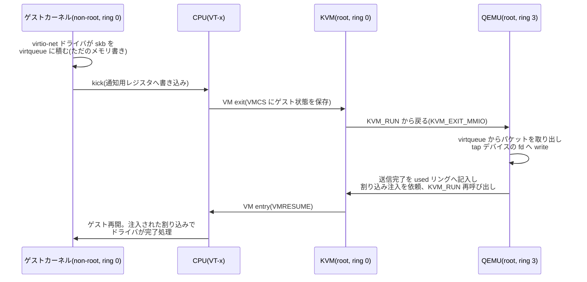

# KVM/QEMU — ハードウェアの層で切る仮想化

## 概要

分野05の第2章です。前章の「カーネルの中で切る」コンテナに対し、
**ハードウェアの層で切る**仮想マシンが、どんな CPU の仕組み(VT-x/AMD-V)と
カーネル機構(KVM)とユーザーランド(QEMU)の分業で実現されているかを
理解します。前提知識は分野02(特権レベル・モード切替・仮想メモリ・
スケジューラ)と前章。基準環境は Linux 7.0 / Ubuntu Server 26.04 LTS、
CPU は x86-64(Intel VT-x)を例にとります。

## 導入 — 「もう1台のコンピュータ」を、ただのプロセスとして動かす

前章の最後に、コンテナと仮想マシンの違いを「切る層」で整理しました。
コンテナは全員が同じカーネルの上のプロセスであり、カーネルが見せる
眺めと取り分だけを分けます。では仮想マシン(VM)は何をしているのか——
**ゲストごとに仮想のハードウェア一式(CPU・メモリ・ディスク・NIC)を
見せ、その上でゲストに自前のカーネルを丸ごと動かさせます**。

自前のカーネルが動くことの意味は大きく、コンテナでは原理的に
できないことができます。

- **別の OS・別のカーネルを動かせる。** ホストが Linux でも、ゲストは
  Windows でも、別バージョンの Linux でも、開発中の自作カーネルでもよい
- **隔離の境界がカーネルの外にある。** コンテナの隔離はホストカーネルの
  正しさに全面依存しますが(カーネルの脆弱性1つで塀が消える)、VM は
  ゲストカーネルが乗っ取られてもホストとの間にもう1枚の境界が残ります。
  他人どうしを同居させるパブリッククラウドが VM を基本単位とするのは
  このためです

問題は「どうやって」です。素朴な方法はすぐ思いつきます——ゲストの
機械語命令を1つずつソフトウェアで読んで、解釈して、実行する
**エミュレーション**です(QEMU は単体ではこれができます。TCG という
実行エンジンです)。確実に動きますが、1命令のために何十命令も使う
ので、桁で遅くなります。

そこで核心の問いはこうなります。**ゲストの命令を、ホストの CPU に
そのまま直接実行させられないか。** ゲストのユーザープログラムの
`add` や `mov` は、ホストの CPU が実行しても結果は同じはずです。
ただし全部を素通しにはできません。分野01以来の見取り図を思い出して
ください——カーネルは**特権レベル(ring 0)**でハードウェアを差配する
番人でした(分野02)。ゲストカーネルも自分が番人のつもりで、
ページテーブルの差し替えや割り込みの制御といった**危険な命令**を
発行します。それをホストの実ハードウェアに直接効かせてしまったら、
ホスト(と他のゲスト)が壊れます。

つまり仮想化の技術的な本体は、次の一点に集約されます。

> **無害な命令は CPU に直接実行させ、危険な命令だけを横取り(trap)して、
> ホスト側のソフトウェアが「そのゲスト専用の仮想ハードウェア」への
> 操作として演じ直す。**

この横取りと演じ直しを行うソフトウェアを**ハイパーバイザ
(hypervisor)**、あるいは VMM(Virtual Machine Monitor)と呼びます。
本章の主役である Linux の答えは、独立したハイパーバイザ OS を
新造することではなく、**Linux カーネル自身をハイパーバイザにする
カーネルモジュール(KVM)+デバイスの演技を担当する普通のユーザー
ランドプロセス(QEMU)**という分業でした。仮想マシンは特別な存在では
なく、ホストから見れば**ただのプロセス**として動きます——この事実が
本章を貫く軸です。

## 理論

本節の内容は、主に **Linux カーネルドキュメント
(Documentation/virt/kvm/api.rst)**、Intel SDM(Intel 64 and IA-32
Architectures Software Developer's Manual)の VMX の章、
Popek & Goldberg の論文(1974年)、および **virtio 仕様
(OASIS Virtual I/O Device (VIRTIO) Version 1.x)** に基づきます。

### trap-and-emulate と、x86 が抱えていた欠陥

「危険な命令だけ横取りする」方式には、古典的な理論があります。
Popek & Goldberg(1974年)は、仮想化が素直に成立する条件を
定式化しました。命令を2つの観点で分類します。

- **特権命令**: 特権レベルが足りない状態で実行すると、例外(trap)が
  起きる命令(分野02で見た「例外=CPU からの同期的な報告」の一種)
- **センシティブ命令**: 資源の構成を変える、または特権レベルによって
  結果が変わる命令(=素通しにできない危険な命令)

彼らの定理は「**センシティブ命令がすべて特権命令に含まれるなら、
その ISA は trap-and-emulate で仮想化できる**」というものです。
理屈は簡単で、ゲストカーネルを ring 0 ではなく非特権レベルで走らせて
おけば、危険な命令は必ず trap になり、ハイパーバイザがそこで捕まえて
演じ直せるからです。無害な命令は trap しないので、フルスピードで
素通りします。

ところが x86 は、この条件を**満たしていませんでした**。有名な例が
`popf` です。フラグレジスタを書き換えるこの命令は、割り込み許可
フラグ(IF)という明らかにセンシティブな状態を触るのに、非特権で
実行しても trap せず、**IF の変更だけが黙って無視されます**。
ゲストカーネルは「割り込みを禁止したつもり」で先へ進み、
ハイパーバイザは介入の機会すら得られません。このような命令が
x86 には十数個あり、2000年代前半の x86 仮想化は、実行前に危険な
命令を書き換えるバイナリ変換(VMware)や、ゲストカーネルの
ソースコードを改造して危険な命令を使わせない**準仮想化**
(paravirtualization。初期の Xen)といった力技で欠陥を回避して
いました。

### VT-x — CPU にもう1つの直交軸を足す

2005〜2006年、Intel と AMD はこの欠陥をハードウェアで解決しました
(Intel VT-x / AMD-V。両者は同じ発想の別実装で、以下 VT-x で
説明します)。追加されたのは、ring 0〜3 と**直交する**新しい
モードの軸です。

```
              VMX root モード          VMX non-root モード
             (ホスト側の世界)          (ゲスト側の世界)
  ring 0   ホストカーネル + KVM   │   ゲストカーネル
  ring 3   QEMU 等のプロセス      │   ゲストのプロセス
                                  │
           ←── VM exit(事象発生で CPU が自動で戻る)──
           ── VM entry(VMLAUNCH / VMRESUME で入る)──→
```

ポイントは、ゲストカーネルが **non-root モードの「本物の ring 0」で
走る**ことです。ring の位置をごまかさないので、`popf` のような
欠陥命令も含めて、ゲストカーネルの命令は原則ハードウェアで
そのまま実行されます。そのうえで、**ハイパーバイザが指定した事象**
——特定の特権命令、I/O ポートへのアクセス、後述する EPT の
フォールトなど——が起きた瞬間に、CPU が自動でゲストの実行を中断し、
root モードのハイパーバイザに制御を返します。この遷移が
**VM exit**、逆に戻るのが **VM entry** です。

分野02の型に重ねると、これは**モード切替の3つ目の類型**です。
システムコール・割り込み・例外が「プロセス→カーネル」の入口
だったのに対し、VM exit は「ゲスト世界→ホスト世界」の入口で、
やはり**飛び先も保存すべき状態も、事前に登録されたもの**が使われます。
その登録簿にあたるのが **VMCS(Virtual Machine Control Structure)**
という CPU 定義のデータ構造で、(1) ゲスト側のレジスタ状態、
(2) ホスト側の復帰先状態、(3) 「どの事象で exit するか」の制御設定、
の3部を収めます。VM exit のたびに CPU は VMCS へゲスト状態を保存し
ホスト状態を復元する——**コンテキストスイッチのハードウェア実装版**
と言えます(その分、素のモード切替より重く、マイクロ秒未満〜
数マイクロ秒の桁です。「VM exit をいかに減らすか」が本章後半の
通奏低音になります)。

### KVM — Linux 自身をハイパーバイザにする

VT-x はあくまで CPU の機能であり、それを使って VM を組み立てる
ソフトウェアが要ります。ここで設計の分岐があります。教科書的な
分類では、ハードウェアの上に直接載る専用ハイパーバイザ(type 1。
VMware ESXi、Xen)と、既存 OS の上のアプリケーションとして動くもの
(type 2)に分かれますが、type 1 は結局、スケジューラ・メモリ管理・
デバイスドライバといった「OS がすでに持っているもの」を自前で
作り直すことになります。

KVM(Kernel-based Virtual Machine。Linux 2.6.20、2007年に本線入り)の
答えは、「**それらを全部持っている OS が、手元にあるではないか**」
でした。KVM はカーネルモジュール(kvm.ko と、CPU 対応の
kvm_intel.ko / kvm_amd.ko)として Linux に VT-x の運転能力を足し、
**Linux カーネルそのものをハイパーバイザにします**。すると:

- **vCPU(仮想 CPU)は、ただのスレッドです。** ゲストの CPU を
  何個見せるかは「スレッドを何本作るか」であり、どの vCPU をいつ
  物理 CPU で走らせるかは、分野02で学んだ **EEVDF がそのまま**決めます。
  nice も cgroup の cpu.weight(前章)も普通に効きます
- **ゲストの RAM は、ただのアノニマスメモリです。** QEMU プロセスが
  mmap した領域(VMA)がゲストの物理メモリの正体で、分野02で学んだ
  デマンドページング・スワップ・オーバーコミットが普通に適用されます。
  「8 GiB の VM」を作った瞬間に 8 GiB が消費されるわけではありません
- **管理・観察の道具も流用できます。** VM はプロセスなので、ps にも
  top にも出るし、kill もでき、cgroup にも入れられます

インタフェースも Linux 流です。KVM は **`/dev/kvm`** という
デバイスファイルを見せ、VM の作成も vCPU の作成も実行も、この fd に
対する **ioctl** で行います。「すべてはファイル」(分野01)の再演です。

そして KVM は、意図的に**仕事を半分しかしません**。KVM が担当するのは
性能の核心である CPU の実行とメモリ変換(次節)だけで、ディスク・
NIC・シリアルポートといった**デバイスの演技は、ユーザーランドに
丸投げ**します。その相方が QEMU です。

### QEMU — デバイスモデルという「演技」の担当

QEMU はもともと独立したエミュレータで(前述の TCG で全命令を
ソフト実行できます)、豊富な**デバイスモデル**——「Intel の
このネットワークカードは、このレジスタにこう書くとこう振る舞う」
という演技の台本の膨大な蓄積——を持っていました。KVM と組むとき、
QEMU は CPU の実行を KVM に委ね、自分はこのデバイスの演技に徹します。

分業の噛み合わせはこうです。ゲストの OS が仮想 NIC のレジスタに
書き込む(I/O ポートまたは MMIO=メモリ番地に化けたデバイス
レジスタへのアクセス)と、それは VMCS に登録された「exit すべき
事象」なので **VM exit** が起きます。KVM はカーネル内で処理できない
種類の exit をユーザーランドの QEMU へ返し、QEMU が台本どおりに
デバイスの反応を演じ(パケットなら実際にホストのネットワークへ
流し)、終わったら再び ioctl で VM entry します。逆方向、
「デバイスからの通知」は、QEMU/KVM がゲストへ**仮想割り込みを注入**
することで表現されます——ゲストカーネルは、本物の割り込みだと
思ってハンドラを走らせます(分野02の割り込みの型が、ゲストの
世界の中でもう一周回っている構図です)。

### メモリ — 翻訳表を「二段重ね」にする(EPT/NPT)

分野02の仮想メモリは「翻訳表を1枚挟む」仕組みでした。VM では
これが**二段**になります。ゲストカーネルは自分こそが OS なので、
自前のページテーブルで「ゲスト仮想アドレス→**ゲスト物理アドレス**」を
管理します。しかしゲスト物理アドレスは本物の DRAM の番地ではなく、
QEMU の mmap 領域の中の論理的な位置にすぎません。そこでもう1枚、
「ゲスト物理→ホスト物理」の翻訳表が要ります。

VT-x はこの第二の表もハードウェアで引きます。**EPT(Extended Page
Table。AMD では NPT)**です。MMU はゲスト仮想アドレスに対して、
ゲストのページテーブルと EPT の**両方を続けて**歩き、最終的な
ホスト物理アドレスに到達します。

```
  ゲスト仮想アドレス
      │  ゲストのページテーブル(ゲストカーネルが管理。4段)
      ▼
  ゲスト物理アドレス
      │  EPT(KVM が管理。4段)
      ▼
  ホスト物理アドレス
```

EPT 以前、この問題は**シャドウページテーブル**というソフトウェアの
力技で解いていました。KVM が「ゲスト仮想→ホスト物理」を直接引ける
合成表を裏で作って本物の MMU に載せ、ゲストがページテーブルを
書き換えるたびに trap して合成表を追随させる方式です。ゲストの
メモリ管理操作(fork の CoW など、分野02で見たとおり頻発します)の
たびに VM exit が起きるので、高くつきました。EPT はこれを解消し、
**ゲストは自分のページテーブルを trap なしで自由に書き換えられます**
——第二段の表が最後に必ず挟まるので、何をどう書こうとゲストは
自分に割り当てられた範囲しか触れないからです。

代償は TLB ミスの重さです。2つの4段表の**二次元ウォーク**は、
最悪で20回超のメモリ参照になります(ゲスト表の各段のアドレス自体が
ゲスト物理なので、1段引くごとに EPT のウォークが挟まるためです)。
TLB(分野02)にヒットしている限りはネイティブと同速なので、
仮想化環境では TLB の効きが性能をいっそう左右します。

なお EPT の表は、最初から全部埋まっているわけではありません。
ゲストが未使用のゲスト物理ページに初めて触れると **EPT フォールト**
(VM exit の一種)が起き、KVM がそのとき初めてホストの物理フレームを
割り当てて EPT に記入します——**デマンドページングの二段目**です。
分野02の型がそっくりもう一段で再演されています。

### virtio — 「演技」をやめて「約束」にする

CPU とメモリは以上で速くなりました。最後のボトルネックは I/O です。
実在のハードウェア(IDE ディスクや Intel e1000 NIC)を忠実に演じる
方式は、互換性は完璧(ゲスト OS は無改造で、実機用のドライバが
そのまま動く)ですが、実デバイスのレジスタ操作の作法をなぞるため、
**パケット1個・セクタ1個の転送に何回も VM exit** が起きます。
実機ではレジスタ操作は数十 ns ですが、VM ではその1回ずつが
マイクロ秒級の exit なのです。

そこで、現代の VM の標準は**準仮想化デバイス**です。ゲストに
「実在のハードのそっくりさん」ではなく、**最初から仮想であることを
前提に設計された架空のデバイス**を見せ、ゲスト側には専用ドライバを
入れます。この架空デバイスの標準仕様が **virtio**(OASIS 標準)で、
ディスク(virtio-blk)、NIC(virtio-net)、その他(console、rng 等)が
共通の骨組みに載っています。Linux ゲストは virtio ドライバを標準で
持っているため、「無改造で動く」利点も実質保たれます。

virtio の骨組みは **virtqueue** という共有メモリ上のリング構造です
(内部構造は次節)。要点は通知の削り方にあります。

- 依頼(ディスクの読み書き、パケット)は共有メモリのリングに
  **積むだけ**。積む操作自体は普通のメモリ書き込みなので exit しません
- 「積んだよ」の合図(**kick**)だけが VM exit になります。しかも
  相手がまだ前の分を処理中なら、合図そのものを省略できます
  (通知抑制)。**1回の exit で溜まった分をまとめて処理**する——
  分野04で見た NAPI(割り込みを止めてまとめて刈り取る)と同じ
  思想です

さらに、演技の担当をカーネル内へ移す **vhost** という最適化が
あります。virtio-net の処理を QEMU まで往復させず、カーネル内の
専用ワーカー(vhost_net)が virtqueue を直接読み書きして、ホストの
ネットワークスタックと skb(分野04)を受け渡しします。ゲストからの
kick は **ioeventfd**(exit を eventfd への通知に変換し、vCPU は
すぐゲストへ戻る)、ゲストへの割り込みは **irqfd**(eventfd への
write が仮想割り込み注入になる)で結線され、データ経路から
ユーザーランドが消えます。

## 内部動作の詳細

### /dev/kvm と ioctl の3層 — VM を組み立てる API

**Documentation/virt/kvm/api.rst** が規定する KVM API は、fd の
3層構造です。

| 層 | 得る方法 | 主な ioctl |
|---|---|---|
| システム | `open("/dev/kvm")` | KVM_CREATE_VM(VM fd を返す) |
| VM | KVM_CREATE_VM | KVM_SET_USER_MEMORY_REGION、KVM_CREATE_VCPU |
| vCPU | KVM_CREATE_VCPU | KVM_RUN、KVM_GET/SET_REGS |

QEMU が VM を1つ立ち上げるときの骨子は、驚くほど短く書けます。

1. `/dev/kvm` を open し、KVM_CREATE_VM で VM fd を得る
2. ゲスト RAM にする領域を自分のアドレス空間に mmap し、
   **KVM_SET_USER_MEMORY_REGION** で「ゲスト物理アドレスのこの範囲は、
   当プロセスの仮想アドレスのこの範囲である」と対応を登録する
   (EPT はこの対応をもとに、フォールト駆動で埋まっていきます)
3. KVM_CREATE_VCPU で vCPU fd を必要数作り、**スレッドを1本ずつ**
   充てる
4. 各スレッドが **KVM_RUN** を呼ぶ

KVM_RUN が、この API の心臓です。この ioctl は「戻ってこない」のが
正常で、呼んだスレッドはそのまま**ゲストの命令列を non-root モードで
実行し続けます**。戻ってきたときは何かの VM exit がユーザーランドの
介入を必要としたときで、vCPU スレッドのメインループは次の形に
なります(QEMU の実装の骨格そのものです)。

```c
for (;;) {
    ioctl(vcpu_fd, KVM_RUN, 0);          /* ゲストとして走る */
    switch (run->exit_reason) {          /* 戻ってきた=要介入 */
    case KVM_EXIT_IO:    /* I/O ポート操作 → デバイスモデルが演技 */
    case KVM_EXIT_MMIO:  /* MMIO 操作 → 同上 */
    ...
    }
}
```

重要なのは、**すべての VM exit がユーザーランドまで届くわけではない**
ことです。KVM はカーネル内で片付く exit(EPT フォールト、多くの
特権レジスタ操作、vhost/ioeventfd に結線済みの kick 等)をその場で
処理して即 VM entry します(軽量な exit)。KVM_RUN から戻るのは、
デバイスの演技などユーザーランドにしか台本がない場合だけです
(重量な exit)。「できるだけカーネル内で折り返す」——分野02で見た
「境界を越える回数を減らす」原則の、もう一段外側での適用です。

### 1回の I/O の一部始終

仮想 NIC(vhost なしの virtio-net とします)でパケットを1つ送る
流れを、登場人物を揃えて追います。



ゲストの中では「ドライバがデバイスに依頼し、割り込みで完了を知る」
という、分野02・04で学んだ普通の I/O の形が完結しています。ホスト側
から見ればその全部が「プロセスがメモリを読み書きし、fd に write
した」だけです。**2つの世界のどちらの視点でも、既習の型しか
登場しない**——これが KVM/QEMU 設計の美点です。

### ホストから見た VM の姿と、二重スケジューリング

QEMU プロセスの中身は、おおよそ次のスレッド構成です。

- **メインスレッド**: イベントループ(モニタ、タイマ、非同期 I/O の
  完了処理)
- **vCPU スレッド × N**: それぞれが KVM_RUN の中に潜っている
- **I/O ワーカースレッド**: ディスク I/O などの実処理

vCPU スレッドは、ホストのスケジューラから見れば「よく走る普通の
スレッド」です。ここから **steal time(スチールタイム)** という
VM 特有の観測値が生まれます。ゲストカーネルは自分の vCPU が常時
走れる前提で会計しますが、実際にはホスト側の混雑で vCPU スレッドが
ランキュー(分野02)で待たされる時間があります。この「ゲストは
走りたかったのに、ホストの都合で走れなかった時間」がゲスト内の
top に **%st** として現れます。ゲストの中で CPU 使用率が低いのに
遅い、という症状の定番原因で、**原因はゲストの中には存在しない**
(ホスト側の隣人か、cgroup の cpu.max による絞りです)。
スケジューリングがゲストとホストの二重になっていることの、
運用上いちばん重要な帰結です。

### virtqueue の中身

virtio の共有リングは3部構成です(virtio 1.x の split virtqueue)。

```
  ディスクリプタテーブル      avail リング          used リング
  ┌──────────────────┐   (ゲスト→ホスト)     (ホスト→ゲスト)
  │[0] addr,len,flags,next│  ┌────────────┐   ┌─────────────┐
  │[1] addr,len,flags,next│  │「先頭は desc 0」 │   │「desc 0 済み、  │
  │[2] ...           │  │「先頭は desc 2」 │   │ 書いた長さ n」  │
  └──────────────────┘  └────────────┘   └─────────────┘
```

- **ディスクリプタテーブル**は「ゲスト物理アドレス addr から len
  バイト」というバッファの所番地の一覧で、next で数珠つなぎにして
  1依頼=複数バッファ(ヘッダ+データ等)を表せます
- ゲストは依頼にするディスクリプタ連鎖の先頭番号を **avail リング**に
  積み、ホスト(QEMU または vhost)は処理を終えた連鎖を **used
  リング**に積み返します
- どちらのリングも「書く側だけが書く」一方通行の設計で、ロックなしに
  進みます。kick(ゲスト→ホスト)と割り込み(ホスト→ゲスト)は
  「リングを見に来て」という合図にすぎず、フラグで抑制できます——
  データはリング、通知は合図だけ、という分離です

アドレスが**ゲスト物理**で書かれている点に注意してください。QEMU は
KVM_SET_USER_MEMORY_REGION の対応表を逆に引けば、ゲスト物理アドレスを
自分の仮想アドレスに変換してバッファを直接読み書きできます。ゲスト
RAM が QEMU の mmap 領域である設計が、ここでコピーの削減として
効いています。

### ディスクの出口 — キャッシュモードと「印のない日誌」(分野03の宿題回収)

仮想ディスクの実体は、ホスト上のただのファイル(またはブロック
デバイス)です。フォーマットは、ゲストのブロック番地がそのまま
ファイルオフセットになる **raw** と、書かれた分だけ後ろに追記して
対応表で引く **qcow2**(QEMU Copy-On-Write 2)が代表です。qcow2 の
「使った分だけ実体を持つ」「ある時点の姿を保存して差分を積む」は、
分野03で学んだシンプロビジョニングとスナップショットの型の
ファイル版です。

ここに、分野03のジャーナリングの章で予告した宿題があります。
ゲストの ext4 は「日誌を書き、**フラッシュで順序を確定させてから**、
コミットレコードを書く」ことでクラッシュ整合性を守っていました
(「印のない日誌は、なかったことにする」)。VM でこの約束が成立する
には、**ゲストのフラッシュ依頼が、ホストの永続化まで翻訳されて
届く**必要があります。QEMU の `cache=` オプションが、この翻訳の
方針です。

- **writeback(既定)**: ゲストの書き込みはホストのページキャッシュに
  載り(分野03)、ゲストからの FLUSH(virtio-blk のフラッシュ
  コマンド)を fdatasync に翻訳して実行します。ゲストの FS が正しく
  バリアを発行する限り、**整合性の約束は連鎖して保たれます**
- **none**: ホストのページキャッシュを介しません(O_DIRECT)。
  二重キャッシュ(ゲストとホストで同じデータを2回持つ)を避ける、
  サーバー用途の定番です。FLUSH の翻訳は writeback と同様に行われます
- **unsafe**: **FLUSH を握りつぶします**。ベンチマークは速くなりますが、
  ホストの電源断・QEMU の異常終了のとき、ゲストの ext4 は「確定した
  はずの日誌が実は書かれていない」という、ジャーナリングのモデルの
  **外**の壊れ方をします。分野03で「ジャーナルが守れるのは順序の
  約束が守られる限り」と述べたことの、最も現実的な破れ方です。
  使い捨ての試験 VM 以外で使ってはいけません

### ネットワークの出口 — tap とブリッジ(分野04の再演)

仮想 NIC のホスト側の出口は **TAP デバイス**です。TAP は「片足が
カーネル、片足がプロセス」の仮想 NIC で、カーネル側からは普通の
ネットワークデバイスに見え、プロセス側からは fd に見えます。
プロセスが fd に write したフレームはカーネル側に「受信」として
現れ、カーネル側からの「送信」はプロセスが fd から read できます。
QEMU(または vhost_net)は、ゲストの virtqueue と tap の fd の間で
フレームを往復させるだけです。

すると、ホスト側の構成は分野04第3章とまったく同じ絵になります。
tap は**ブリッジに挿せる同列のデバイス**なので、コンテナの veth を
束ねたのと同じブリッジに VM の tap を挿せば、VM とコンテナと
ホストが同じ L2 セグメントに同居します。ホストをルータにして外へ
出す・masquerade する構成もそのまま使えます。仮想スイッチングを
ホストの外まで延ばす話(VXLAN/EVPN)は network-guide が主です
(`../../network-guide/02_vlan_vxlan_evpn/03_vxlan_fundamentals.md`)。

## 実行例

以下は Ubuntu Server 26.04 LTS での例です。まず、ハードウェア
仮想化支援と KVM が使えることを確かめます。

```console
$ grep -c -E 'vmx|svm' /proc/cpuinfo
8                                ← vmx(Intel)/svm(AMD)を持つ論理CPU数。0なら支援なし
$ ls -l /dev/kvm
crw-rw---- 1 root kvm 10, 232 ...  /dev/kvm   ← これが KVM への唯一の入口
$ lsmod | grep kvm
kvm_intel   ...                  ← CPU ベンダー対応モジュール
kvm         ...
```

VM が「ただのプロセス」であることを、スレッド構成で確かめます
(qemu-system-x86_64 で 2 vCPU のゲストを起動済みとします)。

```console
$ ps -T -p $(pgrep qemu-system) -o spid,comm
   SPID COMMAND
   4211 qemu-system-x86            ← メインスレッド(イベントループ)
   4215 CPU 0/KVM                  ← vCPU スレッド。KVM_RUN の中にいる
   4216 CPU 1/KVM                  ← vCPU の数だけスレッドがある
   ...
$ grep -A2 'rw-p.*$' /proc/$(pgrep qemu-system)/smaps_rollup
Rss:  812340 kB                   ← ゲストRAMは QEMU の VMA。触った分だけ実在する
```

vCPU スレッドに nice を掛ければゲスト全体が遅くなり、cgroup の
`cpu.max`(前章)で絞ればゲスト内の top に %st が立ちます——
仮想化の章の道具ではなく、分野02・前章の道具がそのまま効きます。

## トラブルシューティング

- **`/dev/kvm` がない、または qemu が「KVM not available」と言う。**
  (1) ファームウェア設定で VT-x/AMD-V が無効(実機では BIOS/UEFI 画面で
  有効化)。(2) クラウドの VM の中で VM を作ろうとしている——ゲストに
  VT-x を見せる**ネステッド仮想化**をホストが許可していない限り、
  VM の中に `/dev/kvm` は現れません。(3) 単に kvm グループに入って
  いない(Permission denied)。KVM なしでも QEMU は TCG で起動だけは
  してしまうので、「動くが桁違いに遅い」ときはまずこれを疑います
- **ゲストのディスク/ネットワークだけが異常に遅い。** ゲストに
  見せているデバイスが IDE や e1000 のエミュレーションになっていない
  かを確認します(ゲスト内で `lspci`)。virtio-blk / virtio-net に
  替えるだけで、VM exit の回数が桁で変わります
- **ゲスト内の CPU 使用率は低いのに遅く、top の %st が高い。**
  本文のとおり、原因はホスト側にあります(物理 CPU の取り合い、
  または cgroup による絞り)。ゲストの中をいくら調べても
  見つかりません——「観察は原因のある世界で行う」(分野04の
  ネームスペースの原則の VM 版)です
- **ホストの電源断のあと、ゲストのファイルシステムが激しく壊れた。**
  fsck が多数のエラーを報告するようなモデル外の壊れ方は、
  `cache=unsafe`(または writeback 相当なのにゲストがバリアを
  発行しない古い構成)を疑います。ジャーナリングの前提(フラッシュの
  約束)が仮想ディスクの層で破られていなかったかを確認します
- **ゲストの時計が遅れる・飛ぶ。** vCPU は走れない時間がある
  (スケジュールされない・VM exit 中)ため、tick を数える古い計時は
  ずれます。Linux ゲストは通常、ホストと同期する準仮想化クロック
  (kvm-clock)を自動選択するので、ずれる場合はゲストの
  clocksource(`/sys/devices/system/clocksource/...`)を確認します

## 演習・確認問題

1. Popek & Goldberg の仮想化可能条件を述べ、x86 がそれを満たして
   いなかったとはどういうことか(`popf` を例に)、VT-x はそれを
   どんな仕組みで解決したかを説明せよ。
2. 「vCPU はただのスレッド、ゲスト RAM はただのアノニマスメモリ」
   という KVM の設計から、(a) ホストの nice / cpu.weight がゲストに
   効く理由、(b) ゲスト内の steal time(%st)が生じる理由を説明せよ。
3. EPT はシャドウページテーブルの何を解決したか。また EPT 環境で
   TLB ミスが相対的に高くつく理由を、二次元ウォークの構造から
   説明せよ。
4. 完全エミュレーションの e1000 より virtio-net が速い理由を、
   「VM exit の回数」を軸に説明せよ。vhost と ioeventfd/irqfd は
   さらに何を削るか。
5. `cache=unsafe` の VM でホストが電源断すると、ゲストの ext4 が
   ジャーナリングのモデル外の壊れ方をしうるのはなぜか。分野03の
   「印のない日誌は、なかったことにする」の前提に触れて説明せよ。

## まとめ

- 仮想化の本体は「無害な命令は直接実行、危険な命令だけ trap して
  演じ直す」。x86 はこれができない欠陥 ISA だったが、VT-x/AMD-V が
  **root/non-root モードと VM exit/entry(状態の置き場は VMCS)**で
  解決した
- **KVM は Linux 自身をハイパーバイザにする**。vCPU はただの
  スレッド(EEVDF が配分)、ゲスト RAM はただの VMA(デマンド
  ページング適用)、入口は /dev/kvm への ioctl——既習の型の再利用で
  できている
- デバイスの演技はユーザーランドの **QEMU** が担い、性能が要る所は
  **virtio**(リングに積んで合図だけ exit)と **vhost**(カーネル内で
  折り返す)が VM exit を削る
- メモリは**二段の翻訳表(ゲストのページテーブル+EPT)**。ディスクの
  出口ではゲストのフラッシュをホストの fsync に翻訳して整合性の
  約束を連鎖させ(cache=unsafe はこれを破る)、ネットワークの出口は
  tap としてブリッジに挿さる——コンテナと同じ絵に合流する
